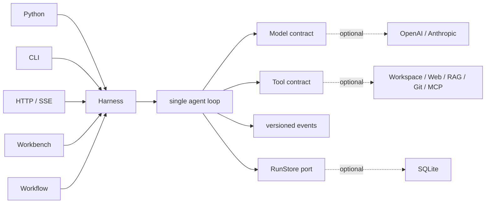

<h1 align="center">Sasori</h1>

<p align="center"><strong>A small Python agent runtime. A complete framework when you need one.</strong></p>

<p align="center">
  <a href="https://github.com/syusama/sasori/blob/main/README.md"><strong>English</strong></a> ·
  <a href="https://github.com/syusama/sasori/blob/main/README_zh.md">简体中文</a> ·
  <a href="https://github.com/syusama/sasori/blob/main/README_ja.md">日本語</a> ·
  <a href="https://github.com/syusama/sasori/blob/main/README_ko.md">한국어</a>
</p>

<p align="center">
  <a href="https://github.com/syusama/sasori/actions/workflows/ci.yml"></a>
  
  
  
  <a href="https://github.com/syusama/sasori/blob/main/LICENSE"></a>
</p>

<p align="center">
  
</p>

Sasori is a Python-first framework for tool-using agents. Its smallest useful
form is a dependency-free Loop/Harness that can be read end to end. When the
product needs more, the same runtime can add providers, SQLite, plugins,
Workflows, Memory, artifacts, HTTP/SSE, and a responsive Workbench—without
introducing a second execution engine behind the UI.

The name carries a deliberate design metaphor: as Sasori controls an adaptable
arsenal of puppets, developers should be able to compose models, Tools, Skills,
Memory, and Workflows with the same freedom and precision. The ambition is not
to theme the product after a character; it is to treat every Agent as an
engineered work of art—modular, expressive, dependable, and built to endure.

> **Current boundary:** `0.1.0.dev1` is a verified, single-machine,
> single-owner prerelease candidate. It is not yet a public multi-tenant
> control plane, distributed executor, untrusted-code sandbox, or public
> plugin market. Install it from a checkout while package publication is on
> hold.

## Why Sasori

> **The short answer: a small core, one runtime path, and execution you can trust.**

Sasori treats models, Tools, Skills, Memory, and Workflows as replaceable
capabilities around one readable runtime. Use only `sasori-core` for a small
Python agent, or assemble the full framework without replacing the engine that
was already tested.

| What matters | The pressure frameworks often face | Sasori's default |
|---|---|---|
| **Size** | Every integration expands the central Agent object | A zero-dependency core with a deliberately narrow ownership boundary; product capabilities stay detachable |
| **Consistency** | Python, server, Workflow, and UI paths slowly acquire different rules | One Harness and one Loop serve every adapter; a fix at the shared boundary benefits every surface |
| **Tool safety** | Partial or malformed model output reaches real code | Only complete, structurally valid Tool calls can execute; reserved runtime arguments fail closed |
| **Real-world effects** | A timeout or retry is mistaken for proof that an external operation stopped or failed | Tools declare `read_only`, `idempotent`, or `side_effecting`; approval, explicit resume, and `effect_unknown` recovery remain separate facts |
| **Live experience** | Streaming progress is persisted or replayed as if it were execution truth | Bounded model and Tool progress is transient; versioned public events and checkpoints remain the durable truth |
| **Product growth** | A polished UI becomes a second implementation of the Agent | CLI, HTTP/SSE, Workflow, and Workbench consume the same runtime and public projection |

The distinction is simple: many frameworks optimize first for how many things
an Agent can call; Sasori first establishes whether each call was valid,
approved, committed, recoverable, and honestly represented. That makes it a
strong fit for developer agents, operations automation, long-running Tool work,
and business workflows where files, Git, databases, browsers, or external APIs
have real consequences.

Sasori does not yet claim the largest integration ecosystem, mature public
multi-agent orchestration, or a community plugin market. Its current advantage
is more fundamental: **start light, add only what you need, and keep one
auditable execution contract as the application grows.**

## Two distributions, one runtime

| | `sasori-core` | `sasori` |
|---|---|---|
| Import | `sasori_core` | `sasori` plus optional top-level modules |
| Use it for | Embedding the canonical single-agent runtime | Building a batteries-included Agent application |
| Owns | Contracts, Loop/Harness, versioned projection, `RunStore`, ephemeral store, test helpers | The exact same-version core plus SQLite, providers, CLI, HTTP/SSE, plugins, Workflow, Memory, artifacts, apps, Workbench, and market scaffolding |
| Runtime dependencies | **0** | Exactly `sasori-core==0.1.0.dev1`; first-party features otherwise prefer the standard library |
| Deliberately outside core | Provider SDKs, persistence, HTTP, RAG, multi-agent, UI, marketplace | No duplicate Loop and no shadow Harness |

The package identities are explicit:

```text
PyPI distribution: sasori-core       Python import: sasori_core
PyPI distribution: sasori            Python import: sasori
```

Install the current candidate from the repository:

```bash
# Smallest runtime
python -m pip install ./packages/sasori-core

# Complete framework
python -m pip install ./packages/sasori-core
python -m pip install --no-deps .
```

## A complete agent in 30 seconds

```python
import asyncio

from sasori_core import Harness, Message, ModelReply, Tool, ToolCall


def inspect(topic: str) -> str:
    return f"verified evidence for {topic}"


class DemoModel:
    async def complete(self, messages, tools):
        if messages[-1].role == "user":
            return ModelReply(
                tool_calls=(ToolCall("inspect-1", "inspect", {"topic": "Sasori"}),)
            )
        return ModelReply(content=f"Grounded: {messages[-1].content}")


async def main():
    with Harness(
        DemoModel(),
        (Tool("inspect", inspect, effect="read_only"),),
    ) as agent:
        result = await agent.run((Message("user", "Inspect the runtime"),))
    print(result.final_message.content)


asyncio.run(main())
```

Complete-only models are the minimal contract. Streaming is optional and
provider-neutral. A truncated, oversized, invalid, or incomplete tool call
fails closed and never executes.

## One line of control



The solid path is `sasori-core`. Everything dotted is replaceable and stays
outside core.

## The Workbench is real

These images were captured from the real Sasori server at runtime commit
[`71993de`](https://github.com/syusama/sasori/commit/71993de377a837c85c6cba5bcbf83a36228a1dc2).
The browser journeys use SQLite, approval, explicit resume, two audited effects,
cold-history reconstruction, artifacts, capability projection, strict Workflow
preflight, and durable Catalog save. Exact dimensions, byte counts, SHA-256
digests, browser version, and capture scenarios are recorded in the
[screenshot manifest](docs/assets/screenshots-manifest.json).

<p align="center">
  
</p>

<p align="center"><sub>A completed typed Workflow with verified output, definition identity, and effective capability disclosure.</sub></p>

<p align="center">
  
</p>

<p align="center"><sub>Workflow Studio saves immutable definitions with strong-ETag CAS and performs server-authoritative preflight with zero model calls and zero tool dispatches.</sub></p>

<table>
  <tr>
    <td width="50%" align="center"></td>
    <td width="50%" align="center"></td>
  </tr>
  <tr>
    <td align="center"><sub>Task workspace · exact 390×844 CSS viewport</sub></td>
    <td align="center"><sub>Capability inspector · exact 390×844 CSS viewport</sub></td>
  </tr>
</table>

Proma is a benchmark for information architecture, workspace density, and
three-pane interaction. Sasori's no-build frontend, CSS, copy, logo, screenshots,
and assets are independently implemented against Sasori's own contracts.

## What is included today

| Surface | Delivered in this candidate |
|---|---|
| Core | Zero-dependency contracts, Loop/Harness, strict streaming settlement, approval/recovery, `RunStore`, ephemeral storage, stable public projection, deterministic fakes |
| Durability | SQLite revisions, events, checkpoints, restart recovery, CAS, and single-owner admission |
| Providers | Standard-library OpenAI Responses and Anthropic Messages adapters with shared wire-conformance tests |
| Context & Memory | Bounded context plus a separate, fixed-scope, immutable-revision SQLite Memory extension |
| Tools & plugins | Workspace, allowlisted HTTPS, SQLite/FTS5 RAG, local Git, frozen MCP stdio, trusted entry-point discovery, permission disclosure |
| Workflow | Strict static serial definitions, zero-execution preflight, immutable saved revisions, CAS conflict reconciliation, one Harness execution path |
| Product | Python API, CLI, HTTP/SSE, Incident/Research/Developer apps, artifacts, responsive Workbench, market scaffolding |

Deep contracts live in [Foundation](docs/FOUNDATION.md),
[HTTP API](docs/HTTP_API.md), [Providers](docs/PROVIDERS.md),
[Workflow](docs/WORKFLOWS.md), [Memory](docs/MEMORY.md),
[Artifacts](docs/ARTIFACTS.md), and the
[Pi/Proma benchmark](docs/BENCHMARK-PI-PROMA.md).

## Runtime guarantees

- Public events are versioned semantic projections, never dumps of mutable
  internal state.
- Every Tool is `read_only`, `idempotent`, or `side_effecting`; unsafe work
  crosses explicit approval and resume boundaries.
- Tool exceptions become explicit Tool results. Cancellation is propagated and
  never swallowed.
- Checkpoint/resume is step-boundary recovery. Side-effecting Tools require an
  idempotency key or an explicit manual-recovery policy.
- Installed Python entry points are trusted host code, not a sandbox.
- Mutable inputs cannot rewrite durable arguments, approvals, retries, or
  another store adapter's view.

## Evidence before claims

The current runtime snapshot has passed:

- `546` deterministic `unittest` checks; `5` Windows symlink cases skip when
  the required OS privilege is unavailable;
- `31 / 31` real Chrome Workbench cases at 1600×1000, 390×844, and 360×800,
  including reduced-motion and narrow structured-result checks;
- real-server browser journeys covering approval, explicit resume, exactly two
  audited effects, cold history, artifacts, typed Workflow, and saved Catalog;
- original-wheel, rebuilt-sdist, exact bundle/core, and installed-distribution
  verification;
- mainland-source Docker build and a real non-root container workflow.

The repository does not treat a generated plan, self-test, screenshot, or
upstream README as release authority. Runnable acceptance evidence is the gate.

## Benchmarked, not copied

- **Pi** — readable loop structure and disciplined tool/event ordering; Sasori
  keeps a zero-dependency Python core, executable Harness, strict terminal
  settlement, and explicit recovery boundaries.
- **Proma** — product density and workspace discoverability; Sasori uses only
  architectural and interaction lessons, not Proma's AGPL source or assets.
- **LeAgent / ToFu** — useful product breadth and runtime ideas; Sasori tightens
  effect ambiguity, projection ownership, package boundaries, and evidence.

See [Pi / Proma](docs/BENCHMARK-PI-PROMA.md),
[LeAgent / ToFu](docs/BENCHMARK-LEAGENT-TOFU.md), and
[third-party notices](THIRD_PARTY_NOTICES.md) for fixed commits and license
boundaries.

## Roadmap — not shipped yet

- Signed plugin provenance, compatibility policy, and a governed public market;
- tenant identity, authorization, quotas, durable queues, and distributed workers;
- isolated untrusted Tool execution with explicit CPU, memory, filesystem, and
  egress policies;
- DAG/parallel Workflow and multi-agent orchestration after effect,
  cancellation, approval, and replay semantics are proved;
- team workspaces and digital employees on the same canonical runtime.

## Name and affiliation

The name is inspired by Sasori, the puppet master from *Naruto*: precise
craftsmanship, modular mechanisms, and a preference for work that endures. That
reference is limited to the project name, this short origin note, and the
owner-supplied project brand asset; it is not the Workbench's visual theme.

Sasori is an independent open-source project and is not affiliated with,
authorized by, sponsored by, or endorsed by *Naruto*, Masashi Kishimoto,
Shueisha, TV Tokyo, Studio Pierrot, or their rights holders. The supplied logo
is presented as project branding. This repository does not represent it
as official media or assert ownership of third-party rights in it.

## License and contribution

Sasori code is released under the [MIT License](LICENSE). Third-party plugins
retain their own licenses and run as trusted code. Security boundaries are in
[SECURITY.md](SECURITY.md). Changes to public events, recovery semantics,
golden traces, or plugin permissions should include a decision record and
runnable regression evidence.

**Start small. Add only what the product needs. Keep every important action inspectable.**
