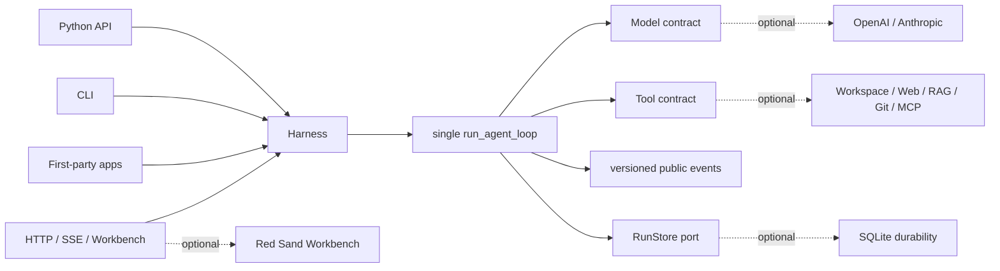

<p align="center">
  
</p>

<p align="center">
  <a href="https://github.com/syusama/sasori/actions/workflows/ci.yml"></a>
  
  
  
  <a href="https://github.com/syusama/sasori/blob/main/LICENSE"></a>
</p>

<p align="center">
  <strong>English</strong> ·
  <a href="https://github.com/syusama/sasori/blob/main/README_zh.md">简体中文</a> ·
  <a href="https://github.com/syusama/sasori/blob/main/README_ja.md">日本語</a> ·
  <a href="https://github.com/syusama/sasori/blob/main/README_ko.md">한국어</a>
</p>

<h1 align="center">One kernel. Many puppets.</h1>

<p align="center"><strong>A tiny, inspectable Python Agent kernel that can grow into a complete, beautiful AI workbench without growing a second runtime.</strong></p>

Sasori is both a precision knife and a puppet atelier. Start with one
dependency-free Loop/Harness, one model, and only the tools you need. Add
SQLite, providers, plugins, workflows, Memory, artifacts, HTTP/SSE, and the
Workbench when the job calls for them. Python, CLI, HTTP, and UI all pull the
same runtime threads.

The naming spark comes from the fictional puppeteer Sasori in *Naruto*: an
artist of intricate mechanisms, interchangeable arsenals, and the pursuit of
an enduring form. Sasori translates that idea—not the character artwork—into
software: **one readable mechanism, many detachable puppets, every dangerous
thread visible, every result preserved as evidence.**

> Current boundary: Sasori is a verified single-machine, single-owner
> prerelease candidate. It is not yet a public multi-tenant control plane, a
> distributed executor, an untrusted-code sandbox, or a central plugin market.

## Two distributions, one canonical mechanism

| | `sasori-core` | `sasori` |
|---|---|---|
| Import | `sasori_core` | `sasori` plus optional top-level modules |
| Purpose | Embed the canonical single-agent runtime | Assemble the complete batteries-included framework |
| Owns | contracts, one Loop/Harness, versioned public projections, storage-neutral `RunStore`, `EphemeralRunStore`, test helpers | exact same-version core plus SQLite, providers, CLI, HTTP/SSE, plugins, Workflow, Memory, artifacts, apps, Workbench, marketplace scaffolding |
| Runtime dependencies | **0** | exactly `sasori-core==0.1.0.dev1`; application features otherwise use the standard library and repository modules |
| Does not own | provider SDKs, DB, HTTP, RAG, multi-agent, UI, marketplace | no second Loop and no shadow Harness |

The package identities are intentionally explicit:

```text
PyPI distribution: sasori-core       Python import: sasori_core
PyPI distribution: sasori            Python import: sasori
```

Until the `0.1.0.dev1` prerelease completes its Hosted CI and TestPyPI gates,
install the current candidate from a checkout:

```bash
# Smallest mode
python -m pip install ./packages/sasori-core

# Complete mode: install the exact local core, then the bundle without resolving it remotely
python -m pip install ./packages/sasori-core
python -m pip install --no-deps .
```

## Thirty-second core

```python
import asyncio

from sasori_core import Harness, Message, ModelReply, Tool, ToolCall


def inspect(topic: str) -> str:
    return f"verified evidence for {topic}"


class DemoModel:
    async def complete(self, messages, tools):
        if messages[-1].role == "user":
            return ModelReply(
                tool_calls=(ToolCall("inspect-1", "inspect", {"topic": "Sasori"}),)
            )
        return ModelReply(content=f"Grounded: {messages[-1].content}")


async def main():
    with Harness(
        DemoModel(),
        (Tool("inspect", inspect, effect="read_only"),),
    ) as agent:
        result = await agent.run((Message("user", "Inspect the mechanism"),))
    print(result.final_message.content)


asyncio.run(main())
```

Complete-only models are the smallest contract. Streaming is optional and
provider-neutral. Its strict grammar is:

```text
start → deltas* → exactly one done / error / aborted → iterator end
```

Truncated, partial, oversized, non-UTF-8, deeply nested, cyclic, or otherwise
structurally invalid tool calls fail closed and never execute.

## A real Workbench, not a concept render

Every image below was captured from the real Sasori server at runtime commit
[`b10b787`](https://github.com/syusama/sasori/commit/b10b787f93f2b5d29cd35c30dee17bbdc9e4de7b),
using a real browser journey through SQLite, approval, explicit resume, one
audited side effect, cold history, artifact verification, capability
projection, Workflow preflight, and durable Catalog save. The source commit,
requested viewport, actual pixels, byte count, and SHA-256 for every image are
recorded in the [screenshot manifest](https://github.com/syusama/sasori/blob/main/docs/assets/screenshots-manifest.json).

<p align="center">
  
</p>

<table>
  <tr>
    <td width="50%"></td>
    <td width="50%"></td>
  </tr>
  <tr>
    <td align="center"><sub>Approval records intent; it does not execute the effect.</sub></td>
    <td align="center"><sub>Execution starts only after an explicit resume.</sub></td>
  </tr>
  <tr>
    <td></td>
    <td></td>
  </tr>
  <tr>
    <td align="center"><sub>Strict JSON preflight, immutable revision, strong-ETag CAS; zero runs.</sub></td>
    <td align="center"><sub>Loaded Skills, Tools, MCP transports, providers, plugins, and effective trust.</sub></td>
  </tr>
  <tr>
    <td></td>
    <td></td>
  </tr>
</table>

<table>
  <tr>
    <td width="50%" align="center"></td>
    <td width="50%" align="center"></td>
  </tr>
</table>

The visual language is an original **Red Sand Atelier**: black lacquer,
brass, cinnabar, calibration marks, immutable scrolls, and mechanical threads.
Proma is a product-density and three-pane workflow benchmark; Sasori does not
copy Proma's AGPL source, CSS, copy, logo, screenshots, or assets.

## One line of control



The solid path is `sasori-core`. Everything dotted is replaceable and remains
outside the core. There is no duplicate product loop hidden behind the UI.

## The invariants that matter

- **One Loop/Harness:** Python, CLI, HTTP, Workflow, and UI converge on the same
  runtime path.
- **Events are projections:** public events are versioned semantic facts, never
  a dump of mutable internal objects.
- **Effects are explicit:** each Tool is `read_only`, `idempotent`, or
  `side_effecting`; non-read-only calls carry a revision and cross approval.
- **Approval is not execution:** approval/denial is committed first, then the
  operator explicitly resumes the run.
- **Recovery is honest:** checkpoint/resume is step-boundary recovery, not
  exactly-once. Unknown external effects pause for fingerprint-bound manual
  resolution or an explicitly authorized retry.
- **Cancellation is cooperative:** Sasori propagates cancellation but never
  claims an arbitrary remote model or synchronous thread was forcibly killed.
- **Plugins disclose trust:** installed Python entry points are trusted host
  code, not a sandbox. MCP is classified by server-owned transport metadata,
  not guessed by the frontend.
- **State stays detached:** mutable model/tool inputs cannot rewrite durable
  arguments, approvals, retries, or another store adapter's view.

## What ships in this candidate

| Surface | Delivered |
|---|---|
| Core | zero-dependency contracts, Loop/Harness, strict streaming, approval/recovery, `RunStore`, ephemeral store, stable projections, deterministic harness helpers |
| Durability | SQLite revisions, events, checkpoints, CAS, restart recovery, and single-owner admission |
| Providers | standard-library OpenAI Responses and Anthropic Messages adapters behind one conformance suite |
| Context & Memory | bounded structural/optional semantic context; separate fixed-scope, immutable-revision SQLite Memory with Harness-gated writes |
| Tools & plugins | workspace, allowlisted HTTPS, SQLite/FTS5 RAG, local Git, frozen MCP stdio, trusted entry-point discovery and permission disclosure |
| Workflow | strict static serial definitions, authoritative zero-execution preflight, immutable saved revisions, CAS conflict/reconciliation, one Harness execution path |
| Product | CLI, HTTP/SSE, deterministic Incident app, configured Research/Developer apps, artifacts, responsive Workbench, marketplace scaffolding |

Deep contracts live in [Foundation](https://github.com/syusama/sasori/blob/main/docs/FOUNDATION.md),
[HTTP API](https://github.com/syusama/sasori/blob/main/docs/HTTP_API.md),
[Workflow](https://github.com/syusama/sasori/blob/main/docs/WORKFLOWS.md),
[Memory](https://github.com/syusama/sasori/blob/main/docs/MEMORY.md),
[Artifacts](https://github.com/syusama/sasori/blob/main/docs/ARTIFACTS.md), and the
[Pi/Proma benchmark](https://github.com/syusama/sasori/blob/main/docs/BENCHMARK-PI-PROMA.md).

## Evidence before adjectives

The current runtime snapshot has passed:

- `531` deterministic `unittest` checks (`5` Windows symlink cases skip when
  the OS privilege is unavailable);
- `30 / 30` browser acceptance cases across desktop, narrow, and
  reduced-motion layouts;
- `3 / 3` real-server browser journeys covering approval, resume, Workflow,
  catalog, history, artifact, and permission paths;
- mainland-source Docker build and a real non-root container workflow using a
  DaoCloud digest-pinned Python image and Tsinghua PyPI index;
- clean install of the original core wheel, rebuilt core sdist, exact bundle +
  core wheels, and the locked bundle sdist rebuild.

Final wheel hashes are intentionally not printed here: README metadata changes
the bundle artifact. The [release gate](https://github.com/syusama/sasori/blob/main/docs/RELEASE.md) rebuilds and binds the
exact bytes before Hosted CI, TestPyPI, and any tag. Tests are the release
authority; a model-generated plan or a pretty screenshot is not.

## Designed against strong references

- **Pi** (MIT, fixed benchmark commit): Sasori adopts the readable Loop and
  ordered tool/event discipline, while keeping a zero-dependency Python core,
  an executable Harness, stricter stream termination, and explicit recovery.
- **Proma** (AGPL-3.0-only, fixed benchmark commit): Sasori studies the dense
  three-pane workbench and workflow discoverability, then implements an
  original no-build UI and visual system against Sasori's own event contract.
- **LeAgent / ToFu:** Sasori retains their useful product breadth and durable
  runtime lessons while tightening effect ambiguity, projection ownership,
  package boundaries, and evidence gates.

Source and license notes:
[Pi / Proma](https://github.com/syusama/sasori/blob/main/docs/BENCHMARK-PI-PROMA.md),
[LeAgent / ToFu](https://github.com/syusama/sasori/blob/main/docs/BENCHMARK-LEAGENT-TOFU.md), and
[third-party notices](https://github.com/syusama/sasori/blob/main/THIRD_PARTY_NOTICES.md).

## Next mechanisms — not shipped yet

- signed plugin provenance, compatibility policy, and a governed public market;
- tenant identity, authorization, quotas, durable queues, and distributed workers;
- isolated untrusted tool execution with explicit CPU, memory, filesystem, and
  egress policy;
- richer DAG/parallel Workflow semantics and multi-agent orchestration only
  after effect, cancellation, approval, and replay contracts are proved;
- a larger desktop-grade product with teams and digital employees, still using
  the one canonical Loop.

## Name, art, and affiliation

Sasori is an independent open-source project. It is not affiliated with,
authorized by, sponsored by, or endorsed by *Naruto*, Masashi Kishimoto,
Shueisha, TV Tokyo, Studio Pierrot, or their rights holders. The repository uses
only original abstract scorpion, puppet-thread, mechanism, precision,
detachable-module, red-sand, and “enduring art” metaphors—no official character
art, animation frames, costume design, logos, dialogue, or fonts. A separate
name and trademark review is required before a formal public launch.

## License and contribution

Sasori code is released under the [MIT License](https://github.com/syusama/sasori/blob/main/LICENSE). Installed third-party
plugins keep their own licenses and run as trusted code. Security boundaries are
documented in [SECURITY.md](https://github.com/syusama/sasori/blob/main/SECURITY.md); architecture-changing contributions
should include a decision record and runnable acceptance evidence.

**Build a puppet. Keep the threads visible. Make the result endure.**
