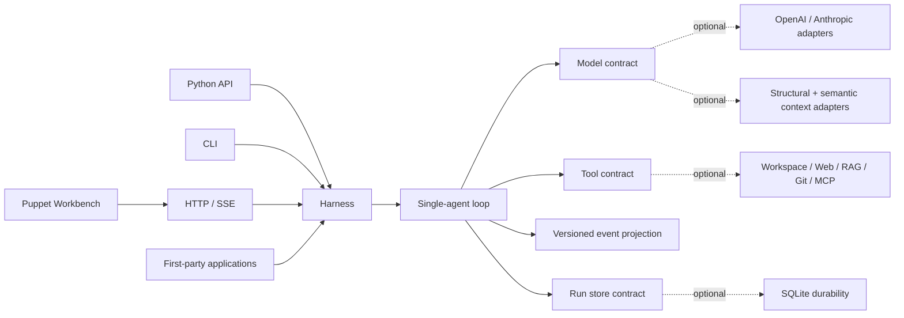
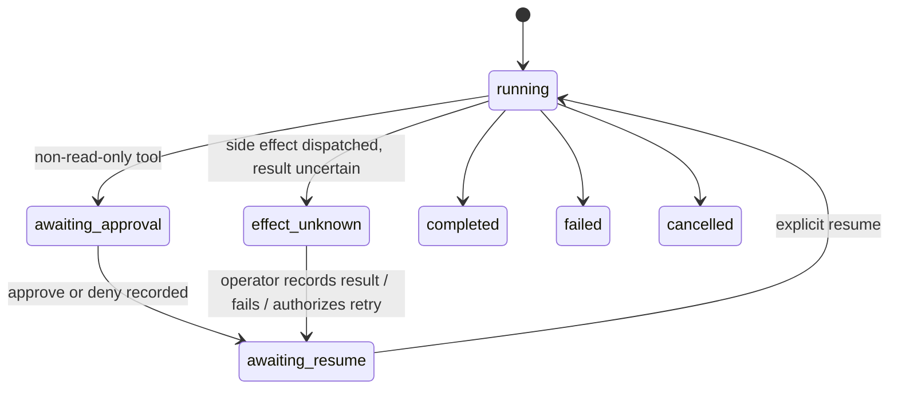

<p align="center">
  
</p>

<p align="center">
  <a href="https://github.com/syusama/sasori/actions/workflows/ci.yml"></a>
  
  
  <a href="https://github.com/syusama/sasori/blob/main/LICENSE"></a>
</p>

<p align="center">
  <a href="https://github.com/syusama/sasori/blob/main/README_zh.md">简体中文</a> ·
  <a href="#thirty-second-start">Quick Start</a> ·
  <a href="https://github.com/syusama/sasori/blob/main/docs/FOUNDATION.md">Architecture</a> ·
  <a href="https://github.com/syusama/sasori/blob/main/docs/BENCHMARK-LEAGENT-TOFU.md">LeAgent / ToFu benchmark</a> ·
  <a href="https://github.com/syusama/sasori/blob/main/docs/RELEASE.md">Release evidence</a>
</p>

## One kernel. Many puppets.

**Sasori is a Python-first framework for tool-using AI agents: a tiny,
inspectable kernel underneath durable runs, explicit effects, optional modules,
and a distinctive local Workbench.**

The name means *scorpion* (蠍). Its puppetcraft metaphor shapes the architecture:
one mechanism controls many replaceable puppets; every thread has an owner;
every dangerous motion stops at a human gate. The visual identity is original
and uses no anime artwork or copied character assets.

Sasori can be a sharp pocket knife—one `Harness`, one model, the tools you
choose—or the kernel beneath applications, plugins, HTTP services, and a rich
UI. Those forms do not fork the runtime. Python, CLI, HTTP, and Workbench all
drive the same single-agent loop.

> Sasori is intentionally honest about its current boundary. It is a strong
> single-machine G1 foundation, not yet a public multi-tenant control plane,
> distributed executor, untrusted-code sandbox, workflow engine, or central
> marketplace. [Current and Next](#current-and-next) are kept visibly separate.

## The ten-second map

| If you care about… | Sasori's answer |
|---|---|
| A core you can read | `sasori` owns contracts, one loop, event projection, and the harness; the core uses only the Python standard library |
| Tool safety | malformed or truncated calls never execute; tool exceptions become explicit results; cancellation is propagated |
| Real side effects | every tool declares `read_only`, `idempotent`, or `side_effecting`; mutable effects require a revision and a human decision |
| Crash ambiguity | dispatch intent is durable; unknown outcomes stop at `effect_unknown` for explicit operator recovery |
| One runtime everywhere | Python, CLI, HTTP, first-party apps, and Workbench converge on `Harness.run()` / `resume()` |
| Context under pressure | deterministic structural projection is the default; an opt-in named compactor selects cold history without splitting tool-call/result atoms, while the durable transcript stays unchanged |
| Durable deliverables | optional `sasori_artifacts` binds immutable bytes, metadata, and a public event to the exact run without enlarging the Loop |
| Small-to-large composition | providers, SQLite, RAG, MCP, Git, workspace tools, apps, catalog, server, and UI stay outside core |
| Evidence, not slogans | deterministic fakes, provider conformance, process-crash tests, live/cold reducer tests, real-browser journeys, package and container gates |
| China-friendly delivery | DaoCloud base image, Tsinghua PyPI default, digest/hash locking, and a real mainland-source container workflow |

## Thirty-second start

Run the deterministic Incident application—no provider key required:

```bash
git clone https://github.com/syusama/sasori.git
cd sasori
python -m pip install -e .
sasori-server --host 127.0.0.1 --port 8080 \
  --db ./sasori-runs.sqlite3 \
  --artifact-root ./sasori-artifacts \
  --app incident=sasori_apps.incident:create_harness \
  --publish-final-artifact \
  --trusted-loopback-no-auth
```

Open **http://127.0.0.1:8080**. Submit an incident, inspect the exact pending
`record_action`, approve it, then explicitly resume. Approval does not execute
the side effect by itself.

`--trusted-loopback-no-auth` is accepted only for an explicit loopback bind.
Use a bearer-token file for normal or container use.

## The smallest useful agent

```python
import asyncio

from sasori import Harness, Message, ModelReply, Tool, ToolCall


def lookup(topic: str) -> str:
    return f"evidence for {topic}"


class DemoModel:
    async def complete(self, messages, tools):
        if messages[-1].role == "user":
            return ModelReply(
                tool_calls=(ToolCall("lookup-1", "lookup", {"topic": "Sasori"}),)
            )
        return ModelReply(content=f"Grounded result: {messages[-1].content}")


async def main():
    with Harness(
        DemoModel(),
        (Tool("lookup", lookup, effect="read_only"),),
    ) as agent:
        result = await agent.run((Message("user", "Research Sasori"),))
    print(result.final_message.content)
    print([event.type for event in result.events])


asyncio.run(main())
```

Synchronous tools run through `asyncio.to_thread`; they do not block the event
loop. A timeout stops Sasori from waiting, but Python cannot forcibly terminate
an arbitrary worker thread or remote model request. Sasori never describes that
as a hard kill.

## Architecture: one line of control



The core owns only the solid path. Dotted modules are replaceable and stay out
of the loop. There is no second “product loop” hidden behind the UI.

## Recovery is a protocol, not a checkbox



Sasori commits a step's revision, accepted model reply, tool ledger,
recoverable checkpoint, and append-only events in one SQLite transaction.
Event sinks run only after commit and are best-effort; consumers repair gaps
with `(run_id, seq)`.

Before a tool invocation, dispatch intent is committed. After restart:

- a committed result is reused;
- ambiguous read-only work may retry;
- idempotent work may retry only with the same key;
- an ordinary side effect pauses as `effect_unknown`;
- an operator must supply the exact fingerprint and audit reason to record a
  verified result, fail, or explicitly authorize a retry.

This is **step-boundary recovery**, not exactly-once execution. Side-effecting
systems still need an idempotency key or a manual-recovery policy. See
[Foundation](https://github.com/syusama/sasori/blob/main/docs/FOUNDATION.md) and the recovery tests for the full contract.

## Compact the view. Keep the record.

**Shorter context. Durable source.** Long histories can opt into a
standard-library-only model adapter:

```python
from sasori_context import BoundedContextModel, ContextBudget, ContextProjector

model = BoundedContextModel(
    provider,
    ContextProjector(
        ContextBudget(max_units=120_000, reserve_units=20_000, hot_turns=2)
    ),
)
```

The default unit is canonical UTF-8 JSON bytes, **not provider tokens**. The
default projector protects leading system messages and recent turns, treats an
assistant tool call plus all matching results as one atom, and fails closed on
orphan or mismatched history. Removed history becomes a deterministic
structural omission marker; vendor-private state is excluded from its public
digest. This path makes no semantic claims.

When explicitly enabled, `SemanticCompactionModel` sends only the selected cold
public projection to a named summarizer with `tools=()`. Sasori accepts one
strict response that echoes the whole-source digest, inserts its free text as a
lossy, unverified assistant note, and remeasures the complete primary request. A
tool call, timeout, refusal,
malformed/oversized output, source mismatch, or final budget overflow fails
closed before the primary model is called. The process-local diagnostic binds
the configured summarizer identity and policy digests, source/summary digests,
canonical source/prompt/summary byte counts, cache state, and failure code; it
is not a durable public event or provider-token bill.

The digest echo proves which whole request produced the note; it does not prove
that any sentence is entailed by the source. Source text can still influence the
summarizer and the note can still influence the primary model. Sasori never
writes the note into approvals or the effect ledger, so every proposed tool call
still crosses the ordinary Harness approval/effect boundary.

The complete durable transcript remains unchanged. This is semantic
compaction, not long-term Memory, lossless compression, or an unlimited context
window. Details: [Context](https://github.com/syusama/sasori/blob/main/docs/CONTEXT.md),
[ADR-0009](https://github.com/syusama/sasori/blob/main/docs/ADR-0009-CONTEXT-PROJECTION-BOUNDARY.md),
and [ADR-0011](https://github.com/syusama/sasori/blob/main/docs/ADR-0011-SEMANTIC-COMPACTION-BOUNDARY.md).

## Immutable artifacts without core bloat

Trusted Python hosts can publish a bounded deliverable after a run exists:

```python
from sasori_artifacts import ArtifactStore

artifacts = ArtifactStore(run_store, "./artifacts")
ref = artifacts.put(
    run_id,
    b'{"status":"ready"}',
    declared_filename="report.json",
    declared_media_type="application/json",
)
```

Blob bytes are finalized by SHA-256 without overwrite. The immutable metadata
row and `artifact.available` event commit together on the run's real durable
cursor. Retries are idempotent; reads verify the opened file's exact size and
digest before success headers. HTTP list/content/HEAD/single-Range routes are
run-scoped, and unknown versus cross-run IDs share the same 404.

The current bearer authenticates one Sasori instance, not a user or tenant.
There is no upload, delete, retention/GC promise, signed sharing grant, or
active-content preview in this slice. See [Artifacts](https://github.com/syusama/sasori/blob/main/docs/ARTIFACTS.md)
and [ADR-0010](https://github.com/syusama/sasori/blob/main/docs/ADR-0010-ARTIFACT-REF-BOUNDARY.md).

## Puppet Workbench

<p align="center">
  
</p>

This image is captured from the production Workbench after a real browser
journey through `sasori.server`, the Incident Harness, SQLite, approval,
explicit resume, one external effect, page reload, and cold-history reopen.
The run has 16 Loop events followed by one host-policy `artifact.available`
event; the artifact card, authenticated preview, download fetch, and cold
reopen are verified in Chrome. It is not a static mockup.

The no-build UI includes:

- fixed first-party application selection and capability availability;
- cursor-paginated durable run history;
- task input, REST/SSE progress, approval/denial, explicit resume, and manual
  effect recovery;
- a live/cold/reconnect-safe timeline driven by one pure reducer;
- run-scoped immutable artifact cards, authenticated UTF-8 text/JSON preview,
  verified download, and stale-response isolation;
- capability, tool effect, plugin identity, and effective host-permission
  disclosure;
- responsive navigation, keyboard focus, reduced-motion behavior, and text-only
  rendering for untrusted model/tool content.

## What ships today

| Surface | Delivered boundary |
|---|---|
| `sasori` | contracts, single-agent Harness/loop, event projection, in-memory store |
| `SQLiteStore` | atomic revisions/checkpoints/events, CAS, restart recovery, one cross-process owner |
| Providers | stdlib OpenAI Responses and Anthropic Messages adapters; strict schema and shared conformance |
| `sasori_context` | deterministic structural projection; opt-in named semantic compactor; source lineage, bounded output/cache/diagnostics, explicit failure |
| `sasori_artifacts` | immutable content-addressed blobs; run/event association; verified list/content/HEAD/Range |
| CLI | run, status, events, approval, explicit resume, manual effect resolution; JSON/JSONL modes |
| HTTP/SSE | local single-owner service, apps, run history, durable event cursors, readiness, Workbench |
| Applications | deterministic Incident; configured Research; configured Developer |
| Plugins | bounded workspace, allowlisted HTTPS fetch, SQLite/FTS5 RAG, local Git, frozen MCP stdio |
| Catalog | strict local curated index and manifest checks; no central marketplace yet |
| Delivery | source, wheel, rebuilt sdist, Compose candidate, SBOM binding, Windows/Linux matrices |

The three applications are compositions, not three engines:

- **Incident Chamber** — deterministic diagnosis and one operator-approved
  local audit action.
- **Research Atelier** — configured provider + allowlisted web evidence +
  citation-preserving SQLite/FTS5 retrieval.
- **Puppet Workshop** — configured provider + bounded workspace tools +
  state-bound local Git + optional frozen MCP tools.

Unavailable configuration is reported as unavailable; Sasori does not silently
replace an app with the demo.

## Providers and tool schemas

`OpenAIResponsesModel` maps the OpenAI Responses API;
`AnthropicMessagesModel` maps Anthropic Messages. Both adapters:

- use only `urllib` and reject redirects, oversized/malformed JSON, and invalid
  SSE sequences;
- disable parallel tool calls and validate returned arguments locally;
- preserve vendor continuation state without exposing reasoning blocks as
  public events;
- pass one shared deterministic conformance suite covering malformed output,
  timeout, rate limit, interrupted stream, duplicate calls, and cancellation.

`stream=True` validates and aggregates an upstream vendor stream; public token
streaming is not yet shipped. Real-provider smoke is claimed only when locally
configured credentials and model names complete a two-turn tool workflow.
Repository CI does not currently claim that credentialed smoke.

## Plugins are capabilities, not magic

Python entry-point plugins are trusted installed code. Importing one gives it
the Sasori process and OS user's full privileges. Manifest permissions are
review/disclosure metadata, not runtime enforcement. The bundled Workbench says
`FULL HOST PROCESS PRIVILEGES` and `enforced=false` for that reason.

The local catalog checks identity, API version, digest, compatibility, execution
mode, permission declarations, and upgrade differences. Bundled applications
compose first-party registrations directly and do not dynamically load external
entry points. `container` and `supervised_process` remain manifest-only modes;
Sasori does not call them sandboxes.

Read the trust records before enabling third-party code:

- [ADR-0001: plugin trust](https://github.com/syusama/sasori/blob/main/docs/ADR-0001-PLUGIN-TRUST.md)
- [ADR-0002: web fetch](https://github.com/syusama/sasori/blob/main/docs/ADR-0002-WEB-FETCH-BOUNDARY.md)
- [ADR-0003: SQLite RAG](https://github.com/syusama/sasori/blob/main/docs/ADR-0003-RAG-SQLITE-BOUNDARY.md)
- [ADR-0004: Git boundary](https://github.com/syusama/sasori/blob/main/docs/ADR-0004-GIT-PLUGIN-BOUNDARY.md)
- [ADR-0005: MCP stdio](https://github.com/syusama/sasori/blob/main/docs/ADR-0005-MCP-STDIO-BOUNDARY.md)
- [ADR-0007: external plugin host](https://github.com/syusama/sasori/blob/main/docs/ADR-0007-TRUSTED-EXTERNAL-PLUGIN-HOST.md)

## CLI and local service

```powershell
sasori --db .\runs.sqlite3 --app sasori_apps.incident:create_harness run "checkout latency is high" --run-id incident-1
sasori --db .\runs.sqlite3 status incident-1
sasori --db .\runs.sqlite3 events incident-1 --after 0
sasori --db .\runs.sqlite3 --app sasori_apps.incident:create_harness approval incident-1 <fingerprint> --approve
sasori --db .\runs.sqlite3 --app sasori_apps.incident:create_harness resume incident-1
```

Exit code `3` means the run durably paused for an explicit next action. Approval
and manual effect decisions never resume implicitly.

`sasori-server` allows one active mutation across all enabled applications; a
second receives `503 runtime_busy` instead of disappearing into an in-memory
queue. File-backed stores hold one cross-process owner lock. Network filesystems,
replicas, failover, public TLS, and horizontal scheduling are not shipped.

The HTTP surface is documented in [HTTP_API.md](https://github.com/syusama/sasori/blob/main/docs/HTTP_API.md).

## Docker: mainland sources, locked integrity

The Compose delivery uses:

- a digest-pinned DaoCloud Python base;
- hash-pinned build requirements from the Tsinghua PyPI mirror;
- a non-root user, read-only root filesystem, dropped capabilities,
  `no-new-privileges`, and bounded resources;
- a local bearer-token file instead of a token in Git or an environment value.

```powershell
$env:SASORI_TOKEN_FILE = "C:\secure-local-path\sasori-token"
$env:SASORI_PORT = "18888"
docker compose up -d --build --wait
```

On native Linux, keep the token owned by the operator and a dedicated group at
mode `0640`, then set `SASORI_TOKEN_GID` to that numeric group. Compose file
secrets are bind mounts and cannot remap host ownership. See
[Release and container gates](https://github.com/syusama/sasori/blob/main/docs/RELEASE.md) for the exact workflow.

## Tests are the product contract

```powershell
$env:PYTHONPATH = "src"
python -m unittest discover -s tests -v
node --test tests/workbench_event_reducer.test.cjs
python tests/workbench_browser_acceptance.py --require-browser
python tests/workbench_browser_journey.py --require-browser
```

The browser journey can also regenerate the README product evidence after a UI
change:

```powershell
python tests/workbench_browser_journey.py --require-browser `
  --screenshot docs/assets/workbench.png
```

The latest Hosted-verified main baseline,
[`8751b4e`](https://github.com/syusama/sasori/commit/8751b4edd8998493e25e1afc826a9832ac9b6206),
passed [Hosted run 31306732164](https://github.com/syusama/sasori/actions/runs/31306732164):

- Ubuntu + Windows × Python 3.11, 3.12, and 3.13 source matrix, including
  Semantic Compaction cancellation, deadline, cache-race, and failure contracts;
- installed-wheel and rebuilt-sdist matrices;
- package verification, with the exact-tag release bundle correctly skipped on
  this ordinary `main` push;
- mainland-source image build and real Compose workflow/restart/owner lock,
  including run-scoped artifact GET/HEAD/Range and same-size tamper rejection;
- SBOM generation, image binding, and audited evidence upload;
- delayed-response UI race acceptance and a real 17-event Artifact-enabled
  Incident lifecycle in Chrome on Ubuntu/Python 3.12.

That main-branch run did **not** create a tag, signed attestation, or final release
bundle. Exact-tag provenance remains a separate release gate.

The run verifies Semantic Compaction's deterministic protocol and integration
gates. It is **not** evidence of real OpenAI/Anthropic summary quality, factual
recall, unsupported-claim or contradiction rates, provider token usage, billing,
or cost savings; those credentialed evaluations remain open.

## Current and Next

| Current — usable and tested | Next — not claimed yet |
|---|---|
| Tiny standard-library core | Artifact access grants, version lineage, and lifecycle/GC |
| Immutable run-scoped ArtifactRef + safe text/JSON preview | Safe PDF/image preview after dedicated content-validation gates |
| Single-agent loop and one runtime path | Durable bounded Memory with scoped, versioned retrieval |
| Versioned durable events and pure UI reducer | Dynamic skill selection and reviewed marketplace |
| Approval, effect fingerprints, crash ambiguity recovery | Typed Workflow on the same tool/effect contracts |
| OpenAI + Anthropic conformance | More providers after the shared suite passes |
| Structural projection + opt-in whole-request-bound unverified compaction note | Project Charter/Board and multi-agent orchestration |
| CLI, local HTTP/SSE, three app compositions, Workbench | Safe versioned GenUI and richer product surfaces |
| Single-owner SQLite/Compose delivery | Leased durable executor and genuine isolation boundary |

The complete source-grounded comparison, anti-patterns, P0/P1/P2 order, and
acceptance gates are in
[Sasori × LeAgent × ToFu](https://github.com/syusama/sasori/blob/main/docs/BENCHMARK-LEAGENT-TOFU.md).

## Design laws

1. **One loop.** Adapters and products may compose it; none may fork it.
2. **Durable before visible.** Public progress never outruns committed truth.
3. **Effects are explicit.** Read-only, idempotent, and side-effecting work have
   different retry and recovery rights.
4. **Invalid means inert.** A truncated or structurally invalid tool call never
   executes.
5. **Core stays small.** Provider SDKs, persistence, HTTP, RAG, orchestration,
   UI, and marketplace logic remain outside it.
6. **Trust is named.** Path containment is not a sandbox; entry points are
   trusted code; cancellation is cooperative.
7. **Evidence beats adjectives.** A feature is shipped when its real path and
   failure path pass a runnable acceptance gate.

## Contributing

Sasori is building a small kernel and a large ecosystem in that order. Good
contributions include:

- a regression that makes a recovery invariant executable;
- a provider adapter that passes the shared conformance suite;
- an extension that stays outside core and declares its trust boundary;
- a first-party app or curated plugin with deterministic acceptance;
- accessibility, responsive, visual, or real-browser improvements to the
  Puppet Workbench.

Read [AGENTS.md](https://github.com/syusama/sasori/blob/main/AGENTS.md), the relevant ADRs, and
[Foundation](https://github.com/syusama/sasori/blob/main/docs/FOUNDATION.md) before changing public events, recovery,
golden traces, or plugin permissions.

## Security and license

Report vulnerabilities through the private path in [SECURITY.md](https://github.com/syusama/sasori/blob/main/SECURITY.md).
Sasori code and first-party assets use the [MIT License](https://github.com/syusama/sasori/blob/main/LICENSE), subject to
the origin and license boundaries in
[THIRD_PARTY_NOTICES.md](https://github.com/syusama/sasori/blob/main/THIRD_PARTY_NOTICES.md).
