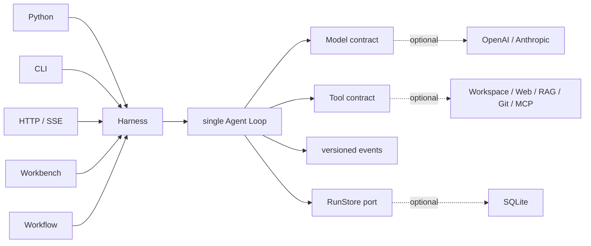

<h1 align="center">Sasori</h1>

<p align="center"><strong>小さな Python Agent ランタイムから始め、必要なときだけ完全なフレームワークへ。</strong></p>

<p align="center">
  <a href="https://github.com/syusama/sasori/blob/main/README.md">English</a> ·
  <a href="https://github.com/syusama/sasori/blob/main/README_zh.md">简体中文</a> ·
  <a href="https://github.com/syusama/sasori/blob/main/README_ja.md"><strong>日本語</strong></a> ·
  <a href="https://github.com/syusama/sasori/blob/main/README_ko.md">한국어</a>
</p>

<p align="center">
  <a href="https://github.com/syusama/sasori/actions/workflows/ci.yml"></a>
  
  
  
  <a href="https://github.com/syusama/sasori/blob/main/LICENSE"></a>
</p>

<p align="center">
  
</p>

Sasori は、Tool を利用する Agent のための Python-first フレームワークです。
最小構成は、先頭から末尾まで読める依存ゼロの Loop/Harness です。製品に機能が
必要になったときだけ、同じランタイムに Provider、SQLite、Plugin、Workflow、
Memory、Artifact、HTTP/SSE、レスポンシブな Workbench を追加できます。UI の
背後に別の実行エンジンは存在しません。

Sasori という名前には、意図的な設計上の比喩もあります。サソリが多様な傀儡を
自在かつ精密に操るように、開発者は Model、Tool、Skill、Memory、Workflow を
柔軟に組み合わせられるべきです。目指すのはキャラクター風の UI ではなく、各
Agent を工学的な芸術作品として磨くことです。モジュール化され、表現力があり、
信頼でき、長く使える仕組みを作ります。

> **現在の境界:** `0.1.0.dev1` は、検証済みの single-machine / single-owner
> prerelease candidate です。公開 multi-tenant control plane、分散 executor、
> untrusted-code sandbox、公開 plugin market ではありません。パッケージ公開は
> 一時停止中のため、現時点では checkout からインストールしてください。

## なぜ Sasori なのか

> **一言でいえば、小さな Core、一本の実行経路、信頼できる実行です。**

Sasori は Model、Tool、Skill、Memory、Workflow を、一つの読みやすい Runtime の
周りで交換・組み合わせできる能力として扱います。小さな Python Agent なら
`sasori-core` だけを使い、必要になった時点で、すでにテストされた実行 Engine を
置き換えることなく完全な Framework へ拡張できます。

| 本当に重要なこと | Agent Framework が直面しやすい課題 | Sasori の既定値 |
|---|---|---|
| **サイズ** | Integration を増やすたびに中央の Agent object が肥大化する | 実行時依存ゼロの小さな Core は所有範囲を限定し、製品機能は着脱・交換可能なまま Core 外に置く |
| **一貫性** | Python、Server、Workflow、UI が少しずつ別の規則を持つ | すべての Adapter が一つの Harness と一つの Loop を共有し、共通境界の修正が全 Surface に反映される |
| **Tool の安全性** | 途中までの出力や構造不正な Model 出力が実コードに届く | 完全かつ構造的に正しい Tool call だけを実行し、Runtime 予約引数の偽装も fail closed で拒否する |
| **現実の副作用** | Timeout や Retry を、外部操作が停止・失敗した証拠と誤認する | Tool は `read_only`、`idempotent`、`side_effecting` を宣言し、Approval、明示的 Resume、`effect_unknown` Recovery を別々の事実として扱う |
| **リアルタイム体験** | Streaming progress を実行事実のように永続化・Replay する | 境界付き Model/Tool progress は transient、versioned public event と Checkpoint だけが durable truth になる |
| **製品への成長** | 洗練された UI の裏に第二の Agent 実装が生まれる | CLI、HTTP/SSE、Workflow、Workbench は同じ Runtime と public projection を消費する |

違いは単純です。多くの Framework が、Agent が「いくつの機能を呼べるか」を
先に最適化するのに対し、Sasori は各呼び出しが完全で、正当で、承認済みで、
Commit され、復旧可能であり、事実どおりに表現されているかを先に確立します。
そのため、Developer Agent、運用 Automation、長時間 Tool、そして File、Git、
Database、Browser、外部 API を実際に操作する業務 Workflow に適しています。

Sasori は現時点で、最大の Integration ecosystem、成熟した公開 Multi-Agent
orchestration、Community plugin market を持つとは主張しません。現在の強みは
より根本的です。**軽く始め、必要な機能だけを追加し、Application が成長しても
一つの監査可能な実行 Contract を守り続けます。**

## 二つの配布物、一つのランタイム

| | `sasori-core` | `sasori` |
|---|---|---|
| Import | `sasori_core` | `sasori` と optional top-level modules |
| 用途 | canonical single-agent runtime の埋め込み | batteries-included Agent application の構築 |
| 所有範囲 | Contract、Loop/Harness、versioned projection、`RunStore`、ephemeral store、test helper | 同一バージョンの Core に SQLite、Provider、CLI、HTTP/SSE、Plugin、Workflow、Memory、Artifact、App、Workbench、market scaffolding を追加 |
| 実行時依存 | **0** | `sasori-core==0.1.0.dev1` に厳密依存。first-party 機能は標準ライブラリを優先 |
| Core の外に置くもの | Provider SDK、永続化、HTTP、RAG、multi-agent、UI、marketplace | 重複 Loop も shadow Harness も持たない |

配布名と import 名は明確に分けています。

```text
PyPI distribution: sasori-core       Python import: sasori_core
PyPI distribution: sasori            Python import: sasori
```

現在の candidate は repository からインストールします。

```bash
# 最小ランタイム
python -m pip install ./packages/sasori-core

# 完全なフレームワーク
python -m pip install ./packages/sasori-core
python -m pip install --no-deps .
```

## 30 秒で動く Agent

```python
import asyncio

from sasori_core import Harness, Message, ModelReply, Tool, ToolCall


def inspect(topic: str) -> str:
    return f"verified evidence for {topic}"


class DemoModel:
    async def complete(self, messages, tools):
        if messages[-1].role == "user":
            return ModelReply(
                tool_calls=(ToolCall("inspect-1", "inspect", {"topic": "Sasori"}),)
            )
        return ModelReply(content=f"Grounded: {messages[-1].content}")


async def main():
    with Harness(
        DemoModel(),
        (Tool("inspect", inspect, effect="read_only"),),
    ) as agent:
        result = await agent.run((Message("user", "Inspect the runtime"),))
    print(result.final_message.content)


asyncio.run(main())
```

complete-only Model が最小 contract です。Streaming は optional かつ
provider-neutral。途中で切れた、過大な、構造不正な、または未完了の Tool Call は
fail closed となり、実行されません。

## 一本の制御経路



実線が `sasori-core` です。点線はすべて交換可能で、Core の外に留まります。

## Workbench は実物です

以下は runtime commit
[`71993de`](https://github.com/syusama/sasori/commit/71993de377a837c85c6cba5bcbf83a36228a1dc2)
の実 Sasori Server から取得した画像です。Browser journey は SQLite、approval、
explicit resume、二つの監査済み副作用、cold-history reconstruction、Artifact、
capability projection、strict Workflow preflight、durable Catalog save を通過します。
各画像の寸法、byte 数、SHA-256、browser version、scenario は
[screenshot manifest](docs/assets/screenshots-manifest.json) に記録しています。

<p align="center">
  
</p>

<p align="center"><sub>完了した typed Workflow。検証済み出力、definition identity、effective capability boundary を同時に確認できます。</sub></p>

<p align="center">
  
</p>

<p align="center"><sub>Workflow Studio は strong-ETag CAS で immutable revision を保存し、model call も Tool dispatch も行わず server-authoritative preflight を実行します。</sub></p>

<table>
  <tr>
    <td width="50%" align="center"></td>
    <td width="50%" align="center"></td>
  </tr>
  <tr>
    <td align="center"><sub>Task workspace · 正確な 390×844 CSS viewport</sub></td>
    <td align="center"><sub>Capability inspector · 正確な 390×844 CSS viewport</sub></td>
  </tr>
</table>

Proma は information architecture、workspace density、three-pane interaction
の benchmark です。Sasori の no-build frontend、CSS、copy、logo、screenshot、
asset は Sasori 自身の contract に対して独立実装されており、Proma の AGPL source
や asset は再利用していません。

## 現在含まれているもの

| Surface | この candidate で提供済み |
|---|---|
| Core | 依存ゼロの contract、Loop/Harness、strict streaming settlement、approval/recovery、`RunStore`、ephemeral storage、stable public projection、deterministic fake |
| Durability | SQLite revision、event、checkpoint、restart recovery、CAS、single-owner admission |
| Providers | 標準ライブラリ実装の OpenAI Responses / Anthropic Messages adapter と共通 wire-conformance test |
| Context & Memory | bounded context と、独立した fixed-scope / immutable-revision SQLite Memory extension |
| Tools & Plugins | Workspace、allowlisted HTTPS、SQLite/FTS5 RAG、local Git、frozen MCP stdio、trusted entry-point discovery、permission disclosure |
| Workflow | strict static serial definition、zero-execution preflight、immutable saved revision、CAS conflict reconciliation、単一 Harness execution path |
| Product | Python API、CLI、HTTP/SSE、Incident/Research/Developer app、Artifact、responsive Workbench、market scaffolding |

詳細は [Foundation](docs/FOUNDATION.md)、[HTTP API](docs/HTTP_API.md)、
[Providers](docs/PROVIDERS.md)、[Workflow](docs/WORKFLOWS.md)、
[Memory](docs/MEMORY.md)、[Artifacts](docs/ARTIFACTS.md)、
[Pi/Proma benchmark](docs/BENCHMARK-PI-PROMA.md) を参照してください。

## ランタイム保証

- Public event は versioned semantic projection であり、mutable internal state の
  dump ではありません。
- Tool は `read_only`、`idempotent`、`side_effecting` のいずれかです。危険な
  操作は明示的な approval と resume boundary を通ります。
- Tool exception は明示的な Tool Result Error になります。Cancellation は
  伝播され、握りつぶされません。
- Checkpoint/resume は step-boundary recovery です。副作用 Tool には
  idempotency key または明示的な manual-recovery policy が必要です。
- Third-party Python entry point は trusted host code であり、sandbox ではありません。
- Mutable input は durable argument、approval、retry、他の Store adapter の view
  を書き換えられません。

## 形容詞より先に証拠

現在の runtime snapshot は次を通過しています。

- `546` deterministic `unittest`。Windows で必要な権限がない場合は `5` 件の
  symlink test を skip。
- 1600×1000、390×844、360×800、reduced-motion、narrow structured result を
  含む `31 / 31` 件の real Chrome Workbench acceptance。
- approval、explicit resume、厳密に二つの監査済み副作用、cold history、Artifact、
  typed Workflow、saved Catalog を含む real-server browser journey。
- original wheel、rebuilt sdist、exact bundle/core、installed distribution verification。
- 中国本土 mirror を利用した Docker build と real non-root container workflow。

生成された plan、self-test、きれいな screenshot、upstream README は release authority
ではありません。実行可能な acceptance evidence が gate です。

## 比較して学ぶ。コピーはしない

- **Pi** — 読みやすい Loop と規律ある Tool/Event ordering。Sasori は依存ゼロの
  Python Core、実行可能 Harness、strict terminal settlement、明示的 recovery
  boundary を維持します。
- **Proma** — product density と workspace discoverability。architecture と interaction
  だけを学び、AGPL source や asset はコピーしません。
- **LeAgent / ToFu** — 有用な product breadth と runtime idea。Sasori は effect
  ambiguity、projection ownership、package boundary、evidence gate をより厳密にします。

固定 commit、evidence、license boundary は [Pi / Proma](docs/BENCHMARK-PI-PROMA.md)、
[LeAgent / ToFu](docs/BENCHMARK-LEAGENT-TOFU.md)、
[third-party notices](THIRD_PARTY_NOTICES.md) に記載しています。

## Roadmap — 未提供

- 署名付き plugin provenance、compatibility policy、governed public market。
- tenant identity、authorization、quota、durable queue、distributed worker。
- CPU、memory、filesystem、egress policy を明示した untrusted Tool isolation。
- effect、cancellation、approval、replay semantics の実証後に DAG/parallel Workflow
  と multi-agent orchestration。
- 同じ canonical runtime 上の team workspace と digital employee。

## 名前の由来と独立性

Sasori という名前は、『NARUTO -ナルト-』の傀儡師サソリから着想を得ています。
精密な技、組み替え可能な仕組み、長く残る作品への志向。その関連は project name、
この短い説明、project owner 提供の brand asset に限られ、Workbench の visual
theme ではありません。

Sasori は独立した open-source project です。『NARUTO -ナルト-』、岸本斉史、集英社、
テレビ東京、Studio Pierrot、その他の権利者との提携、許諾、スポンサー関係、推奨関係は
ありません。Project Logo は project owner から提供された branding 用素材です。本 repository
は公式素材であるとは表明せず、そこに含まれる第三者の権利を Sasori が所有するとも
主張しません。

## License と contribution

Sasori code は [MIT License](LICENSE) で提供されます。Third-party plugin はそれぞれの
license を保持し、trusted host code として実行されます。Security boundary は
[SECURITY.md](SECURITY.md) を参照してください。Public event、recovery semantics、
golden trace、plugin permission を変更する場合は、decision record と実行可能な
regression evidence を添付してください。

**小さく始める。製品が必要とする機能だけを加える。重要な動作を常に検証可能にする。**
