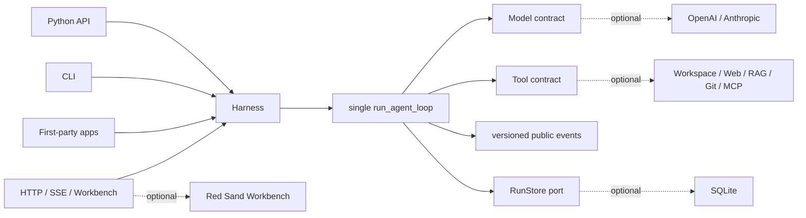

<p align="center">
  
</p>

<p align="center">
  <a href="https://github.com/syusama/sasori/actions/workflows/ci.yml"></a>
  
  
  
  <a href="https://github.com/syusama/sasori/blob/main/LICENSE"></a>
</p>

<p align="center">
  <a href="https://github.com/syusama/sasori/blob/main/README.md">English</a> ·
  <a href="https://github.com/syusama/sasori/blob/main/README_zh.md">简体中文</a> ·
  <strong>日本語</strong> ·
  <a href="https://github.com/syusama/sasori/blob/main/README_ko.md">한국어</a>
</p>

<h1 align="center">一つの核、多彩な傀儡。</h1>

<p align="center"><strong>最初から最後まで読める小さな Python Agent カーネル。二重のランタイムを作らず、美しく総合的な AI ワークベンチへ成長できます。</strong></p>

Sasori は、鋭い小道具であると同時に拡張可能な傀儡工房です。最小構成は、実行時
依存ゼロの Loop/Harness、モデル一つ、必要な Tool だけ。必要になった時に SQLite、
Provider、Plugin、Workflow、Memory、Artifact、HTTP/SSE、Workbench を装着します。
Python、CLI、HTTP、UI はすべて同じ糸、同じランタイムを動かします。

名前の着想は、『NARUTO -ナルト-』に登場する傀儡師・サソリです。精密な仕掛け、
交換可能な武装、そして永遠に残る芸術への執念。その発想をキャラクター画像ではなく
ソフトウェア設計へ翻訳しました。**核は読みやすく、部品は着脱可能で、危険な糸は
すべて見え、結果は検証可能な証拠として残る。**

> 現在の境界：Sasori は検証済みの単一マシン・単一 owner 向けプレリリース候補です。
> 公開マルチテナント基盤、分散実行系、未信頼コード用サンドボックス、中央 Plugin
> Market はまだ提供していません。

## 二つの配布物、一つの機構

| | `sasori-core` | `sasori` |
|---|---|---|
| Import | `sasori_core` | `sasori` とオプションモジュール |
| 目的 | 正式な単一 Agent ランタイムの組み込み | フルスタックのフレームワーク構成 |
| 所有範囲 | contracts、唯一の Loop/Harness、versioned projection、storage-neutral `RunStore`、`EphemeralRunStore`、test helpers | 同一バージョンの core、SQLite、Provider、CLI、HTTP/SSE、Plugin、Workflow、Memory、Artifact、App、Workbench、Market scaffold |
| 実行時依存 | **0** | `sasori-core==0.1.0.dev1` を厳密に固定 |
| 持たないもの | Provider SDK、DB、HTTP、RAG、multi-agent、UI、market | 二つ目の Loop や shadow Harness は禁止 |

```text
PyPI distribution: sasori-core       Python import: sasori_core
PyPI distribution: sasori            Python import: sasori
```

`0.1.0.dev1` が Hosted CI と TestPyPI の gate を完了するまでは、checkout から候補を
インストールしてください。

```bash
# 最小構成
python -m pip install ./packages/sasori-core

# 完全構成
python -m pip install ./packages/sasori-core
python -m pip install --no-deps .
```

## 30 秒の core

```python
import asyncio

from sasori_core import Harness, Message, ModelReply, Tool, ToolCall


def inspect(topic: str) -> str:
    return f"verified evidence for {topic}"


class DemoModel:
    async def complete(self, messages, tools):
        if messages[-1].role == "user":
            return ModelReply(
                tool_calls=(ToolCall("inspect-1", "inspect", {"topic": "Sasori"}),)
            )
        return ModelReply(content=f"Grounded: {messages[-1].content}")


async def main():
    with Harness(
        DemoModel(),
        (Tool("inspect", inspect, effect="read_only"),),
    ) as agent:
        result = await agent.run((Message("user", "Inspect the mechanism"),))
    print(result.final_message.content)


asyncio.run(main())
```

`complete()` だけが最小 contract です。streaming は任意かつ provider-neutral で、
文法は厳密です。

```text
start → deltas* → done / error / aborted のどれか一つ → iterator end
```

途中で切れた Tool call、partial のみ、上限超過、不正 UTF-8、過深・循環・構造不正の
arguments は fail closed し、絶対に実行されません。

## コンセプト画像ではない、本物の Workbench

以下の画像は、runtime commit
[`b10b787`](https://github.com/syusama/sasori/commit/b10b787f93f2b5d29cd35c30dee17bbdc9e4de7b)
から起動した実サービスを実ブラウザで操作して取得しました。SQLite、human approval、
explicit resume、監査可能な side effect、cold history、Artifact 検証、capability
projection、Workflow preflight、durable Catalog save を通過しています。各画像の
commit、要求 viewport、実ピクセル、bytes、SHA-256 は
[screenshot manifest](docs/assets/screenshots-manifest.json) に固定されています。

<p align="center">
  
</p>

<table>
  <tr>
    <td width="50%"></td>
    <td width="50%"></td>
  </tr>
  <tr>
    <td align="center"><sub>承認は意図を記録するだけで、effect を実行しません。</sub></td>
    <td align="center"><sub>明示的な resume の後だけ機構が動きます。</sub></td>
  </tr>
  <tr>
    <td></td>
    <td></td>
  </tr>
  <tr>
    <td align="center"><sub>strict JSON、immutable revision、strong-ETag CAS、実行数 0。</sub></td>
    <td align="center"><sub>Skill、Tool、MCP、Provider、Plugin、実際の trust boundary。</sub></td>
  </tr>
  <tr>
    <td></td>
    <td></td>
  </tr>
</table>

<table>
  <tr>
    <td width="50%" align="center"></td>
    <td width="50%" align="center"></td>
  </tr>
</table>

オリジナルの visual language は **Red Sand Atelier / 赤砂機関工房**。黒漆、真鍮、
朱砂、校正目盛り、傀儡の糸、不変の巻物で構成しています。Proma は product density
と 3-pane workflow の benchmark ですが、AGPL source、CSS、文章、Logo、画像、asset
は一切コピーしていません。

## 制御線は一本だけ



実線だけが `sasori-core` です。点線の module はすべて交換可能で core の外側にあり、
UI の背後に二つ目の product Loop は存在しません。

## 守るべき invariant

- **唯一の Loop/Harness：** Python、CLI、HTTP、Workflow、UI は同じ runtime path。
- **Event は projection：** mutable internal state の dump ではなく、versioned semantic fact。
- **Effect は明示：** Tool は `read_only` / `idempotent` / `side_effecting` を宣言し、
  非 read-only call は revision と approval を通過。
- **Approval ≠ execution：** 承認/拒否を commit した後、operator が明示的に resume。
- **正直な recovery：** checkpoint は step-boundary recovery。exactly-once ではありません。
  不明な外部 effect は fingerprint-bound manual recovery で停止。
- **Cooperative cancellation：** cancellation を伝播しても、remote model や同期 thread を
  強制停止したとは主張しません。
- **Plugin trust を可視化：** installed Python entry point は trusted host code であり
  sandbox ではありません。MCP は server-owned transport metadata で分類します。
- **状態を detach：** mutable input が durable arguments、approval、retry、別 store の
  view を書き換えることはできません。

## 現在の候補で提供するもの

| Surface | 提供済みの境界 |
|---|---|
| Core | zero-dependency contracts、Loop/Harness、strict streaming、approval/recovery、`RunStore`、ephemeral store、stable projection、test helpers |
| Durability | SQLite revision/event/checkpoint/CAS、restart recovery、single-owner admission |
| Provider | standard-library OpenAI Responses / Anthropic Messages adapter、shared conformance |
| Context / Memory | bounded structural / optional semantic context、固定 scope・immutable revision の別 SQLite Memory、Harness-gated writes |
| Tool / Plugin | workspace、allowlisted HTTPS、SQLite/FTS5 RAG、local Git、frozen MCP stdio、entry-point discovery、permission disclosure |
| Workflow | strict static serial definition、zero-execution authoritative preflight、immutable saved revision、CAS reconciliation、one Harness path |
| Product | CLI、HTTP/SSE、Incident、設定式 Research/Developer、Artifact、responsive Workbench、marketplace scaffold |

詳細は [Foundation](docs/FOUNDATION.md)、[HTTP API](docs/HTTP_API.md)、
[Workflow](docs/WORKFLOWS.md)、[Memory](docs/MEMORY.md)、
[Artifacts](docs/ARTIFACTS.md)、[Pi/Proma benchmark](docs/BENCHMARK-PI-PROMA.md) を参照してください。

## 形容詞より先に証拠を

現在の runtime snapshot は次を通過しています。

- deterministic `unittest` `531` 件（Windows の symlink privilege がない場合は関連 `5` 件を skip）
- desktop / narrow / reduced-motion で browser acceptance `30 / 30`
- approval、resume、Workflow、Catalog、history、Artifact、permission を含む実 server journey `3 / 3`
- DaoCloud の digest-pinned Python image と Tsinghua PyPI index を使う中国本土向け Docker build、non-root container workflow
- original core wheel、rebuilt core sdist、exact bundle + core wheel、locked bundle sdist rebuild の clean-install roundtrip

README metadata は bundle wheel の bytes を変えるため、ここに古くなる最終 hash は載せません。
[Release gate](docs/RELEASE.md) が Hosted CI、TestPyPI、tag より前に正確な artifact を再構築し、
source と結び付けます。テストが release authority です。

## 強い実装を学び、コピーしない

- **Pi**（MIT、固定 commit）：読みやすい Loop と Tool/Event ordering を学びつつ、Sasori は
  zero-dependency Python core、実行可能 Harness、厳密な stream termination、explicit recovery を提供。
- **Proma**（AGPL-3.0-only、固定 commit）：3-pane workbench と Workflow discoverability を
  benchmark にし、Sasori 独自の event contract と visual system で実装。
- **LeAgent / ToFu：** product breadth と durable runtime の知見を取り込み、effect ambiguity、
  projection ownership、package boundary、evidence gate を強化。

根拠と license は [Pi / Proma](docs/BENCHMARK-PI-PROMA.md)、
[LeAgent / ToFu](docs/BENCHMARK-LEAGENT-TOFU.md)、
[Third-party notices](THIRD_PARTY_NOTICES.md) にあります。

## 次の機構 — 未提供

- signed plugin provenance、compatibility policy、governed public market
- tenant identity、authorization、quota、durable queue、distributed worker
- CPU / memory / filesystem / egress policy を検証できる untrusted tool isolation
- effect、cancel、approval、replay contract を先に証明した後の DAG、parallel Workflow、multi-agent orchestration
- team、digital employee、desktop-grade product。ただし canonical Loop は一つのまま

## 名称・創作・権利について

Sasori は独立したオープンソースプロジェクトです。『NARUTO -ナルト-』、岸本斉史、
集英社、テレビ東京、Studio Pierrot その他の権利者との公式な提携、許諾、協賛、推薦は
ありません。本リポジトリが使用するのは、独自に制作した抽象的な機械サソリ、傀儡の糸、
機構、精密さ、着脱可能な module、赤砂、「永遠に残る芸術」という比喩のみです。公式の
キャラクター画像、アニメ frame、衣装造形、Logo、台詞、font は使用しません。正式公開前に
別途、名称と商標の調査が必要です。

## License と contribution

Sasori code は [MIT License](LICENSE) です。third-party plugin は各自の license を維持し、
trusted code として動作します。security boundary は [SECURITY.md](SECURITY.md) に記載。
public contract を変更する contribution には decision record と実行可能な acceptance evidence が必要です。

**傀儡を造る。糸を隠さない。結果を永く残す。**
