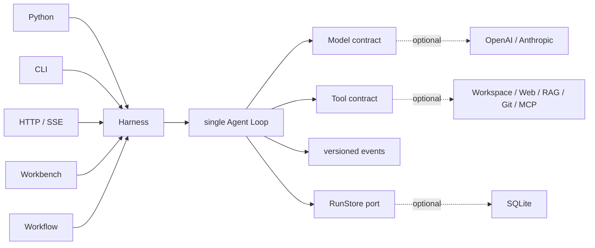

<h1 align="center">Sasori</h1>

<p align="center"><strong>精密な実行、自由な構成、持続的な進化のための Python Agent Framework。</strong></p>

<p align="center">
  <a href="https://github.com/syusama/sasori/blob/main/README.md">English</a> ·
  <a href="https://github.com/syusama/sasori/blob/main/README_zh.md">简体中文</a> ·
  <a href="https://github.com/syusama/sasori/blob/main/README_ja.md"><strong>日本語</strong></a> ·
  <a href="https://github.com/syusama/sasori/blob/main/README_ko.md">한국어</a>
</p>

<p align="center">
  <a href="https://github.com/syusama/sasori/actions/workflows/ci.yml"></a>
  
  
  
  <a href="https://github.com/syusama/sasori/blob/main/LICENSE"></a>
</p>

<p align="center">
  
</p>

Sasori は、成長しても明快さ、制御性、信頼性を失わない Tool 利用型 Agent のための
Python-first Framework です。中心にある `sasori-core` は、先頭から末尾まで読める
実行時依存ゼロの Loop/Harness。その周囲に Provider、SQLite、Plugin、Workflow、
Memory、Artifact、HTTP/SSE、レスポンシブな Workbench がそろい、すべてが同じ
実行 Contract で動きます。

Sasori という名前には、明確な設計思想があります。サソリが多様な傀儡を自在かつ
精密に操るように、開発者は Model、Tool、Skill、Memory、Workflow を自由に
組み合わせられます。各機能は着脱可能で、それらを統率する知性は常に正確です。
Sasori が目指すのはキャラクター風の UI ではなく、一つひとつの Agent を工学的な
芸術作品として磨き上げること。明快で、表現力があり、監査でき、長く使える設計です。

## なぜ Sasori なのか

> **一言でいえば、小さな Core、一本の実行経路、信頼できる実行です。**

Sasori は Model、Tool、Skill、Memory、Workflow を、一つの読みやすい Runtime の
周りで交換・組み合わせできる能力として扱います。小さな Python Agent なら
`sasori-core` だけを使い、必要になった時点で、すでにテストされた実行 Engine を
置き換えることなく完全な Framework へ拡張できます。

| 設計軸 | Sasori Standard | 開発者が得られるもの |
|---|---|---|
| **生まれつき軽量** | 実行時依存ゼロの Core が責務を厳密に限定 | 数秒で始め、全体を理解し、製品に必要な機能だけを装着できる |
| **一本の実行経路** | Python、CLI、HTTP/SSE、Workflow、Workbench が一つの Harness と Loop を共有 | すべての入口で Event、Approval、Recovery の意味が一致する |
| **Tool Safety** | 完全かつ構造的に正しい Tool Call だけを実行し、予約引数の偽装は fail closed | 壊れた Model 出力が現実の操作に化けることがない |
| **Effect Integrity** | Tool は `read_only`、`idempotent`、`side_effecting` を宣言し、Approval、Resume、`effect_unknown` を明示 | Timeout、Retry、Cancellation、Recovery を越えても外部操作を追跡できる |
| **速さと正確さ** | Model/Tool progress は transient、versioned event と Checkpoint が durable truth | 滑らかな Streaming UX と正確な Audit/Replay を同時に実現 |
| **製品級の成長** | すべての Adapter が同じ public projection を利用 | 小さな Script から完成度の高い製品まで Engine を移行せずに進化できる |

Sasori では、機能の豊富さが実行の明快さを損なうことはありません。すべての呼び出しを
検証し、すべての副作用を分類し、Approval を明示し、永続化された遷移を追跡できます。
軽快な Developer Tool、長時間動く運用 Agent、File、Git、Database、Browser、外部
API を扱う本格的な業務 Workflow まで、一つの Runtime で支えます。

**一振りのメスから始め、完全な Studio へ。最初の Tool Call から製品完成まで、
同じ信頼できる Runtime を使い続けます。**

## 二つの配布物、一つのランタイム

| | `sasori-core` | `sasori` |
|---|---|---|
| Import | `sasori_core` | `sasori` と optional top-level modules |
| 用途 | canonical single-agent runtime の埋め込み | batteries-included Agent application の構築 |
| 所有範囲 | Contract、Loop/Harness、versioned projection、`RunStore`、ephemeral store、test helper | 同一バージョンの Core に SQLite、Provider、CLI、HTTP/SSE、Plugin、Workflow、Memory、Artifact、App、Workbench を追加 |
| 実行時依存 | **0** | `sasori-core==0.1.0.dev1` に厳密依存。first-party 機能は標準ライブラリを優先 |
| Core の外に置くもの | Provider SDK、永続化、HTTP、RAG、multi-agent、UI、marketplace | 重複 Loop も shadow Harness も持たない |

配布名と import 名は明確に分けています。

```text
PyPI distribution: sasori-core       Python import: sasori_core
PyPI distribution: sasori            Python import: sasori
```

Repository から直接インストールできます。

```bash
# 最小ランタイム
python -m pip install ./packages/sasori-core

# 完全なフレームワーク
python -m pip install ./packages/sasori-core
python -m pip install --no-deps .
```

## 30 秒で動く Agent

```python
import asyncio

from sasori_core import Harness, Message, ModelReply, Tool, ToolCall


def inspect(topic: str) -> str:
    return f"verified evidence for {topic}"


class DemoModel:
    async def complete(self, messages, tools):
        if messages[-1].role == "user":
            return ModelReply(
                tool_calls=(ToolCall("inspect-1", "inspect", {"topic": "Sasori"}),)
            )
        return ModelReply(content=f"Grounded: {messages[-1].content}")


async def main():
    with Harness(
        DemoModel(),
        (Tool("inspect", inspect, effect="read_only"),),
    ) as agent:
        result = await agent.run((Message("user", "Inspect the runtime"),))
    print(result.final_message.content)


asyncio.run(main())
```

complete-only Model が最小 contract です。Streaming は optional かつ
provider-neutral。途中で切れた、過大な、構造不正な、または未完了の Tool Call は
fail closed となり、実行されません。

## 一本の制御経路



実線が `sasori-core` です。点線はすべて交換可能で、Core の外に留まります。

## 目に見える精密さ

以下は runtime commit
[`71993de`](https://github.com/syusama/sasori/commit/71993de377a837c85c6cba5bcbf83a36228a1dc2)
の実 Sasori Server から取得した画像です。Browser journey は SQLite、approval、
explicit resume、二つの監査済み副作用、cold-history reconstruction、Artifact、
capability projection、strict Workflow preflight、durable Catalog save を通過します。
各画像の寸法、byte 数、SHA-256、browser version、scenario は
[screenshot manifest](docs/assets/screenshots-manifest.json) に記録しています。

<p align="center">
  
</p>

<p align="center"><sub>完了した typed Workflow。検証済み出力、definition identity、effective capability boundary を同時に確認できます。</sub></p>

<p align="center">
  
</p>

<p align="center"><sub>Workflow Studio は strong-ETag CAS で immutable revision を保存し、model call も Tool dispatch も行わず server-authoritative preflight を実行します。</sub></p>

<table>
  <tr>
    <td width="50%" align="center"></td>
    <td width="50%" align="center"></td>
  </tr>
  <tr>
    <td align="center"><sub>Task workspace · 正確な 390×844 CSS viewport</sub></td>
    <td align="center"><sub>Capability inspector · 正確な 390×844 CSS viewport</sub></td>
  </tr>
</table>

Workbench は同じ Sasori Runtime の操作面であり、別実装の上に載せた Visual Demo
ではありません。Live execution、durable history、Approval/Recovery、Workflow
authoring、Artifact、Capability inspection が、静かで高密度な一つの Workspace に
統合されています。

## Sasori の完全な Stack

| Surface | Built in |
|---|---|
| Core | 依存ゼロの contract、Loop/Harness、strict streaming settlement、approval/recovery、`RunStore`、ephemeral storage、stable public projection、deterministic fake |
| Durability | SQLite revision、event、checkpoint、restart recovery、CAS、single-owner admission |
| Providers | 標準ライブラリ実装の OpenAI Responses / Anthropic Messages adapter と共通 wire-conformance test |
| Context & Memory | bounded context と、独立した fixed-scope / immutable-revision SQLite Memory extension |
| Tools & Plugins | Workspace、allowlisted HTTPS、SQLite/FTS5 RAG、local Git、frozen MCP stdio、trusted entry-point discovery、permission disclosure |
| Workflow | strict static serial definition、zero-execution preflight、immutable saved revision、CAS conflict reconciliation、単一 Harness execution path |
| Product | Python API、CLI、HTTP/SSE、Incident/Research/Developer app、Artifact、responsive Workbench |

詳細は [Foundation](docs/FOUNDATION.md)、[HTTP API](docs/HTTP_API.md)、
[Providers](docs/PROVIDERS.md)、[Workflow](docs/WORKFLOWS.md)、
[Memory](docs/MEMORY.md)、[Artifacts](docs/ARTIFACTS.md)、
[Security](SECURITY.md) を参照してください。

## ランタイム保証

- Public event は versioned semantic projection であり、mutable internal state の
  dump ではありません。
- Tool は `read_only`、`idempotent`、`side_effecting` のいずれかです。危険な
  操作は明示的な approval と resume boundary を通ります。
- Tool exception は明示的な Tool Result Error になります。Cancellation は
  伝播され、握りつぶされません。
- Checkpoint/resume は step-boundary recovery です。副作用 Tool には
  idempotency key または明示的な manual-recovery policy が必要です。
- Third-party Python entry point は trusted host code であり、sandbox ではありません。
- Mutable input は durable argument、approval、retry、他の Store adapter の view
  を書き換えられません。

## Core から Container まで検証済み

Sasori は Delivery path 全体で継続的に検証されています。

- `547` deterministic `unittest`。Windows で必要な権限がない場合は `5` 件の
  symlink test を skip。
- 1600×1000、390×844、360×800、reduced-motion、narrow structured result を
  含む `31 / 31` 件の real Chrome Workbench acceptance。
- approval、explicit resume、厳密に二つの監査済み副作用、cold history、Artifact、
  typed Workflow、saved Catalog を含む real-server browser journey。
- original wheel、rebuilt sdist、exact bundle/core、installed distribution verification。
- 中国本土 mirror を利用した Docker build と real non-root container workflow。

すべての Layer を、開発者が実際に実行、検査、Package、Deploy できる Software として
確かめています。構想や Promise、演出された Mockup ではありません。

## 一つの System として設計

- 数行で Core を Embed し、同じ設計のまま responsive Workspace まで運用できます。
- Live progress を配信しながら、versioned で durable な source of truth を守ります。
- Provider、Tool、Skill、Memory、Workflow、Plugin を自由に追加しても Core は軽量です。
- Approval、Effect classification、Recovery、Audit の意味が Python から HTTP/SSE、
  Workbench まで一本につながります。
- Lock された package graph、reproducible source archive、中国本土 mirror 対応の
  non-root container workflow で出荷できます。

これが Sasori の強みです。**Micro-framework の優雅さ、完全な Agent Platform の
奥行き、そしてすべてを貫く一つの精密な Runtime。**

## 名前の由来と独立性

Sasori という名前は、『NARUTO -ナルト-』の傀儡師サソリから着想を得ています。
精密な技、組み替え可能な仕組み、長く残る作品への志向。その関連は project name、
この短い説明、project owner 提供の brand asset に限られ、Workbench の visual
theme ではありません。

Sasori は独立した open-source project です。『NARUTO -ナルト-』、岸本斉史、集英社、
テレビ東京、Studio Pierrot、その他の権利者との提携、許諾、スポンサー関係、推奨関係は
ありません。Project Logo は project owner から提供された branding 用素材です。本 repository
は公式素材であるとは表明せず、そこに含まれる第三者の権利を Sasori が所有するとも
主張しません。

## License と contribution

Sasori code は [MIT License](LICENSE) で提供されます。Third-party plugin はそれぞれの
license を保持し、trusted host code として実行されます。Security boundary は
[SECURITY.md](SECURITY.md) を参照してください。Public event、recovery semantics、
golden trace、plugin permission を変更する場合は、decision record と実行可能な
regression evidence を添付してください。

**軽く構築し、精密に操り、信頼に値する Agent を届ける。**
