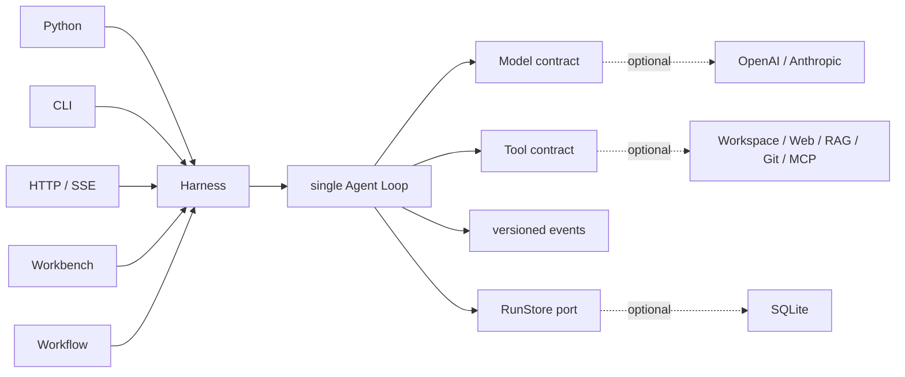

<h1 align="center">Sasori</h1>

<p align="center"><strong>작은 Python Agent 런타임으로 시작해, 필요할 때 완전한 프레임워크로 확장합니다.</strong></p>

<p align="center">
  <a href="https://github.com/syusama/sasori/blob/main/README.md">English</a> ·
  <a href="https://github.com/syusama/sasori/blob/main/README_zh.md">简体中文</a> ·
  <a href="https://github.com/syusama/sasori/blob/main/README_ja.md">日本語</a> ·
  <a href="https://github.com/syusama/sasori/blob/main/README_ko.md"><strong>한국어</strong></a>
</p>

<p align="center">
  <a href="https://github.com/syusama/sasori/actions/workflows/ci.yml"></a>
  
  
  
  <a href="https://github.com/syusama/sasori/blob/main/LICENSE"></a>
</p>

<p align="center">
  
</p>

Sasori는 Tool을 사용하는 Agent를 위한 Python-first 프레임워크입니다. 가장 작은
형태는 처음부터 끝까지 읽을 수 있는 의존성 없는 Loop/Harness입니다. 제품에 더 많은
기능이 필요할 때 같은 런타임에 Provider, SQLite, Plugin, Workflow, Memory, Artifact,
HTTP/SSE와 반응형 Workbench를 추가할 수 있습니다. UI 뒤에 별도의 실행 엔진을 두지
않습니다.

Sasori라는 이름에는 의도적인 설계 비유도 담겨 있습니다. 사소리가 여러 꼭두각시를
자유롭고 정밀하게 다루듯, 개발자는 Model, Tool, Skill, Memory, Workflow를 유연하게
조합할 수 있어야 합니다. 목표는 캐릭터풍 UI가 아니라 각 Agent를 공학적 예술품처럼
다듬는 것입니다. 모듈화되어 있고 표현력이 있으며 신뢰할 수 있고 오래가는 시스템을
만듭니다.

> **현재 경계:** `0.1.0.dev1`은 검증된 single-machine, single-owner prerelease
> candidate입니다. 공개 multi-tenant control plane, 분산 executor, untrusted-code
> sandbox 또는 공개 plugin market은 아직 아닙니다. 패키지 공개는 잠시 보류되었으므로
> 현재는 checkout에서 설치하십시오.

## 왜 Sasori인가

Agent framework는 처음에는 우아한 Loop로 시작하지만 Provider, Tool, Recovery, API,
제품 UI가 추가되면 실행 경로를 이해하기 어려워지기 쉽습니다. Sasori는 각 책임과
경계를 명확하게 유지합니다.

- **기본이 작습니다.** `sasori-core`는 런타임 의존성이 없으며 contract, 하나의
  Agent Loop, Harness, public event projection과 결정론적 test helper만 소유합니다.
- **실행 경로는 하나입니다.** Python, CLI, HTTP/SSE, Workflow, Workbench는 같은
  Harness와 durable event contract를 사용합니다.
- **부작용을 감사할 수 있습니다.** Tool은 effect class를 선언하며 approval,
  execution, explicit resume, manual recovery는 서로 다른 사실로 기록됩니다.
- **Recovery를 과장하지 않습니다.** Checkpoint는 step boundary에서 복구하지만
  임의의 외부 부작용을 exactly-once라고 주장하지 않습니다.
- **제품 품질을 검증할 수 있습니다.** Workbench는 실제 runtime client이며 concept
  mockup이나 두 번째 business logic이 아닙니다.

## 두 배포판, 하나의 런타임

| | `sasori-core` | `sasori` |
|---|---|---|
| Import | `sasori_core` | `sasori` 및 optional top-level module |
| 용도 | canonical single-agent runtime 임베딩 | batteries-included Agent application 구축 |
| 소유 범위 | Contract, Loop/Harness, versioned projection, `RunStore`, ephemeral store, test helper | 동일 버전 Core에 SQLite, Provider, CLI, HTTP/SSE, Plugin, Workflow, Memory, Artifact, App, Workbench, market scaffolding 추가 |
| 런타임 의존성 | **0** | `sasori-core==0.1.0.dev1`에 정확히 의존하며 first-party 기능은 표준 라이브러리를 우선 사용 |
| Core 밖에 두는 것 | Provider SDK, persistence, HTTP, RAG, multi-agent, UI, marketplace | 중복 Loop와 shadow Harness 없음 |

배포 이름과 import 이름은 의도적으로 분명하게 구분합니다.

```text
PyPI distribution: sasori-core       Python import: sasori_core
PyPI distribution: sasori            Python import: sasori
```

현재 candidate는 repository에서 설치합니다.

```bash
# 최소 런타임
python -m pip install ./packages/sasori-core

# 전체 프레임워크
python -m pip install ./packages/sasori-core
python -m pip install --no-deps .
```

## 30초 안에 실행하는 Agent

```python
import asyncio

from sasori_core import Harness, Message, ModelReply, Tool, ToolCall


def inspect(topic: str) -> str:
    return f"verified evidence for {topic}"


class DemoModel:
    async def complete(self, messages, tools):
        if messages[-1].role == "user":
            return ModelReply(
                tool_calls=(ToolCall("inspect-1", "inspect", {"topic": "Sasori"}),)
            )
        return ModelReply(content=f"Grounded: {messages[-1].content}")


async def main():
    with Harness(
        DemoModel(),
        (Tool("inspect", inspect, effect="read_only"),),
    ) as agent:
        result = await agent.run((Message("user", "Inspect the runtime"),))
    print(result.final_message.content)


asyncio.run(main())
```

complete-only Model이 최소 contract입니다. Streaming은 optional이며
provider-neutral합니다. 잘렸거나, 너무 크거나, 구조가 잘못되었거나, 완료되지 않은
Tool Call은 fail closed되고 절대 실행되지 않습니다.

## 하나의 제어 경로



실선 경로가 `sasori-core`입니다. 점선 요소는 모두 교체 가능하며 Core 밖에 머뭅니다.

## Workbench는 실제 제품입니다

아래 이미지는 runtime commit
[`71993de`](https://github.com/syusama/sasori/commit/71993de377a837c85c6cba5bcbf83a36228a1dc2)
의 실제 Sasori Server에서 캡처했습니다. Browser journey는 SQLite, approval,
explicit resume, 두 번의 감사된 부작용, cold-history reconstruction, Artifact,
capability projection, strict Workflow preflight와 durable Catalog save를 거칩니다.
각 이미지의 크기, byte 수, SHA-256, browser version과 scenario는
[screenshot manifest](docs/assets/screenshots-manifest.json)에 기록되어 있습니다.

<p align="center">
  
</p>

<p align="center"><sub>완료된 typed Workflow에서 검증된 출력, definition identity와 effective capability boundary를 함께 확인합니다.</sub></p>

<p align="center">
  
</p>

<p align="center"><sub>Workflow Studio는 strong-ETag CAS로 immutable revision을 저장하고 model call과 Tool dispatch 없이 server-authoritative preflight를 수행합니다.</sub></p>

<table>
  <tr>
    <td width="50%" align="center"></td>
    <td width="50%" align="center"></td>
  </tr>
  <tr>
    <td align="center"><sub>Task workspace · 정확한 390×844 CSS viewport</sub></td>
    <td align="center"><sub>Capability inspector · 정확한 390×844 CSS viewport</sub></td>
  </tr>
</table>

Proma는 information architecture, workspace density와 three-pane interaction의
benchmark입니다. Sasori의 no-build frontend, CSS, copy, logo, screenshot과 asset은
Sasori 자체 contract에 맞춰 독립적으로 구현되었으며 Proma의 AGPL source나 asset을
재사용하지 않습니다.

## 현재 실제로 포함된 것

| Surface | 이 candidate에서 제공 |
|---|---|
| Core | 의존성 없는 contract, Loop/Harness, strict streaming settlement, approval/recovery, `RunStore`, ephemeral storage, stable public projection, deterministic fake |
| Durability | SQLite revision, event, checkpoint, restart recovery, CAS, single-owner admission |
| Providers | 표준 라이브러리 기반 OpenAI Responses / Anthropic Messages adapter와 공통 wire-conformance test |
| Context & Memory | bounded context와 분리된 fixed-scope, immutable-revision SQLite Memory extension |
| Tools & Plugins | Workspace, allowlisted HTTPS, SQLite/FTS5 RAG, local Git, frozen MCP stdio, trusted entry-point discovery, permission disclosure |
| Workflow | strict static serial definition, zero-execution preflight, immutable saved revision, CAS conflict reconciliation, 단일 Harness execution path |
| Product | Python API, CLI, HTTP/SSE, Incident/Research/Developer app, Artifact, responsive Workbench, market scaffolding |

세부 contract는 [Foundation](docs/FOUNDATION.md), [HTTP API](docs/HTTP_API.md),
[Providers](docs/PROVIDERS.md), [Workflow](docs/WORKFLOWS.md),
[Memory](docs/MEMORY.md), [Artifacts](docs/ARTIFACTS.md),
[Pi/Proma benchmark](docs/BENCHMARK-PI-PROMA.md)에 있습니다.

## 런타임 보장

- Public event는 versioned semantic projection이며 mutable internal state의 dump가
  아닙니다.
- 모든 Tool은 `read_only`, `idempotent`, `side_effecting` 중 하나입니다. 위험한
  작업은 명시적인 approval과 resume boundary를 통과합니다.
- Tool exception은 명시적인 Tool Result Error가 됩니다. Cancellation은 전파되며
  삼켜지지 않습니다.
- Checkpoint/resume은 step-boundary recovery입니다. 부작용 Tool에는 idempotency
  key 또는 명시적인 manual-recovery policy가 필요합니다.
- Third-party Python entry point는 trusted host code이며 sandbox가 아닙니다.
- Mutable input은 durable argument, approval, retry 또는 다른 Store adapter의 view를
  덮어쓸 수 없습니다.

## 수식어보다 증거를 먼저

현재 runtime snapshot은 다음을 통과했습니다.

- `532`개의 deterministic `unittest`. Windows에서 필요한 권한이 없으면 `5`개의
  symlink case를 skip합니다.
- 1600×1000, 390×844, 360×800, reduced-motion, narrow structured result를 포함한
  `31 / 31`개의 real Chrome Workbench acceptance.
- approval, explicit resume, 정확히 두 번의 감사된 부작용, cold history, Artifact,
  typed Workflow, saved Catalog를 포함한 real-server browser journey.
- original wheel, rebuilt sdist, exact bundle/core, installed distribution verification.
- 중국 본토 mirror를 사용한 Docker build와 real non-root container workflow.

생성된 plan, self-test, 보기 좋은 screenshot 또는 upstream README는 release authority가
아닙니다. 실행 가능한 acceptance evidence가 gate입니다.

## 비교해 배우되 복사하지 않습니다

- **Pi** — 읽기 쉬운 Loop와 엄격한 Tool/Event ordering. Sasori는 의존성 없는
  Python Core, 실행 가능한 Harness, strict terminal settlement와 명시적 recovery
  boundary를 유지합니다.
- **Proma** — product density와 workspace discoverability. Architecture와 interaction
  원칙만 학습하고 AGPL source나 asset은 복사하지 않습니다.
- **LeAgent / ToFu** — 유용한 product breadth와 runtime 아이디어. Sasori는 effect
  ambiguity, projection ownership, package boundary와 evidence gate를 더 엄격하게 합니다.

고정 commit, evidence와 license boundary는 [Pi / Proma](docs/BENCHMARK-PI-PROMA.md),
[LeAgent / ToFu](docs/BENCHMARK-LEAGENT-TOFU.md),
[third-party notices](THIRD_PARTY_NOTICES.md)를 참조하십시오.

## Roadmap — 아직 제공되지 않음

- 서명된 plugin provenance, compatibility policy, governed public market.
- tenant identity, authorization, quota, durable queue, distributed worker.
- CPU, memory, filesystem, egress policy가 명시된 untrusted Tool isolation.
- effect, cancellation, approval, replay semantics를 검증한 뒤 DAG/parallel Workflow와
  multi-agent orchestration.
- 동일한 canonical runtime 위의 team workspace와 digital employee.

## 이름의 유래와 독립성

Sasori라는 이름은 *나루토*의 꼭두각시 술사 사소리에서 영감을 얻었습니다. 정밀한
기술, 조합 가능한 구조, 오래 남는 작품에 대한 지향이 핵심입니다. 이 연관은 project
name, 이 짧은 설명, 위의 project owner 제공 Logo에만 한정되며 Workbench의
visual theme가 아닙니다.

Sasori는 독립적인 open-source project입니다. *나루토*, 키시모토 마사시, 슈에이샤,
TV 도쿄, Studio Pierrot 또는 기타 권리자와 제휴, 허가, 후원, 보증 관계가 없습니다.
위 Logo는 project owner가 branding 용도로 제공했습니다. 이 repository는 해당
Logo를 공식 자료로 표시하거나 그 안의 제3자 권리를 Sasori가 소유한다고 주장하지
않습니다.

## License와 contribution

Sasori code는 [MIT License](LICENSE)로 배포됩니다. Third-party plugin은 각자의
license를 유지하며 trusted host code로 실행됩니다. Security boundary는
[SECURITY.md](SECURITY.md)에 있습니다. Public event, recovery semantics, golden trace,
plugin permission을 변경할 때는 decision record와 실행 가능한 regression evidence를
함께 제출해야 합니다.

**작게 시작하고, 제품에 필요한 기능만 더하며, 중요한 모든 동작을 검증 가능하게 유지합니다.**
