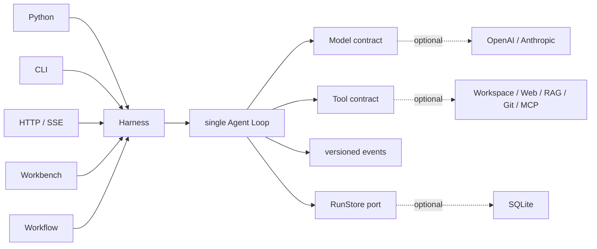

<h1 align="center">Sasori</h1>

<p align="center"><strong>정밀한 실행, 자유로운 조합, 지속적인 진화를 위한 Python Agent Framework.</strong></p>

<p align="center">
  <a href="https://github.com/syusama/sasori/blob/main/README.md">English</a> ·
  <a href="https://github.com/syusama/sasori/blob/main/README_zh.md">简体中文</a> ·
  <a href="https://github.com/syusama/sasori/blob/main/README_ja.md">日本語</a> ·
  <a href="https://github.com/syusama/sasori/blob/main/README_ko.md"><strong>한국어</strong></a>
</p>

<p align="center">
  <a href="https://github.com/syusama/sasori/actions/workflows/ci.yml"></a>
  
  
  
  <a href="https://github.com/syusama/sasori/blob/main/LICENSE"></a>
</p>

<p align="center">
  
</p>

Sasori는 성장할수록 더 명확하고 제어 가능하며 신뢰할 수 있는 Tool 기반 Agent를 위한
Python-first Framework입니다. 중심에는 처음부터 끝까지 읽을 수 있는 런타임 의존성 없는
Loop/Harness, `sasori-core`가 있습니다. 그 위에 Provider, SQLite, Plugin, Workflow,
Memory, Artifact, HTTP/SSE와 반응형 Workbench가 하나의 실행 Contract로 연결됩니다.

Sasori라는 이름에는 분명한 설계 철학이 담겨 있습니다. 사소리가 다양한 꼭두각시를
자유롭고 정밀하게 다루듯, 개발자는 Model, Tool, Skill, Memory, Workflow를 유연하게
조합할 수 있습니다. 각 기능은 분리 가능하고, 이를 지휘하는 지능은 언제나 정확합니다.
Sasori가 추구하는 것은 캐릭터풍 UI가 아니라 모든 Agent를 공학적 예술품처럼 다듬는 것—
명확하고 표현력이 있으며 감사할 수 있고 오래가는 시스템입니다.

## 왜 Sasori인가

> **한마디로 말하면 작은 Core, 하나의 실행 경로, 신뢰할 수 있는 실행입니다.**

Sasori는 Model, Tool, Skill, Memory, Workflow를 하나의 읽기 쉬운 Runtime 주위에서
교체하고 조합할 수 있는 능력으로 다룹니다. 작은 Python Agent에는 `sasori-core`만
사용하고, 더 많은 기능이 필요해지면 이미 검증된 실행 Engine을 바꾸지 않은 채 전체
Framework를 조립할 수 있습니다.

| 설계 축 | Sasori Standard | 개발자가 얻는 것 |
|---|---|---|
| **태생부터 가벼움** | 런타임 의존성 없는 Core가 책임 범위를 엄격하게 유지 | 몇 초 만에 시작하고 전체를 이해하며 필요한 기능만 장착할 수 있음 |
| **하나의 실행 경로** | Python, CLI, HTTP/SSE, Workflow, Workbench가 하나의 Harness와 Loop를 공유 | 모든 진입점에서 Event, Approval, Recovery 의미가 일치함 |
| **Tool Safety** | 완전하고 구조적으로 유효한 Tool Call만 실행하며 예약 인수 위조는 fail closed | 손상된 Model 출력이 실제 작업으로 바뀌지 않음 |
| **Effect Integrity** | Tool은 `read_only`, `idempotent`, `side_effecting`을 선언하고 Approval, Resume, `effect_unknown`을 명시 | Timeout, Retry, Cancellation, Recovery 이후에도 외부 작업을 추적할 수 있음 |
| **빠르면서 정확함** | Model/Tool progress는 transient이고 versioned event와 Checkpoint가 durable truth | 부드러운 Streaming UX와 정확한 Audit/Replay를 동시에 확보 |
| **제품급 성장** | 모든 Adapter가 같은 public projection을 사용 | 작은 Script에서 완성도 높은 제품까지 Engine 교체 없이 진화 |

Sasori에서는 기능의 폭이 실행의 명확성을 희생하지 않습니다. 모든 호출을 검증하고,
모든 부작용을 분류하며, Approval을 명시하고, Durable transition을 추적할 수 있습니다.
가벼운 Developer Tool부터 장시간 운영 Agent, File, Git, Database, Browser, 외부 API를
다루는 본격적인 업무 Workflow까지 하나의 Runtime으로 지탱합니다.

**한 자루의 메스에서 완전한 Studio까지. 첫 Tool Call부터 최종 제품까지 같은 신뢰할 수
있는 Runtime을 사용합니다.**

## 두 배포판, 하나의 런타임

| | `sasori-core` | `sasori` |
|---|---|---|
| Import | `sasori_core` | `sasori` 및 optional top-level module |
| 용도 | canonical single-agent runtime 임베딩 | batteries-included Agent application 구축 |
| 소유 범위 | Contract, Loop/Harness, versioned projection, `RunStore`, ephemeral store, test helper | 동일 버전 Core에 SQLite, Provider, CLI, HTTP/SSE, Plugin, Workflow, Memory, Artifact, App, Workbench 추가 |
| 런타임 의존성 | **0** | `sasori-core==0.1.0.dev1`에 정확히 의존하며 first-party 기능은 표준 라이브러리를 우선 사용 |
| Core 밖에 두는 것 | Provider SDK, persistence, HTTP, RAG, multi-agent, UI, marketplace | 중복 Loop와 shadow Harness 없음 |

배포 이름과 import 이름은 의도적으로 분명하게 구분합니다.

```text
PyPI distribution: sasori-core       Python import: sasori_core
PyPI distribution: sasori            Python import: sasori
```

Repository에서 바로 설치할 수 있습니다.

```bash
# 최소 런타임
python -m pip install ./packages/sasori-core

# 전체 프레임워크
python -m pip install ./packages/sasori-core
python -m pip install --no-deps .
```

## 30초 안에 실행하는 Agent

```python
import asyncio

from sasori_core import Harness, Message, ModelReply, Tool, ToolCall


def inspect(topic: str) -> str:
    return f"verified evidence for {topic}"


class DemoModel:
    async def complete(self, messages, tools):
        if messages[-1].role == "user":
            return ModelReply(
                tool_calls=(ToolCall("inspect-1", "inspect", {"topic": "Sasori"}),)
            )
        return ModelReply(content=f"Grounded: {messages[-1].content}")


async def main():
    with Harness(
        DemoModel(),
        (Tool("inspect", inspect, effect="read_only"),),
    ) as agent:
        result = await agent.run((Message("user", "Inspect the runtime"),))
    print(result.final_message.content)


asyncio.run(main())
```

complete-only Model이 최소 contract입니다. Streaming은 optional이며
provider-neutral합니다. 잘렸거나, 너무 크거나, 구조가 잘못되었거나, 완료되지 않은
Tool Call은 fail closed되고 절대 실행되지 않습니다.

## 하나의 제어 경로



실선 경로가 `sasori-core`입니다. 점선 요소는 모두 교체 가능하며 Core 밖에 머뭅니다.

## 눈으로 확인하는 정밀함

아래 이미지는 runtime commit
[`71993de`](https://github.com/syusama/sasori/commit/71993de377a837c85c6cba5bcbf83a36228a1dc2)
의 실제 Sasori Server에서 캡처했습니다. Browser journey는 SQLite, approval,
explicit resume, 두 번의 감사된 부작용, cold-history reconstruction, Artifact,
capability projection, strict Workflow preflight와 durable Catalog save를 거칩니다.
각 이미지의 크기, byte 수, SHA-256, browser version과 scenario는
[screenshot manifest](docs/assets/screenshots-manifest.json)에 기록되어 있습니다.

<p align="center">
  
</p>

<p align="center"><sub>완료된 typed Workflow에서 검증된 출력, definition identity와 effective capability boundary를 함께 확인합니다.</sub></p>

<p align="center">
  
</p>

<p align="center"><sub>Workflow Studio는 strong-ETag CAS로 immutable revision을 저장하고 model call과 Tool dispatch 없이 server-authoritative preflight를 수행합니다.</sub></p>

<table>
  <tr>
    <td width="50%" align="center"></td>
    <td width="50%" align="center"></td>
  </tr>
  <tr>
    <td align="center"><sub>Task workspace · 정확한 390×844 CSS viewport</sub></td>
    <td align="center"><sub>Capability inspector · 정확한 390×844 CSS viewport</sub></td>
  </tr>
</table>

Workbench는 같은 Sasori Runtime의 운영 Surface이며 별도 구현 위에 올린 Visual Demo가
아닙니다. Live execution, durable history, Approval/Recovery, Workflow authoring,
Artifact와 Capability inspection이 차분하고 정보 밀도 높은 하나의 Workspace에 모입니다.

## 완전한 Sasori Stack

| Surface | Built in |
|---|---|
| Core | 의존성 없는 contract, Loop/Harness, strict streaming settlement, approval/recovery, `RunStore`, ephemeral storage, stable public projection, deterministic fake |
| Durability | SQLite revision, event, checkpoint, restart recovery, CAS, single-owner admission |
| Providers | 표준 라이브러리 기반 OpenAI Responses / Anthropic Messages adapter와 공통 wire-conformance test |
| Context & Memory | bounded context와 분리된 fixed-scope, immutable-revision SQLite Memory extension |
| Tools & Plugins | Workspace, allowlisted HTTPS, SQLite/FTS5 RAG, local Git, frozen MCP stdio, trusted entry-point discovery, permission disclosure |
| Workflow | strict static serial definition, zero-execution preflight, immutable saved revision, CAS conflict reconciliation, 단일 Harness execution path |
| Product | Python API, CLI, HTTP/SSE, Incident/Research/Developer app, Artifact, responsive Workbench |

세부 contract는 [Foundation](docs/FOUNDATION.md), [HTTP API](docs/HTTP_API.md),
[Providers](docs/PROVIDERS.md), [Workflow](docs/WORKFLOWS.md),
[Memory](docs/MEMORY.md), [Artifacts](docs/ARTIFACTS.md),
[Security](SECURITY.md)에 있습니다.

## 런타임 보장

- Public event는 versioned semantic projection이며 mutable internal state의 dump가
  아닙니다.
- 모든 Tool은 `read_only`, `idempotent`, `side_effecting` 중 하나입니다. 위험한
  작업은 명시적인 approval과 resume boundary를 통과합니다.
- Tool exception은 명시적인 Tool Result Error가 됩니다. Cancellation은 전파되며
  삼켜지지 않습니다.
- Checkpoint/resume은 step-boundary recovery입니다. 부작용 Tool에는 idempotency
  key 또는 명시적인 manual-recovery policy가 필요합니다.
- Third-party Python entry point는 trusted host code이며 sandbox가 아닙니다.
- Mutable input은 durable argument, approval, retry 또는 다른 Store adapter의 view를
  덮어쓸 수 없습니다.

## Core부터 Container까지 검증

Sasori는 전체 Delivery path에서 지속적으로 검증됩니다.

- `547`개의 deterministic `unittest`. Windows에서 필요한 권한이 없으면 `5`개의
  symlink case를 skip합니다.
- 1600×1000, 390×844, 360×800, reduced-motion, narrow structured result를 포함한
  `31 / 31`개의 real Chrome Workbench acceptance.
- approval, explicit resume, 정확히 두 번의 감사된 부작용, cold history, Artifact,
  typed Workflow, saved Catalog를 포함한 real-server browser journey.
- original wheel, rebuilt sdist, exact bundle/core, installed distribution verification.
- 중국 본토 mirror를 사용한 Docker build와 real non-root container workflow.

모든 Layer를 개발자가 실제로 실행하고, 검사하고, Package하고, Deploy할 수 있는
Software로 검증합니다. 구상이나 Promise, 연출된 Mockup에 머물지 않습니다.

## 하나의 System으로 설계

- 몇 줄로 Core를 Embed하고 같은 설계 그대로 responsive Workspace까지 운영합니다.
- Live progress를 전달하면서 versioned durable source of truth를 지킵니다.
- Provider, Tool, Skill, Memory, Workflow, Plugin을 자유롭게 추가해도 Core는 가볍습니다.
- Approval, Effect classification, Recovery, Audit 의미가 Python에서 HTTP/SSE,
  Workbench까지 하나로 이어집니다.
- 잠긴 package graph, reproducible source archive, 중국 본토 mirror를 지원하는 non-root
  container workflow로 배포합니다.

이것이 Sasori의 강점입니다. **Micro-framework의 우아함, 완전한 Agent Platform의 깊이,
그리고 모든 것을 관통하는 하나의 정밀한 Runtime.**

## 이름의 유래와 독립성

Sasori라는 이름은 *나루토*의 꼭두각시 술사 사소리에서 영감을 얻었습니다. 정밀한
기술, 조합 가능한 구조, 오래 남는 작품에 대한 지향이 핵심입니다. 이 연관은 project
name, 이 짧은 설명, project owner가 제공한 brand asset에만 한정되며 Workbench의
visual theme가 아닙니다.

Sasori는 독립적인 open-source project입니다. *나루토*, 키시모토 마사시, 슈에이샤,
TV 도쿄, Studio Pierrot 또는 기타 권리자와 제휴, 허가, 후원, 보증 관계가 없습니다.
Project Logo는 project owner가 branding 용도로 제공했습니다. 이 repository는 해당
Logo를 공식 자료로 표시하거나 그 안의 제3자 권리를 Sasori가 소유한다고 주장하지
않습니다.

## License와 contribution

Sasori code는 [MIT License](LICENSE)로 배포됩니다. Third-party plugin은 각자의
license를 유지하며 trusted host code로 실행됩니다. Security boundary는
[SECURITY.md](SECURITY.md)에 있습니다. Public event, recovery semantics, golden trace,
plugin permission을 변경할 때는 decision record와 실행 가능한 regression evidence를
함께 제출해야 합니다.

**가볍게 만들고, 정밀하게 지휘하며, 신뢰할 수 있는 Agent를 제공합니다.**
