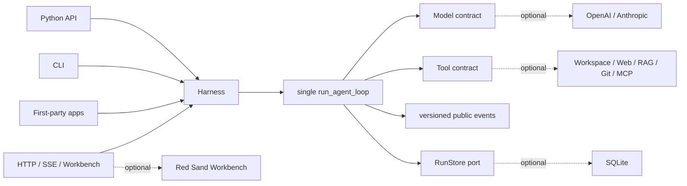

<p align="center">
  
</p>

<p align="center">
  <a href="https://github.com/syusama/sasori/actions/workflows/ci.yml"></a>
  
  
  
  <a href="https://github.com/syusama/sasori/blob/main/LICENSE"></a>
</p>

<p align="center">
  <a href="https://github.com/syusama/sasori/blob/main/README.md">English</a> ·
  <a href="https://github.com/syusama/sasori/blob/main/README_zh.md">简体中文</a> ·
  <a href="https://github.com/syusama/sasori/blob/main/README_ja.md">日本語</a> ·
  <strong>한국어</strong>
</p>

<h1 align="center">하나의 핵, 수많은 꼭두각시.</h1>

<p align="center"><strong>처음부터 끝까지 읽을 수 있는 작은 Python Agent 커널. 두 번째 런타임을 만들지 않고도 완전하고 아름다운 AI 워크벤치로 확장됩니다.</strong></p>

Sasori는 날카로운 휴대 도구이자 확장 가능한 꼭두각시 공방입니다. 가장 작은 형태는
런타임 의존성이 없는 Loop/Harness 하나, 모델 하나, 실제로 필요한 Tool뿐입니다.
필요해질 때 SQLite, Provider, Plugin, Workflow, Memory, Artifact, HTTP/SSE,
Workbench를 장착합니다. Python, CLI, HTTP, UI는 모두 같은 실과 같은 런타임을 당깁니다.

이름의 영감은 *나루토*의 꼭두각시 술사 사소리에서 왔습니다. 정교한 장치, 교체 가능한
무장, 영원히 남는 예술을 향한 집념을 캐릭터 이미지가 아닌 소프트웨어 설계로 번역했습니다.
**핵은 읽을 수 있어야 하고, 부품은 탈착 가능해야 하며, 위험한 실은 모두 보여야 하고,
결과는 검증 가능한 증거로 남아야 합니다.**

> 현재 경계: Sasori는 검증된 단일 머신·단일 owner용 사전 릴리스 후보입니다. 공개
> 멀티테넌트 control plane, 분산 실행기, 신뢰하지 않는 코드용 sandbox, 중앙 Plugin
> Market은 아직 제공하지 않습니다.

## 두 배포판, 하나의 정식 메커니즘

| | `sasori-core` | `sasori` |
|---|---|---|
| Import | `sasori_core` | `sasori`와 선택 모듈 |
| 목적 | 정식 single-agent runtime 임베딩 | batteries-included 전체 프레임워크 조립 |
| 소유 | contracts, 유일한 Loop/Harness, versioned projection, storage-neutral `RunStore`, `EphemeralRunStore`, test helpers | 정확히 같은 버전의 core와 SQLite, Provider, CLI, HTTP/SSE, Plugin, Workflow, Memory, Artifact, App, Workbench, market scaffold |
| 런타임 의존성 | **0** | `sasori-core==0.1.0.dev1`로 정확히 고정 |
| 소유하지 않음 | Provider SDK, DB, HTTP, RAG, multi-agent, UI, market | 두 번째 Loop나 shadow Harness 금지 |

```text
PyPI distribution: sasori-core       Python import: sasori_core
PyPI distribution: sasori            Python import: sasori
```

`0.1.0.dev1`이 Hosted CI와 TestPyPI gate를 완료하기 전에는 checkout에서 후보를
설치하세요.

```bash
# 최소 코어
python -m pip install ./packages/sasori-core

# 전체 프레임워크
python -m pip install ./packages/sasori-core
python -m pip install --no-deps .
```

## 30초 core

```python
import asyncio

from sasori_core import Harness, Message, ModelReply, Tool, ToolCall


def inspect(topic: str) -> str:
    return f"verified evidence for {topic}"


class DemoModel:
    async def complete(self, messages, tools):
        if messages[-1].role == "user":
            return ModelReply(
                tool_calls=(ToolCall("inspect-1", "inspect", {"topic": "Sasori"}),)
            )
        return ModelReply(content=f"Grounded: {messages[-1].content}")


async def main():
    with Harness(
        DemoModel(),
        (Tool("inspect", inspect, effect="read_only"),),
    ) as agent:
        result = await agent.run((Message("user", "Inspect the mechanism"),))
    print(result.final_message.content)


asyncio.run(main())
```

`complete()`만 구현한 모델이 가장 작은 contract입니다. streaming은 선택 사항이며
provider-neutral이고, 문법은 엄격합니다.

```text
start → deltas* → done / error / aborted 중 정확히 하나 → iterator end
```

잘린 Tool call, partial만 있는 call, 크기 초과, 잘못된 UTF-8, 지나치게 깊거나 순환하는
arguments, 구조적으로 잘못된 call은 fail closed되어 절대 실행되지 않습니다.

## 콘셉트 렌더가 아닌 실제 Workbench

아래 모든 이미지는 runtime commit
[`b10b787`](https://github.com/syusama/sasori/commit/b10b787f93f2b5d29cd35c30dee17bbdc9e4de7b)
에서 실제 Sasori server를 실행하고 실제 browser journey로 캡처했습니다. SQLite,
human approval, explicit resume, 감사 가능한 side effect, cold history, Artifact 검증,
capability projection, Workflow preflight, durable Catalog save를 거쳤습니다. 각 이미지의
commit, 요청 viewport, 실제 픽셀, bytes, SHA-256은
[screenshot manifest](docs/assets/screenshots-manifest.json)에 고정되어 있습니다.

<p align="center">
  
</p>

<table>
  <tr>
    <td width="50%"></td>
    <td width="50%"></td>
  </tr>
  <tr>
    <td align="center"><sub>승인은 의도를 기록할 뿐 effect를 실행하지 않습니다.</sub></td>
    <td align="center"><sub>명시적인 resume 뒤에만 메커니즘이 움직입니다.</sub></td>
  </tr>
  <tr>
    <td></td>
    <td></td>
  </tr>
  <tr>
    <td align="center"><sub>strict JSON, immutable revision, strong-ETag CAS, 실행 0회.</sub></td>
    <td align="center"><sub>Skill, Tool, MCP, Provider, Plugin과 실제 trust boundary.</sub></td>
  </tr>
  <tr>
    <td></td>
    <td></td>
  </tr>
</table>

<table>
  <tr>
    <td width="50%" align="center"></td>
    <td width="50%" align="center"></td>
  </tr>
</table>

독창적인 visual language는 **Red Sand Atelier / 적사 기관 공방**입니다. 검은 옻칠,
황동, 주사색, 교정 눈금, 꼭두각시 실, 불변 두루마리로 구성됩니다. Proma는 product
density와 3-pane workflow의 benchmark일 뿐 asset library가 아닙니다. Sasori는 Proma의
AGPL source, CSS, 문구, Logo, screenshot, asset을 복사하지 않습니다.

## 제어선은 하나뿐



실선만 `sasori-core`에 속합니다. 점선 module은 모두 교체 가능하며 core 바깥에 있습니다.
UI 뒤에 숨은 두 번째 product Loop는 없습니다.

## 지켜야 할 runtime invariant

- **하나의 Loop/Harness:** Python, CLI, HTTP, Workflow, UI가 같은 runtime path로 합류합니다.
- **Event는 projection:** mutable internal state dump가 아니라 versioned semantic fact입니다.
- **Effect는 명시적:** Tool은 `read_only` / `idempotent` / `side_effecting`을 선언하고,
  non-read-only call은 revision과 approval을 거칩니다.
- **Approval ≠ execution:** 승인/거부를 먼저 commit하고 operator가 명시적으로 resume합니다.
- **정직한 recovery:** checkpoint는 step-boundary recovery이며 exactly-once가 아닙니다.
  불명확한 외부 effect는 fingerprint-bound manual recovery에서 멈춥니다.
- **Cooperative cancellation:** cancellation을 전달하지만 remote model이나 동기 thread를
  강제 종료했다고 주장하지 않습니다.
- **Plugin trust 공개:** 설치된 Python entry point는 trusted host code이며 sandbox가 아닙니다.
  MCP는 server-owned transport metadata로 분류합니다.
- **상태 detach:** mutable input이 durable arguments, approval, retry, 다른 store의 view를
  다시 쓰지 못합니다.

## 현재 후보가 실제로 제공하는 것

| Surface | 제공 경계 |
|---|---|
| Core | zero-dependency contracts, Loop/Harness, strict streaming, approval/recovery, `RunStore`, ephemeral store, stable projection, test helpers |
| Durability | SQLite revision/event/checkpoint/CAS, restart recovery, single-owner admission |
| Provider | standard-library OpenAI Responses / Anthropic Messages adapter, shared conformance |
| Context / Memory | bounded structural / optional semantic context, 고정 scope·immutable revision의 별도 SQLite Memory, Harness-gated writes |
| Tool / Plugin | workspace, allowlisted HTTPS, SQLite/FTS5 RAG, local Git, frozen MCP stdio, entry-point discovery, permission disclosure |
| Workflow | strict static serial definition, zero-execution authoritative preflight, immutable saved revision, CAS reconciliation, one Harness path |
| Product | CLI, HTTP/SSE, Incident, 설정형 Research/Developer, Artifact, responsive Workbench, marketplace scaffold |

세부 contract는 [Foundation](docs/FOUNDATION.md), [HTTP API](docs/HTTP_API.md),
[Workflow](docs/WORKFLOWS.md), [Memory](docs/MEMORY.md),
[Artifacts](docs/ARTIFACTS.md), [Pi/Proma benchmark](docs/BENCHMARK-PI-PROMA.md)에 있습니다.

## 형용사보다 증거가 먼저

현재 runtime snapshot은 다음을 통과했습니다.

- deterministic `unittest` `531`개(Windows symlink privilege가 없으면 관련 `5`개 skip)
- desktop / narrow / reduced-motion browser acceptance `30 / 30`
- approval, resume, Workflow, Catalog, history, Artifact, permission을 포함한 real-server journey `3 / 3`
- DaoCloud digest-pinned Python image와 Tsinghua PyPI index를 사용하는 중국 본토 소스 Docker build 및 non-root container workflow
- original core wheel, rebuilt core sdist, exact bundle + core wheel, locked bundle sdist rebuild clean-install roundtrip

README metadata가 bundle wheel bytes를 바꾸므로 곧 낡아질 최종 hash는 여기 쓰지 않습니다.
[Release gate](docs/RELEASE.md)가 Hosted CI, TestPyPI, tag 전에 정확한 artifact를 다시 만들고
source와 결합합니다. 테스트가 release authority입니다.

## 강한 프로젝트를 배우되 복사하지 않기

- **Pi**(MIT, fixed commit): 읽을 수 있는 Loop와 Tool/Event ordering을 배우고, Sasori는
  zero-dependency Python core, 실행 가능한 Harness, 엄격한 stream termination, explicit recovery를 제공합니다.
- **Proma**(AGPL-3.0-only, fixed commit): 3-pane workbench와 Workflow discoverability를
  benchmark로 삼고 Sasori 고유 event contract와 visual system으로 구현합니다.
- **LeAgent / ToFu:** product breadth와 durable runtime의 교훈을 흡수하면서 effect ambiguity,
  projection ownership, package boundary, evidence gate를 강화합니다.

근거와 license는 [Pi / Proma](docs/BENCHMARK-PI-PROMA.md),
[LeAgent / ToFu](docs/BENCHMARK-LEAGENT-TOFU.md),
[Third-party notices](THIRD_PARTY_NOTICES.md)에 있습니다.

## 다음 메커니즘 — 아직 제공하지 않음

- signed plugin provenance, compatibility policy, governed public market
- tenant identity, authorization, quota, durable queue, distributed worker
- CPU / memory / filesystem / egress policy를 검증할 수 있는 untrusted tool isolation
- effect, cancel, approval, replay contract를 먼저 증명한 뒤의 DAG, parallel Workflow, multi-agent orchestration
- team, digital employee, desktop-grade product. 단 canonical Loop는 계속 하나

## 이름·창작·권리 고지

Sasori는 독립 오픈소스 프로젝트입니다. *나루토*, 키시모토 마사시, 슈에이샤,
TV Tokyo, Studio Pierrot 및 관련 권리자와 공식 제휴, 허가, 후원, 보증 관계가 없습니다.
이 저장소는 독창적으로 만든 추상적 기계 전갈, 꼭두각시 실, 메커니즘, 정밀함,
탈착 module, 붉은 모래, “영원히 남는 예술”의 은유만 사용합니다. 공식 캐릭터 이미지,
animation frame, 의상 형태, Logo, 대사, font는 사용하지 않습니다. 정식 공개 전 별도의
이름 및 상표 조사가 필요합니다.

## License와 contribution

Sasori code는 [MIT License](LICENSE)로 배포됩니다. third-party plugin은 각자의 license를
유지하며 trusted code로 실행됩니다. security boundary는 [SECURITY.md](SECURITY.md)에
기록되어 있습니다. public contract를 바꾸는 contribution에는 decision record와 실행 가능한
acceptance evidence가 필요합니다.

**꼭두각시를 만들고, 실을 숨기지 말고, 결과를 오래 남기세요.**
