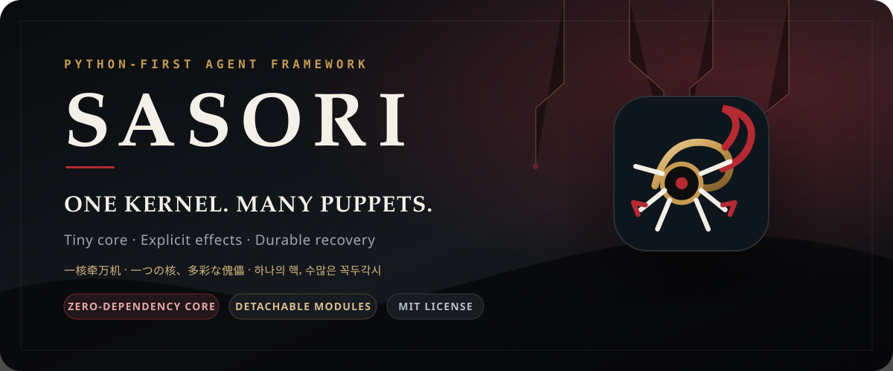
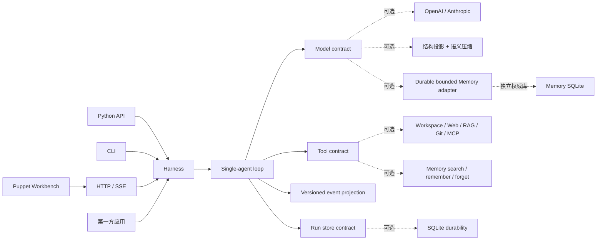
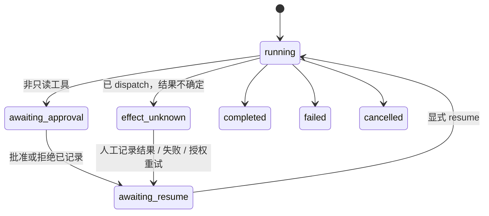
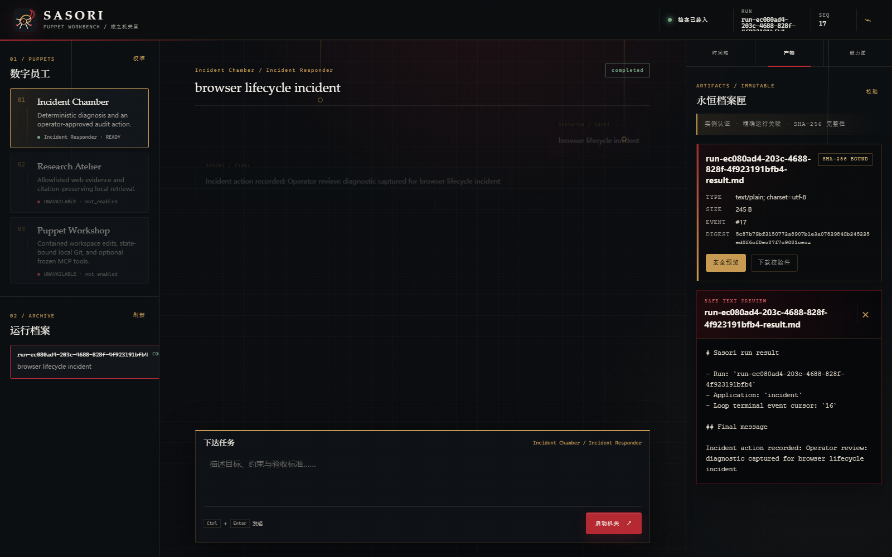

<p align="center">
  
</p>

<p align="center">
  <a href="https://github.com/syusama/sasori/actions/workflows/ci.yml"></a>
  
  
  <a href="LICENSE"></a>
</p>

<p align="center">
  <a href="README.md">English</a> ·
  <a href="#30-秒启动">快速开始</a> ·
  <a href="docs/FOUNDATION.md">架构</a> ·
  <a href="docs/MEMORY.md">Memory</a> ·
  <a href="docs/BENCHMARK-LEAGENT-TOFU.md">LeAgent / ToFu 对标</a> ·
  <a href="docs/RELEASE.md">发布证据</a>
</p>

## 一核牵万机

**Sasori 是一个 Python-first 的开源 AI Agent Framework：用一个小而可读的
内核，牵引可恢复的运行、显式的工具副作用、按需装配的模块，以及独具风格的
本地 Workbench。**

Sasori 意为“蠍”。项目借用了“傀儡术”的设计隐喻：一套机关控制多具可替换的
傀儡，每根操控线都有明确归属，每个危险动作都停在人类闸门前。品牌视觉为原创
机械蠍，不使用动漫画面或复制的角色素材。

它既可以是一把快准狠的瑞士军刀——一个 `Harness`、一个模型、几件需要的工具；
也可以成为应用、插件、HTTP 服务与完整界面的运行底座。轻量和大而全不是两套
Runtime：Python、CLI、HTTP 与 Workbench 全部驱动同一条单 Agent Loop。

> Sasori 会明确区分当前能力与路线图。它现在是可靠的单机 G1 地基，还不是公共
> 多租户控制面、分布式执行器、非受信代码沙箱、Workflow Engine 或中央市场。
> [Current / Next](#current--next) 不会混写。

## 10 秒看懂 Sasori

| 你关心的事 | Sasori 的答案 |
|---|---|
| 内核能不能从头读完 | `sasori` 只拥有 contracts、单 Loop、事件投影与 Harness；核心仅用 Python 标准库 |
| 坏工具调用会不会误执行 | malformed / truncated 永不执行；异常成为显式 tool result；取消继续向上传播 |
| 真实副作用如何控制 | 工具必须声明 `read_only`、`idempotent` 或 `side_effecting`；非只读动作需要 revision 与人工决定 |
| 崩溃后结果不确定怎么办 | 调用前先持久化 dispatch intent；歧义结果停在 `effect_unknown`，等待人工核验恢复 |
| 多入口会不会各写一套逻辑 | Python、CLI、HTTP、应用与 Workbench 都汇入 `Harness.run()` / `resume()` |
| 上下文快装不下时 | 默认做确定性结构投影；可选具名 compactor 选择冷历史时不拆散 tool call/result 原子，完整耐久 transcript 始终不改写 |
| Memory 如何避免玄学 | 可选 `sasori_memory` 用独立 SQLite 保存 immutable revisions，完整 fixed scope 在排序前过滤，每次 mutation 都走 Harness approval/idempotency |
| 交付物如何耐久化 | 可选 `sasori_artifacts` 把 immutable bytes、metadata 与公共事件绑定到精确 run，不扩张 Loop |
| 如何从小框架长成大产品 | Provider、SQLite、RAG、MCP、Git、workspace、apps、catalog、server、UI 全在核心外装配 |
| 如何证明不是 PPT | fake model、provider conformance、进程崩溃、reducer 竞态、真实浏览器、包与容器门禁 |
| 国内网络如何交付 | DaoCloud 基础镜像、清华 PyPI 默认源、digest/hash 锁定、真实国内源容器工作流 |

## 30 秒启动

先运行不需要任何模型密钥的确定性 Incident 应用：

```bash
git clone https://github.com/syusama/sasori.git
cd sasori
python -m pip install -e .
sasori-server --host 127.0.0.1 --port 8080 \
  --db ./sasori-runs.sqlite3 \
  --artifact-root ./sasori-artifacts \
  --app incident=sasori_apps.incident:create_harness \
  --publish-final-artifact \
  --trusted-loopback-no-auth
```

打开 **http://127.0.0.1:8080**。提交一条事件，检查待执行的 `record_action`，
批准后再显式恢复。批准本身不会偷偷执行副作用。

`--trusted-loopback-no-auth` 只允许显式 loopback 地址。正常使用或容器部署应配置
本地 bearer-token 文件。

## 最小但完整的 Agent

```python
import asyncio

from sasori import Harness, Message, ModelReply, Tool, ToolCall


def lookup(topic: str) -> str:
    return f"evidence for {topic}"


class DemoModel:
    async def complete(self, messages, tools):
        if messages[-1].role == "user":
            return ModelReply(
                tool_calls=(ToolCall("lookup-1", "lookup", {"topic": "Sasori"}),)
            )
        return ModelReply(content=f"Grounded result: {messages[-1].content}")


async def main():
    with Harness(
        DemoModel(),
        (Tool("lookup", lookup, effect="read_only"),),
    ) as agent:
        result = await agent.run((Message("user", "Research Sasori"),))
    print(result.final_message.content)
    print([event.type for event in result.events])


asyncio.run(main())
```

同步工具通过 `asyncio.to_thread` 执行，不阻塞 event loop。Timeout 会停止 Sasori
继续等待，但 Python 不能强制杀死任意 worker thread 或远端模型请求；Sasori 不会
把它宣传成 hard kill。

## 架构：只有一根主线



实线属于核心；虚线模块可替换、按需安装，并留在 Loop 外。Workbench 背后没有
第二套“产品专用 Loop”。

## 恢复不是一个布尔开关



Sasori 在一个 SQLite 事务里提交 step revision、接受的模型回复、工具 ledger、
可恢复 checkpoint 与追加写事件。Event sink 只在 commit 后运行，而且是
best-effort；消费者用 `(run_id, seq)` 修复缺口。

工具执行前，dispatch intent 已经持久化。重启后：

- 已提交的结果直接复用；
- 结果不明的只读工作可以重试；
- 幂等工作只能带同一 idempotency key 重试；
- 普通副作用停在 `effect_unknown`；
- 操作者必须提交精确 fingerprint 与审计原因，才能记录核验结果、标记失败或
  明确授权重试。

这是 **step-boundary recovery**，不是 exactly-once。外部副作用仍需要真正的
idempotency key 或人工恢复策略。完整契约见
[Foundation](docs/FOUNDATION.md)。

## 压缩模型视图，保留完整原始记录

**上下文更短，原始记录不动。** 长历史可以包一层纯标准库 model adapter：

```python
from sasori_context import BoundedContextModel, ContextBudget, ContextProjector

model = BoundedContextModel(
    provider,
    ContextProjector(
        ContextBudget(max_units=120_000, reserve_units=20_000, hot_turns=2)
    ),
)
```

默认单位是 canonical UTF-8 JSON bytes，**不是 provider token**。默认投影器保护
开头的 system message 与最近 turns，把 assistant tool call 和全部匹配结果当作
不可拆分原子；orphan 或错配历史会 fail closed。已经被 Harness 拒绝的 malformed /
incomplete 调用只会变成带精确 `error_code` 的普通文本，不再是可执行的 provider
tool protocol。被移除的历史变成确定性的
**结构省略标记**，不会把 vendor 私有状态的稳定指纹发给另一模型；这条默认路径不做
语义事实承诺。

显式启用后，`SemanticCompactionModel` 只把选中的冷区公共投影交给具名 summarizer，
且 `tools=()`。Sasori 只接受一个回显整包 source SHA-256 的严格响应，把自由文本作为
有损、未经事实验证的 assistant 历史注记，再重新测量完整主模型请求。tool call、超时、拒绝、
畸形/超限输出、source 不匹配或最终预算溢出都会 fail closed，主模型不会继续调用。
进程内诊断会绑定 summarizer identity/policy digest、source/summary digest、canonical
source/prompt/summary 字节计数、cache 状态与失败码；它不是耐久公共事件，也不是
provider token 账单。

Digest 回显只证明这段注记对应哪一整包请求，不证明其中任何句子可由 source 推导。
源文本仍可能影响 summarizer，注记也仍可能影响主模型。Sasori 不会把它写入 approval
或 effect ledger；主模型提出的每个工具调用仍必须经过 Harness 原有的审批/副作用边界。

SQLite 中的完整 transcript 始终不改写。这是语义压缩，不是长期 Memory、无损压缩或
无限上下文。详见 [Context](docs/CONTEXT.md)、
[ADR-0009](docs/ADR-0009-CONTEXT-PROJECTION-BOUNDARY.md) 与
[ADR-0011](docs/ADR-0011-SEMANTIC-COMPACTION-BOUNDARY.md)。

## 有边界的 Memory，不讲玄学

`sasori_memory` 是核心外、显式 opt-in 的耐久投影。它不会把 transcript、RAG 索引
或 semantic-compaction cache 换个名字冒充 Memory。一套 record protocol 同时支持
`episodic`、`semantic`、`procedural` 三种 kind，并提供：

- immutable revision 与 expected-revision CAS；
- 来自已提交 Harness tool call 的精确 source lineage，以及互相独立的 operation /
  observation identity；
- provider call ID 在共享的 1–256 UTF-8 字节、无 NUL 合同内保持 opaque、区分大小写；
  非法值或 257-byte 值会在审批与执行前停止，也绝不会成为 Memory idempotency key；
- SQL 先按完整 owner/app/scope/session 过滤，再做确定性 lexical ranking；query、
  candidate、result、injection 和 final context 都有硬上限，分数明确是
  `term_coverage_bps` 相关度，不是真实性或置信度；
- exact item、source 和 whole scope suppression；重放与 generation rebuild 都不能
  让删除的投影复活；
- 新索引 generation 完整构建后一次原子切换；
- 幂等重放会核验 request、operation kind、完整 binding、audit digest、严格结果
  envelope 与底层 immutable record/suppression，不会把伪造 JSON 当成历史真相；
- 每个已提交 model/tool phase 只有一次进程内 invocation lease，旧的父 task 或复制
  context 不能再次调用 Memory。

Research 与 Developer 只有在四项 deployment-owned 配置全部存在时才启用：

```bash
export SASORI_MEMORY_DB=./sasori-memory.sqlite3
export SASORI_MEMORY_OWNER_ID=local-owner
export SASORI_MEMORY_SCOPE_ID=private
export SASORI_MEMORY_SESSION_ID=default
```

自动 recall 会把普通长 user turn 确定性地投影到显式 search API 的 byte/term 限制，
不会因为第 17 个词或大于 2048 bytes 就让整个 Agent 失败。fresh recall 以普通
assistant data 进入 host-only protected prelude，仍与当前问题、结构投影和语义压缩
共用同一个最终预算。空间不足时只按稳定 rank 删除完整低位记录并报告
`omitted_count`；绝不切半一条记录，也不会把本轮 recall 当作旧对话静默删除。

`search_memory` 是 read-only；`remember_memory` 与 `forget_memory` 是 idempotent，
必须先经过操作者批准。v1 没有后台 extractor：model proposal 保存为
`model-proposed-unverified`，批准只授权写入，不证明内容为真。被召回文本仍可能
影响模型；它不会直接成为 system policy、tool call/result、approval、effect
evidence、公共 event 或 checkpoint，模型新提出的 effect 仍走 Harness 原闸门。

whole-scope forget 后，read 返回带 `scope_status=suppressed` 的版本化空结果，因此
当前确认回复和后续 run 都能继续；写入与 rebuild 继续拒绝，v1 没有隐式 restore。
删除只影响 Memory 投影，不会删除 source run、events、artifacts、provider data、
日志或备份。

这一阶段的身份边界是 `local-single-owner`：每个 runtime 只有固定的 application /
scope / session namespace。当前 bearer token 认证的是 Sasori instance，不是用户或
tenant，所以不能宣称 shared SaaS 中的 per-user private Memory。详见
[Memory](docs/MEMORY.md) 与
[ADR-0012](docs/ADR-0012-DURABLE-BOUNDED-MEMORY.md)。

## 不让产物拖大核心的 ArtifactRef

可信 Python host 可以在真实 run 建立后显式注册有界交付物：

```python
from sasori_artifacts import ArtifactStore

artifacts = ArtifactStore(run_store, "./artifacts")
ref = artifacts.put(
    run_id,
    b'{"status":"ready"}',
    declared_filename="report.json",
    declared_media_type="application/json",
)
```

Blob 按 SHA-256 无覆盖 finalize；immutable metadata row 与
`artifact.available` 在 run 的真实 durable cursor 上同事务提交。重试幂等；读取在
发送成功 headers 前，基于同一个已打开文件校验精确 size 与 digest。HTTP
list/content/HEAD/单 Range 全部按 run association 查询，unknown 与 cross-run ID
返回相同 404。

当前 Bearer 只认证一个 Sasori instance，不是用户或租户身份。本阶段没有 upload、
delete、retention/GC 保证、分享 grant 或 active-content preview。详见
[Artifacts](docs/ARTIFACTS.md) 与
[ADR-0010](docs/ADR-0010-ARTIFACT-REF-BOUNDARY.md)。

## Puppet Workbench / 蠍之机关室

<p align="center">
  
</p>

这张图来自真实浏览器链路：生产 Workbench → `sasori.server` → Incident Harness
→ SQLite → 人工批准 → 显式恢复 → 一次外部副作用 → 页面重载 → 冷历史重开。
该 run 先产生 16 个 Loop events，再由显式 host policy 追加一个
`artifact.available`；Chrome 验收会真实检查 artifact card、认证预览、下载 fetch
与冷重开。它不是静态 mockup。

当前 no-build UI 已包含：

- 第一方应用选择、可用性与能力展示；
- cursor 分页的耐久 run history；
- 任务输入、REST/SSE 进度、批准/拒绝、显式恢复、人工 effect recovery；
- live/cold/reconnect 共用 pure reducer 的时间轴；
- 精确 run-scoped artifact cards、认证 UTF-8 text/JSON preview、verified download
  与 stale-response 隔离；
- skill、tool effect、plugin identity 与宿主权限披露；
- 响应式导航、键盘 focus、reduced motion，以及对不可信内容的 text-only 渲染。

## 今天真正交付了什么

| Surface | 当前边界 |
|---|---|
| `sasori` | contracts、single-agent Harness/Loop、事件投影、内存 store |
| `SQLiteStore` | 原子 revision/checkpoint/event、CAS、重启恢复、跨进程单 owner |
| Providers | 标准库 OpenAI Responses 与 Anthropic Messages；strict schema 与共享 conformance |
| `sasori_context` | 确定性结构投影；可选具名 semantic compactor；source lineage、有界输出/cache/诊断、显式失败 |
| `sasori_memory` | 可选 fixed-scope SQLite 权威库；immutable revision/CAS、source lineage、有界 lexical recall、suppression、atomic rebuild、Harness-gated tools |
| `sasori_artifacts` | immutable content-addressed blobs、run/event association、verified list/content/HEAD/Range |
| CLI | run/status/events/approval/resume/effect；JSON/JSONL 模式 |
| HTTP/SSE | 本地单 owner 服务、apps、history、durable cursor、readiness、Workbench |
| Applications | 确定性 Incident；需配置的 Research 与 Developer |
| Plugins | workspace、allowlisted HTTPS、SQLite/FTS5 RAG、Git、冻结 MCP stdio；配置后注册第一方 Memory |
| Catalog | 严格本地 curated index；中央 marketplace 尚未上线 |
| Delivery | source、wheel、重建 sdist、Compose candidate、SBOM binding、多系统矩阵 |

三种应用只是 composition，不是三套 Runtime：

- **Incident Chamber**：确定性诊断 + 一个经操作者批准的本地审计动作。
- **Research Atelier**：已配置 provider + allowlisted web evidence + 保留引用的
  SQLite/FTS5 retrieval + 可选 fixed-scope Memory。
- **Puppet Workshop**：已配置 provider + 有界 workspace tools + state-bound Git
  + 可选冻结 MCP tools 与 fixed-scope Memory。

配置不足会显示 unavailable，不会偷偷用 Incident Demo 冒充成功。

## Provider 与工具 Schema

`OpenAIResponsesModel` 对接 OpenAI Responses API；
`AnthropicMessagesModel` 对接 Anthropic Messages。两者都：

- 仅用 `urllib`，拒绝重定向、超限/畸形 JSON 与错误 SSE 顺序；
- 关闭并行工具调用，并在本地验证模型返回参数；
- 保存 vendor continuation state，但不把 reasoning/thinking 投影成公共事件；
- 通过同一套 malformed、timeout、429、interrupted stream、duplicate call 与
  cancellation conformance。

`stream=True` 表示消费并完整验证上游 SSE，再返回最终回复；公共 token streaming
尚未交付。只有在本地安全配置密钥和 model name，并真实完成两轮工具调用后，才会
宣称 real-provider smoke 通过。当前仓库 CI 不作该声明。

## Plugin 是能力，不是魔法

Python entry-point plugin 是 trusted installed code。导入后，它拥有 Sasori 进程与
OS 用户的全部权限。Manifest permissions 是 review/disclosure metadata，不是运行
时 enforcement，所以 Workbench 明确显示 `FULL HOST PROCESS PRIVILEGES` 与
`enforced=false`。

本地 catalog 会检查 identity、API version、digest、compatibility、execution
mode、permission declaration 与 upgrade diff。第一方应用直接组合注册，不会动态
加载外部 entry point。`container` / `supervised_process` 目前只是 manifest mode，
Sasori 不把它们冒充沙箱。

启用第三方代码前请阅读：

- [ADR-0001：Plugin trust](docs/ADR-0001-PLUGIN-TRUST.md)
- [ADR-0002：Web fetch](docs/ADR-0002-WEB-FETCH-BOUNDARY.md)
- [ADR-0003：SQLite RAG](docs/ADR-0003-RAG-SQLITE-BOUNDARY.md)
- [ADR-0004：Git boundary](docs/ADR-0004-GIT-PLUGIN-BOUNDARY.md)
- [ADR-0005：MCP stdio](docs/ADR-0005-MCP-STDIO-BOUNDARY.md)
- [ADR-0007：External plugin host](docs/ADR-0007-TRUSTED-EXTERNAL-PLUGIN-HOST.md)

## CLI 与本地服务

```powershell
sasori --db .\runs.sqlite3 --app sasori_apps.incident:create_harness run "checkout latency is high" --run-id incident-1
sasori --db .\runs.sqlite3 status incident-1
sasori --db .\runs.sqlite3 events incident-1 --after 0
sasori --db .\runs.sqlite3 --app sasori_apps.incident:create_harness approval incident-1 <fingerprint> --approve
sasori --db .\runs.sqlite3 --app sasori_apps.incident:create_harness resume incident-1
```

退出码 `3` 表示 run 已耐久暂停，等待显式下一步。批准和人工 effect decision 都不会
隐式 resume。

`sasori-server` 在所有应用之间最多允许一个 active mutation；第二个请求收到
`503 runtime_busy`，不会被悄悄塞进内存队列。file-backed store 持有跨进程单
owner lock。network filesystem、replica、failover、public TLS 与 horizontal
scheduling 尚未交付。API 见 [HTTP_API.md](docs/HTTP_API.md)。

## Docker：国内源与依赖完整性同时保证

Compose 使用：

- digest-pinned DaoCloud Python base；
- 清华 PyPI mirror 上带 hash 的 build requirements；
- non-root、read-only root filesystem、dropped capabilities、
  `no-new-privileges` 与资源上限；
- 本地 bearer-token file，而不是把 token 放进 Git 或环境变量。

```powershell
$env:SASORI_TOKEN_FILE = "C:\secure-local-path\sasori-token"
$env:SASORI_PORT = "18888"
docker compose up -d --build --wait
```

原生 Linux 上，token 应由 operator 与专用 group 持有，权限 `0640`，并把数字 GID
传给 `SASORI_TOKEN_GID`。Compose file secret 是 bind mount，不能重映射宿主 owner。
完整流程见 [Release gates](docs/RELEASE.md)。

## 测试才是产品契约

```powershell
$env:PYTHONPATH = "src"
python -m unittest discover -s tests -v
node --test tests/workbench_event_reducer.test.cjs
python tests/workbench_browser_acceptance.py --require-browser
python tests/workbench_browser_journey.py --require-browser
```

UI 改动后可用真实旅程重建 README 证据图：

```powershell
python tests/workbench_browser_journey.py --require-browser `
  --screenshot docs/assets/workbench.png
```

最新已托管验证的 main 基线
[`bc049ec`](https://github.com/syusama/sasori/commit/bc049ec806b450b2d746cdedc1afc3a7813cec72)
通过了 [Hosted run 31323818961](https://github.com/syusama/sasori/actions/runs/31323818961)：

- 347 个确定性用例全部通过 Ubuntu + Windows × Python 3.11 / 3.12 / 3.13
  source matrix，覆盖 Memory、Semantic Compaction、取消、deadline、cache race、
  replay tamper 与 app alias 合同；
- installed wheel 与 rebuilt sdist matrix；
- package 验证；普通 `main` push 上 exact-tag release bundle 按设计跳过；
- 国内源 image build、真实 Compose workflow/restart/owner lock，包括精确 run
  关联的 installed-container Memory write/search/restart、Artifact GET/HEAD/Range
  与同尺寸篡改拒绝；
- SBOM、image binding 与审计证据上传；
- Ubuntu/Python 3.12 上的延迟响应竞态与真实 Chrome 17-event Artifact
  lifecycle，包括 Memory Skill surface。

该 main branch run **没有**创建 tag、签名 attestation 或最终 release bundle。
Exact-tag provenance 仍是单独的发布门禁。

该 run 验证的是文档所述 local-single-owner 边界内 Memory 与 Semantic
Compaction 的确定性协议和集成门禁，**不是** per-user/tenant isolation、prompt
injection neutralization、真实 OpenAI/Anthropic 质量、事实召回、unsupported claim /
contradiction 指标、provider token 用量、账单或成本收益证据；这些门禁仍然开放。

## Current / Next

| Current：可用且有测试 | Next：尚不宣称 |
|---|---|
| 标准库轻核 | Artifact access grant、版本链与 lifecycle/GC |
| immutable run-scoped ArtifactRef + 安全文本/JSON 预览 | 通过专项内容校验门禁后的安全 PDF/image preview |
| 单 Agent Loop 与一个 Runtime path | multi-user Memory 所需的可信 per-request user/tenant identity |
| 本地 single-owner durable bounded Memory | 自动低信任 extraction、conflict policy、embedding/rerank、TTL/export/restore |
| 版本化耐久事件与纯 UI reducer | 动态 skill selection 与受审市场 |
| approval、effect fingerprint、崩溃歧义恢复 | 复用同一 tool/effect contract 的 typed Workflow |
| OpenAI + Anthropic conformance | 通过共享套件后的更多 providers |
| 结构投影 + 可选整包请求绑定、未经事实验证的语义注记 | Project Charter/Board 与多 Agent orchestration |
| CLI、HTTP/SSE、三种应用、Workbench | 安全 versioned GenUI 与更丰富产品面 |
| single-owner SQLite/Compose | leased durable executor 与真正隔离边界 |

完整源码对标、反模式、P0/P1/P2 顺序与验收门禁见
[Sasori × LeAgent × ToFu](docs/BENCHMARK-LEAGENT-TOFU.md)。

## 七条设计戒律

1. **只有一条 Loop。** Adapter 和产品可以组合它，不能复制它。
2. **Durable before visible。** 用户看到的进度不能跑在 commit truth 前面。
3. **副作用必须显式。** read-only、idempotent、side-effecting 拥有不同的重试权。
4. **Invalid means inert。** 截断或结构无效的工具调用永远不执行。
5. **核心保持小。** Provider SDK、persistence、HTTP、RAG、orchestration、UI、
   marketplace 留在核心外。
6. **信任边界必须说人话。** Path containment 不是 sandbox；entry point 是 trusted
   code；cancel 是 cooperative。
7. **证据大于形容词。** 真实路径和失败路径通过可运行验收后，能力才算 shipped。

## 参与贡献

Sasori 先建小内核，再长大生态。尤其欢迎：

- 把 recovery invariant 变成可执行 regression；
- 通过共享 conformance 的 provider adapter；
- 留在 core 外且写清 trust boundary 的 extension；
- 有确定性验收的第一方 app 或 curated plugin；
- 对 Puppet Workbench 的无障碍、响应式、视觉与真实浏览器改进。

修改 public events、recovery、golden trace 或 plugin permissions 前，请先阅读
[AGENTS.md](AGENTS.md)、相关 ADR 与 [Foundation](docs/FOUNDATION.md)。

## 安全与许可证

安全问题请通过 [SECURITY.md](SECURITY.md) 中的私密渠道报告。Sasori 代码与第一方
资产使用 [MIT License](LICENSE)，来源与第三方许可边界记录在
[THIRD_PARTY_NOTICES.md](THIRD_PARTY_NOTICES.md)。
