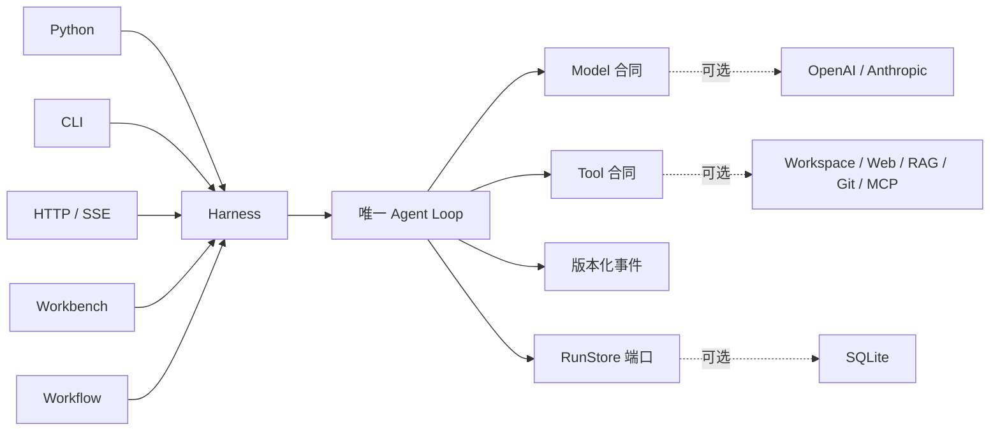

<h1 align="center">Sasori</h1>

<p align="center"><strong>为精密执行、自由组合与持续进化而生的 Python Agent Framework。</strong></p>

<p align="center">
  <a href="https://github.com/syusama/sasori/blob/main/README.md">English</a> ·
  <a href="https://github.com/syusama/sasori/blob/main/README_zh.md"><strong>简体中文</strong></a> ·
  <a href="https://github.com/syusama/sasori/blob/main/README_ja.md">日本語</a> ·
  <a href="https://github.com/syusama/sasori/blob/main/README_ko.md">한국어</a>
</p>

<p align="center">
  <a href="https://github.com/syusama/sasori/actions/workflows/ci.yml"></a>
  
  
  
  <a href="https://github.com/syusama/sasori/blob/main/LICENSE"></a>
</p>

<p align="center">
  
</p>

Sasori 是一个为工具型 Agent 打造的 Python-first Framework。它让 Agent 在能力不断
增长时，依然保持清晰、可控、可信。框架中心是 `sasori-core`：一个零依赖、从头到尾
都能读懂的 Loop/Harness；围绕它，是 Provider、SQLite、插件、Workflow、Memory、
Artifact、HTTP/SSE 与响应式 Workbench 组成的完整应用栈，全部服从同一份执行合同。

Sasori 这个名字代表一种设计隐喻：像蝎自由而精确地操控不同傀儡一样，开发者可以
灵活组合模型、Tool、Skill、Memory 与 Workflow。每项能力都可拆卸，统筹它们的
智能始终精确。Sasori 不追求动漫化界面，而是把每一个 Agent 当作工程艺术品打造：
模块清晰、表现出色、全程可审计，并且经得起长期演进。

## 为什么是 Sasori

> **最简单的答案：核心轻巧，运行统一，执行可信。**

Sasori 把模型、Tool、Skill、Memory 和 Workflow 看作围绕同一个可读运行时自由
组合的能力。你可以只用 `sasori-core` 写一个小巧的 Python Agent，也可以逐步装配
完整框架，而不需要换掉已经通过测试的执行引擎。

| 设计维度 | Sasori 标准 | 开发者获得什么 |
|---|---|---|
| **天生轻巧** | 零依赖小核心严格控制职责边界 | 几秒起步、轻松读懂，只装产品真正需要的能力 |
| **一条执行主线** | Python、CLI、HTTP/SSE、Workflow 与 Workbench 共用一个 Harness 和 Loop | 所有入口遵循相同的事件、审批与恢复语义 |
| **Tool 安全** | 只有完整且结构合法的 Tool Call 才能执行，保留参数伪造直接 fail closed | 错误或残缺的模型输出永远不会意外触发真实操作 |
| **副作用完整性** | Tool 明确声明 `read_only`、`idempotent` 或 `side_effecting`；审批、继续与 `effect_unknown` 全部显式 | 超时、重试、取消和恢复之后，外部动作依然清楚、可查、可处理 |
| **实时而不失真** | 模型流和 Tool 进度保持瞬态；版本化事件与 Checkpoint 构成持久事实 | 既拥有流畅的实时体验，也守住审计与恢复的准确性 |
| **产品级成长** | 所有适配器消费同一份公开投影，不重复实现 Agent | 从小脚本走向完整产品，无需迁移执行引擎 |

在 Sasori 中，能力的广度永远不会以执行的清晰度为代价。每次调用都会被验证，每种
副作用都有明确分类，每次审批都是显式决定，每个持久状态都可以检查。它既适合一把
轻快锋利的 Developer Tool，也足以承载长时间运维 Agent，以及会真实操作文件、Git、
数据库、浏览器和外部 API 的严肃业务流程。

**从一把手术刀开始，组装成一座完整工作室；从第一次 Tool Call 到最终产品，始终
使用同一个可信运行时。**

## 两个发行包，一条运行主线

| | `sasori-core` | `sasori` |
|---|---|---|
| Python 导入 | `sasori_core` | `sasori` 及可选顶层模块 |
| 适合场景 | 嵌入权威的单 Agent 运行时 | 组装功能完整的 Agent 应用 |
| 包含 | 合同、Loop/Harness、版本化投影、`RunStore`、临时存储、测试工具 | 精确同版本核心，加 SQLite、Provider、CLI、HTTP/SSE、插件、Workflow、Memory、Artifact、应用和 Workbench |
| 运行时依赖 | **0** | 精确依赖 `sasori-core==0.1.0.dev1`；第一方能力尽量使用标准库 |
| 明确不放进核心 | Provider SDK、持久化、HTTP、RAG、多 Agent、UI、市场 | 不允许第二个 Loop 或影子 Harness |

包名和导入名刻意保持清楚：

```text
PyPI distribution: sasori-core       Python import: sasori_core
PyPI distribution: sasori            Python import: sasori
```

直接从仓库安装：

```bash
# 最小运行时
python -m pip install ./packages/sasori-core

# 完整框架
python -m pip install ./packages/sasori-core
python -m pip install --no-deps .
```

## 30 秒运行一个完整 Agent

```python
import asyncio

from sasori_core import Harness, Message, ModelReply, Tool, ToolCall


def inspect(topic: str) -> str:
    return f"verified evidence for {topic}"


class DemoModel:
    async def complete(self, messages, tools):
        if messages[-1].role == "user":
            return ModelReply(
                tool_calls=(ToolCall("inspect-1", "inspect", {"topic": "Sasori"}),)
            )
        return ModelReply(content=f"Grounded: {messages[-1].content}")


async def main():
    with Harness(
        DemoModel(),
        (Tool("inspect", inspect, effect="read_only"),),
    ) as agent:
        result = await agent.run((Message("user", "Inspect the runtime"),))
    print(result.final_message.content)


asyncio.run(main())
```

只实现 complete 的 Model 就是最小合同；Streaming 是可选、Provider-neutral 的
扩展。被截断、过大、结构无效或不完整的 Tool Call 会 fail closed，绝不会执行。

## 一条控制链



实线部分就是 `sasori-core`；虚线部分都可替换，并且始终留在核心之外。

## 看得见的精密

下列图片来自运行时提交
[`71993de`](https://github.com/syusama/sasori/commit/71993de377a837c85c6cba5bcbf83a36228a1dc2)
的真实 Sasori Server。浏览器旅程完整经过 SQLite、审批、显式继续、两次已审计副作用、
冷历史重建、Artifact、能力投影、严格 Workflow 预检和耐久 Catalog 保存。
每张图的尺寸、字节数、SHA-256、浏览器版本和场景都记录在
[截图清单](docs/assets/screenshots-manifest.json) 中。

<p align="center">
  
</p>

<p align="center"><sub>已完成的类型化 Workflow：结果、定义身份和有效能力边界同时可见。</sub></p>

<p align="center">
  
</p>

<p align="center"><sub>Workflow Studio 使用 strong-ETag CAS 保存不可变版本；服务端权威预检不会调用模型，也不会分发工具。</sub></p>

<table>
  <tr>
    <td width="50%" align="center"></td>
    <td width="50%" align="center"></td>
  </tr>
  <tr>
    <td align="center"><sub>任务工作区 · 精确 390×844 CSS viewport</sub></td>
    <td align="center"><sub>能力检查器 · 精确 390×844 CSS viewport</sub></td>
  </tr>
</table>

Workbench 是同一个 Sasori 运行时的操作界面，不是覆盖在另一套实现上的概念演示。
实时执行、持久历史、审批恢复、Workflow 创作、Artifact 与能力检查，在一个克制、
高密度而清晰的工作空间里自然汇合。

## 完整的 Sasori 能力栈

| 领域 | 内置能力 |
|---|---|
| Core | 零依赖合同、Loop/Harness、严格 Streaming 收口、审批/恢复、`RunStore`、临时存储、稳定公开投影、确定性 Fake |
| Durability | SQLite revision、事件、Checkpoint、重启恢复、CAS、单 owner 准入 |
| Providers | 标准库实现的 OpenAI Responses 与 Anthropic Messages Adapter，共用线协议一致性测试 |
| Context & Memory | 有界上下文，以及独立的固定作用域、不可变 revision SQLite Memory 扩展 |
| Tools & Plugins | Workspace、HTTPS allowlist、SQLite/FTS5 RAG、本地 Git、冻结 MCP stdio、可信 entry point 发现和权限披露 |
| Workflow | 严格静态串行定义、零执行预检、不可变保存版本、CAS 冲突核验、唯一 Harness 执行路径 |
| Product | Python API、CLI、HTTP/SSE、Incident/Research/Developer 应用、Artifact 与响应式 Workbench |

详细合同见 [Foundation](docs/FOUNDATION.md)、[HTTP API](docs/HTTP_API.md)、
[Providers](docs/PROVIDERS.md)、[Workflow](docs/WORKFLOWS.md)、
[Memory](docs/MEMORY.md)、[Artifacts](docs/ARTIFACTS.md) 与
[Security](SECURITY.md)。

## 运行时保证

- 公开事件是版本化语义投影，不是可变内部状态的序列化。
- 每个 Tool 都是 `read_only`、`idempotent` 或 `side_effecting`；不安全操作
  必须跨过显式审批和继续边界。
- Tool 异常会变成明确的 Tool Result Error；取消信号不会被吞掉。
- Checkpoint/resume 是步骤边界恢复。副作用 Tool 必须提供 idempotency key，
  或声明显式人工恢复策略。
- 第三方 Python entry point 是宿主上的可信代码，不是沙箱。
- 可变输入不能改写已经耐久化的参数、审批、重试或其他 Store Adapter 的视图。

## 从 Core 到容器，全部验证

Sasori 在完整交付链路上持续接受验证：

- `547` 项确定性 `unittest`；Windows 缺少相应系统权限时跳过 `5` 个 symlink 用例；
- `31 / 31` 项真实 Chrome Workbench 验收，覆盖 1600×1000、390×844、
  360×800、reduced-motion 和窄屏结构化结果；
- 真实 Server 浏览器旅程，覆盖审批、显式继续、严格两次审计副作用、冷历史、
  Artifact、类型化 Workflow 与 Saved Catalog；
- original wheel、重建 sdist、精确 bundle/core 与已安装分发包验证；
- 国内源 Docker build 和真实 non-root 容器工作流。

每一层都以开发者能够真实运行、检查、打包和部署的软件形态接受检验，而不是停留在
方案、承诺或摆拍式 Demo 中。

## 一套系统，完整贯通

- 几行代码嵌入 Core，也可以通过响应式工作空间驾驭完整 Framework；
- 提供实时流式反馈，同时维护干净、版本化、可持久恢复的事实来源；
- 自由装配 Provider、Tool、Skill、Memory、Workflow 与插件，Core 始终保持轻巧；
- 审批、副作用分类、恢复和审计语义，从本地 Python 一路贯通 HTTP/SSE 与 Workbench；
- 使用锁定依赖、可复现源码包，以及国内源支持的 non-root 容器工作流交付。

这就是 Sasori 的优势：**微框架般的优雅，完整 Agent 平台的纵深，以及一条精确的
运行主线把所有能力稳稳串联。**

## 名称来源与独立声明

Sasori 的名字灵感来自《火影忍者》中的傀儡师“蝎”：精密的技艺、可组合的机制，
以及对作品持久性的追求。这层关联仅用于项目名、这段简短说明和项目所有者
提供的品牌素材，不是 Workbench 的视觉主题。

Sasori 是独立开源项目，与《火影忍者》、岸本齐史、集英社、东京电视台、Studio
Pierrot 及其权利方没有隶属、授权、赞助或背书关系。项目 Logo 由项目所有者提供，
仅用于品牌展示；本仓库不会把它表述为官方素材，也不主张其中的第三方权利归 Sasori 所有。

## 许可证与贡献

Sasori 代码使用 [MIT License](LICENSE)。第三方插件保留各自许可证，并作为可信
宿主代码运行。安全边界见 [SECURITY.md](SECURITY.md)。修改公开事件、恢复语义、
Golden Trace 或插件权限时，应同时提交决策记录和可运行回归证据。

**轻装构建，精密编排，交付值得信赖的 Agent。**
