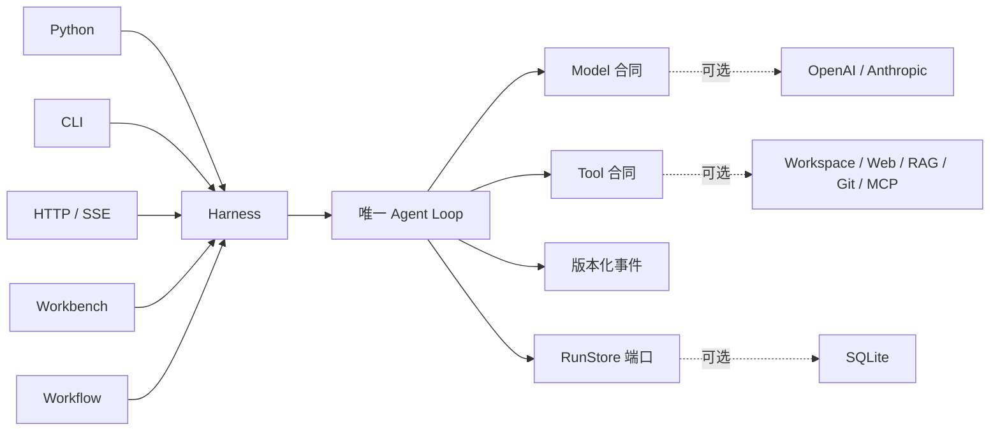

<h1 align="center">Sasori</h1>

<p align="center"><strong>从轻量 Python Agent 核心开始，按需要扩展成完整框架。</strong></p>

<p align="center">
  <a href="https://github.com/syusama/sasori/blob/main/README.md">English</a> ·
  <a href="https://github.com/syusama/sasori/blob/main/README_zh.md"><strong>简体中文</strong></a> ·
  <a href="https://github.com/syusama/sasori/blob/main/README_ja.md">日本語</a> ·
  <a href="https://github.com/syusama/sasori/blob/main/README_ko.md">한국어</a>
</p>

<p align="center">
  <a href="https://github.com/syusama/sasori/actions/workflows/ci.yml"></a>
  
  
  
  <a href="https://github.com/syusama/sasori/blob/main/LICENSE"></a>
</p>

<p align="center">
  
</p>

Sasori 是一个 Python-first 的工具型 Agent Framework。它最小可以只是一个
零依赖、从头到尾都能读懂的 Loop/Harness；当产品需要更多能力时，再沿着同一条
运行路径装配 Provider、SQLite、插件、Workflow、Memory、Artifact、HTTP/SSE
和响应式 Workbench。界面背后不会藏着第二套执行引擎。

Sasori 这个名字也代表一种设计隐喻：像蝎自由而精确地操控不同傀儡一样，开发者
可以灵活组合模型、Tool、Skill、Memory 与 Workflow。这里借用的不是动漫化界面，
而是对精密控制、模块化组合和长久作品的追求——把每一个 Agent 都当作工程艺术品
来打造，既有表现力，也可靠、可拆装、经得起验证。

> **当前边界：** `0.1.0.dev1` 是已经过验证的单机、单 owner 预发布候选，
> 还不是公共多租户控制面、分布式执行器、不可信代码沙箱或公共插件市场。
> 包发布目前暂停，请先从仓库 checkout 安装。

## 为什么是 Sasori

很多 Agent 框架一开始只有一段优雅的 Loop；接入 Provider、工具、恢复、API 和
产品界面后，运行路径却越来越难解释。Sasori 把这些边界保持为可见事实：

- **默认足够小。** `sasori-core` 零运行时依赖，只拥有合同、单 Agent Loop、
  Harness、公开事件投影和确定性测试工具。
- **只有一条运行路径。** Python、CLI、HTTP/SSE、Workflow 和 Workbench
  共用同一个 Harness 与耐久事件合同。
- **副作用可以审计。** Tool 必须声明 effect 类型；审批、执行、显式继续和
  人工恢复是彼此独立的事实。
- **恢复语义不夸大。** Checkpoint 只保证步骤边界恢复，不会把任意外部副作用
  宣称成 exactly-once。
- **产品质量可以验收。** Workbench 是真实运行时客户端，不是概念图，也不复制
  一套业务规则。

## 两个发行包，一条运行主线

| | `sasori-core` | `sasori` |
|---|---|---|
| Python 导入 | `sasori_core` | `sasori` 及可选顶层模块 |
| 适合场景 | 嵌入权威的单 Agent 运行时 | 组装功能完整的 Agent 应用 |
| 包含 | 合同、Loop/Harness、版本化投影、`RunStore`、临时存储、测试工具 | 精确同版本核心，加 SQLite、Provider、CLI、HTTP/SSE、插件、Workflow、Memory、Artifact、应用、Workbench 和市场脚手架 |
| 运行时依赖 | **0** | 精确依赖 `sasori-core==0.1.0.dev1`；第一方能力尽量使用标准库 |
| 明确不放进核心 | Provider SDK、持久化、HTTP、RAG、多 Agent、UI、市场 | 不允许第二个 Loop 或影子 Harness |

包名和导入名刻意保持清楚：

```text
PyPI distribution: sasori-core       Python import: sasori_core
PyPI distribution: sasori            Python import: sasori
```

从当前仓库安装候选版本：

```bash
# 最小运行时
python -m pip install ./packages/sasori-core

# 完整框架
python -m pip install ./packages/sasori-core
python -m pip install --no-deps .
```

## 30 秒运行一个完整 Agent

```python
import asyncio

from sasori_core import Harness, Message, ModelReply, Tool, ToolCall


def inspect(topic: str) -> str:
    return f"verified evidence for {topic}"


class DemoModel:
    async def complete(self, messages, tools):
        if messages[-1].role == "user":
            return ModelReply(
                tool_calls=(ToolCall("inspect-1", "inspect", {"topic": "Sasori"}),)
            )
        return ModelReply(content=f"Grounded: {messages[-1].content}")


async def main():
    with Harness(
        DemoModel(),
        (Tool("inspect", inspect, effect="read_only"),),
    ) as agent:
        result = await agent.run((Message("user", "Inspect the runtime"),))
    print(result.final_message.content)


asyncio.run(main())
```

只实现 complete 的 Model 就是最小合同；Streaming 是可选、Provider-neutral 的
扩展。被截断、过大、结构无效或尚未完整结束的 Tool Call 会 fail closed，绝不会执行。

## 一条控制链



实线部分就是 `sasori-core`；虚线部分都可替换，并且始终留在核心之外。

## 这是真实 Workbench

下列图片来自运行时提交
[`71993de`](https://github.com/syusama/sasori/commit/71993de377a837c85c6cba5bcbf83a36228a1dc2)
的真实 Sasori Server。浏览器旅程完整经过 SQLite、审批、显式继续、两次已审计副作用、
冷历史重建、Artifact、能力投影、严格 Workflow 预检和耐久 Catalog 保存。
每张图的尺寸、字节数、SHA-256、浏览器版本和场景都记录在
[截图清单](docs/assets/screenshots-manifest.json) 中。

<p align="center">
  
</p>

<p align="center"><sub>已完成的类型化 Workflow：结果、定义身份和有效能力边界同时可见。</sub></p>

<p align="center">
  
</p>

<p align="center"><sub>Workflow Studio 使用 strong-ETag CAS 保存不可变版本；服务端权威预检不会调用模型，也不会分发工具。</sub></p>

<table>
  <tr>
    <td width="50%" align="center"></td>
    <td width="50%" align="center"></td>
  </tr>
  <tr>
    <td align="center"><sub>任务工作区 · 精确 390×844 CSS viewport</sub></td>
    <td align="center"><sub>能力检查器 · 精确 390×844 CSS viewport</sub></td>
  </tr>
</table>

Proma 是 Sasori 在信息架构、工作区密度和三栏交互方面的对标。Sasori 的无构建
前端、CSS、文案、Logo、截图和资产均针对自身合同独立实现，不复用 Proma 的
AGPL 源码或资产。

## 当前真正包含什么

| 领域 | 当前候选已交付 |
|---|---|
| Core | 零依赖合同、Loop/Harness、严格 Streaming 收口、审批/恢复、`RunStore`、临时存储、稳定公开投影、确定性 Fake |
| Durability | SQLite revision、事件、Checkpoint、重启恢复、CAS、单 owner 准入 |
| Providers | 标准库实现的 OpenAI Responses 与 Anthropic Messages Adapter，共用线协议一致性测试 |
| Context & Memory | 有界上下文，以及独立的固定作用域、不可变 revision SQLite Memory 扩展 |
| Tools & Plugins | Workspace、HTTPS allowlist、SQLite/FTS5 RAG、本地 Git、冻结 MCP stdio、可信 entry point 发现和权限披露 |
| Workflow | 严格静态串行定义、零执行预检、不可变保存版本、CAS 冲突核验、唯一 Harness 执行路径 |
| Product | Python API、CLI、HTTP/SSE、Incident/Research/Developer 应用、Artifact、响应式 Workbench、市场脚手架 |

详细合同见 [Foundation](docs/FOUNDATION.md)、[HTTP API](docs/HTTP_API.md)、
[Providers](docs/PROVIDERS.md)、[Workflow](docs/WORKFLOWS.md)、
[Memory](docs/MEMORY.md)、[Artifacts](docs/ARTIFACTS.md) 与
[Pi/Proma 对标](docs/BENCHMARK-PI-PROMA.md)。

## 运行时保证

- 公开事件是版本化语义投影，不是可变内部状态的序列化。
- 每个 Tool 都是 `read_only`、`idempotent` 或 `side_effecting`；不安全操作
  必须跨过显式审批和继续边界。
- Tool 异常会变成明确的 Tool Result Error；取消信号不会被吞掉。
- Checkpoint/resume 是步骤边界恢复。副作用 Tool 必须提供 idempotency key，
  或声明显式人工恢复策略。
- 第三方 Python entry point 是宿主上的可信代码，不是沙箱。
- 可变输入不能改写已经耐久化的参数、审批、重试或其他 Store Adapter 的视图。

## 先有证据，再有形容词

当前运行时快照已经通过：

- `532` 项确定性 `unittest`；Windows 缺少相应系统权限时跳过 `5` 个 symlink 用例；
- `31 / 31` 项真实 Chrome Workbench 验收，覆盖 1600×1000、390×844、
  360×800、reduced-motion 和窄屏结构化结果；
- 真实 Server 浏览器旅程，覆盖审批、显式继续、严格两次审计副作用、冷历史、
  Artifact、类型化 Workflow 与 Saved Catalog；
- original wheel、重建 sdist、精确 bundle/core 与已安装分发包验证；
- 国内源 Docker build 和真实 non-root 容器工作流。

生成的计划、自测、漂亮截图或上游 README 都不是发布权威；可运行验收证据才是门槛。

## 对标，但不复制

- **Pi**：学习可读 Loop 与严格的 Tool/Event 顺序；Sasori 保持零依赖 Python Core、
  可执行 Harness、严格终止收口和显式恢复边界。
- **Proma**：学习产品密度和工作区可发现性；只吸收架构与交互经验，不复制其
  AGPL 源码或资产。
- **LeAgent / ToFu**：学习有价值的产品广度和运行时思路，同时收紧副作用歧义、
  投影所有权、包边界和证据门。

固定 commit、证据与许可证边界见 [Pi / Proma](docs/BENCHMARK-PI-PROMA.md)、
[LeAgent / ToFu](docs/BENCHMARK-LEAGENT-TOFU.md) 和
[第三方声明](THIRD_PARTY_NOTICES.md)。

## Roadmap —— 尚未交付

- 插件签名来源、兼容策略和受治理的公共市场；
- 租户身份、授权、配额、耐久队列和分布式 Worker；
- 对 CPU、内存、文件系统和网络出口有明确策略的不可信 Tool 隔离执行；
- 在副作用、取消、审批和回放语义稳定后，再扩展 DAG/并行 Workflow 与多 Agent；
- 在同一权威运行时之上提供团队工作区和数字员工。

## 名称来源与独立声明

Sasori 的名字灵感来自《火影忍者》中的傀儡师“蝎”：精密的技艺、可组合的机制，
以及对作品持久性的追求。这层关联仅用于项目名、这段简短说明和上方由项目所有者
提供的 Logo，不是 Workbench 的视觉主题。

Sasori 是独立开源项目，与《火影忍者》、岸本齐史、集英社、东京电视台、Studio
Pierrot 及其权利方没有隶属、授权、赞助或背书关系。上方 Logo 由项目所有者提供，
仅用于品牌展示；本仓库不会把它表述为官方素材，也不主张其中的第三方权利归 Sasori 所有。

## 许可证与贡献

Sasori 代码使用 [MIT License](LICENSE)。第三方插件保留各自许可证，并作为可信
宿主代码运行。安全边界见 [SECURITY.md](SECURITY.md)。修改公开事件、恢复语义、
Golden Trace 或插件权限时，应同时提交决策记录和可运行回归证据。

**从小处开始，只装配产品真正需要的能力，让每个重要动作都可检查。**
