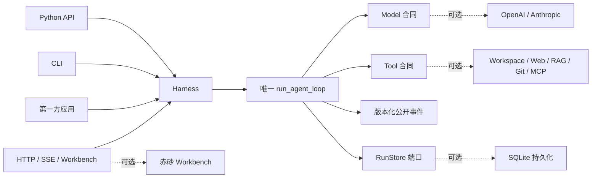

<p align="center">
  
</p>

<p align="center">
  <a href="https://github.com/syusama/sasori/actions/workflows/ci.yml"></a>
  
  
  
  <a href="https://github.com/syusama/sasori/blob/main/LICENSE"></a>
</p>

<p align="center">
  <a href="https://github.com/syusama/sasori/blob/main/README.md">English</a> ·
  <strong>简体中文</strong> ·
  <a href="https://github.com/syusama/sasori/blob/main/README_ja.md">日本語</a> ·
  <a href="https://github.com/syusama/sasori/blob/main/README_ko.md">한국어</a>
</p>

<h1 align="center">一核牵万机</h1>

<p align="center"><strong>一枚小到可以从头读到尾的 Python Agent 核心，也能生长为完整、可靠、高颜值的 AI 工作台——而且永远只有一条运行时主线。</strong></p>

Sasori 既是一把快准狠的机关短刃，也是一座可以不断装配的傀儡工房。
最小形态只有一个零依赖 Loop/Harness、一种模型和你真正需要的工具；需要时再装上
SQLite、Provider、插件、Workflow、Memory、Artifact、HTTP/SSE 与 Workbench。
Python、CLI、HTTP 和 UI 拉动的是同一组傀儡线，不会在产品层暗藏第二套引擎。

名字的灵感来自《火影忍者》中追求“永恒艺术”的傀儡师——赤砂之蝎：精密的机关、
可替换的武装、华丽而危险的傀儡术。Sasori 不复制角色形象，而是把这层精神翻译成
软件：**核心必须经典可读，模块必须随拆随用，危险动作必须看得见，每次运行必须留下
可以审计的证据。**

> 当前边界：Sasori 是经过验证的单机、单 owner 预发布候选，不是已经完成的公共
> 多租户控制面、分布式执行器、不可信代码沙箱或中央插件市场。

## 两个发行包，一枚机关心脏

| | `sasori-core` | `sasori` |
|---|---|---|
| Python 导入 | `sasori_core` | `sasori` 及可选顶层模块 |
| 定位 | 嵌入式、权威的单 Agent 运行时 | 大而全的框架装配包 |
| 包含 | 合同、唯一 Loop/Harness、版本化公开投影、存储无关 `RunStore`、`EphemeralRunStore`、测试工具 | 精确同版本核心，以及 SQLite、Provider、CLI、HTTP/SSE、插件、Workflow、Memory、Artifact、应用、Workbench、市场脚手架 |
| 运行依赖 | **0** | 精确依赖 `sasori-core==0.1.0.dev1` |
| 不包含 | Provider SDK、数据库、HTTP、RAG、多 Agent、UI、市场 | 不允许出现第二个 Loop 或影子 Harness |

正式包名不会含糊：

```text
PyPI distribution: sasori-core       Python import: sasori_core
PyPI distribution: sasori            Python import: sasori
```

在 `0.1.0.dev1` 通过 Hosted CI 与 TestPyPI 双包门之前，请从当前仓库安装候选：

```bash
# 最小核心
python -m pip install ./packages/sasori-core

# 完整框架：先安装本地精确核心，再避免去远端解析同名候选
python -m pip install ./packages/sasori-core
python -m pip install --no-deps .
```

## 30 秒跑起最小 Agent

```python
import asyncio

from sasori_core import Harness, Message, ModelReply, Tool, ToolCall


def inspect(topic: str) -> str:
    return f"verified evidence for {topic}"


class DemoModel:
    async def complete(self, messages, tools):
        if messages[-1].role == "user":
            return ModelReply(
                tool_calls=(ToolCall("inspect-1", "inspect", {"topic": "Sasori"}),)
            )
        return ModelReply(content=f"Grounded: {messages[-1].content}")


async def main():
    with Harness(
        DemoModel(),
        (Tool("inspect", inspect, effect="read_only"),),
    ) as agent:
        result = await agent.run((Message("user", "Inspect the mechanism"),))
    print(result.final_message.content)


asyncio.run(main())
```

模型可以只实现一次性 `complete()`，流式能力完全可选且与 Provider 无关。严格语法是：

```text
start → deltas* → 恰好一个 done / error / aborted → 迭代器结束
```

被截断、只有 partial、超限、非法 UTF-8、超深、循环引用或结构错误的工具调用都会
失败关闭，绝不执行。

## 真实产品，不是概念渲染

下面每张图都来自真实 Sasori 服务，运行时代码固定在
[`b10b787`](https://github.com/syusama/sasori/commit/b10b787f93f2b5d29cd35c30dee17bbdc9e4de7b)。
真实浏览器完成了 SQLite 持久化、人工审批、显式继续、一次可审计副作用、冷历史、
Artifact 校验、能力投影、Workflow 预检与 Catalog 封存。每张图的源码 commit、请求
视口、实际像素、字节数与 SHA-256 都在
[截图证据清单](docs/assets/screenshots-manifest.json) 中。

<p align="center">
  
</p>

<table>
  <tr>
    <td width="50%"></td>
    <td width="50%"></td>
  </tr>
  <tr>
    <td align="center"><sub>审批只记录意图，不会偷偷执行副作用。</sub></td>
    <td align="center"><sub>只有显式继续之后，机关才真正动作。</sub></td>
  </tr>
  <tr>
    <td></td>
    <td></td>
  </tr>
  <tr>
    <td align="center"><sub>严格 JSON 预检、不可变 revision、强 ETag CAS；零运行。</sub></td>
    <td align="center"><sub>Skill、Tool、MCP、Provider、插件与真实信任边界。</sub></td>
  </tr>
  <tr>
    <td></td>
    <td></td>
  </tr>
</table>

<table>
  <tr>
    <td width="50%" align="center"></td>
    <td width="50%" align="center"></td>
  </tr>
</table>

原创视觉体系叫 **赤砂机关工房**：黑漆、黄铜、朱砂、刻度、傀儡线和不可变卷宗。
Proma 是产品密度和三栏工作台的对标，不是素材库；Sasori 不复制其 AGPL 源码、CSS、
文案、Logo、截图或资产。

## 一条控制主线



实线属于 `sasori-core`；虚线模块全部可替换并留在核心之外。

## 真正重要的运行时不变量

- **唯一 Loop/Harness：** Python、CLI、HTTP、Workflow、UI 汇合到同一路径。
- **事件是投影：** 公开事件是版本化语义事实，不是可变内部对象的序列化。
- **副作用显式：** Tool 必须声明 `read_only`、`idempotent` 或
  `side_effecting`；非只读调用带 revision 并进入审批。
- **审批不等于执行：** 先持久化批准/拒绝，再由操作者显式继续。
- **恢复不撒谎：** checkpoint/resume 是步骤边界恢复，不是 exactly-once；外部结果
  不确定时停在 `effect_unknown`，按指纹人工裁决。
- **取消是协作式：** 传播取消，但不声称远端模型或同步线程已经被强行停止。
- **插件公开信任：** 已安装 Python entry point 是宿主可信代码，不是沙箱；MCP 由
  服务端 transport 元数据分类，前端不猜。
- **状态完全隔离：** 模型/工具拿到的可变值不能回写持久参数、审批、重试或其他
  store adapter 的视图。

## 当前候选实际交付

| 模块 | 已交付边界 |
|---|---|
| Core | 零依赖合同、Loop/Harness、严格流式协议、审批/恢复、`RunStore`、临时 store、稳定投影、确定性测试 Harness |
| 持久化 | SQLite revision/event/checkpoint/CAS、重启恢复、单 owner 准入 |
| Provider | 标准库 OpenAI Responses 与 Anthropic Messages adapter，共用 conformance |
| Context / Memory | 有界结构化/可选语义压缩；独立固定 scope、不可变 revision 的 SQLite Memory，写入仍走 Harness |
| 工具 / 插件 | workspace、白名单 HTTPS、SQLite/FTS5 RAG、本地 Git、冻结 MCP stdio、可信 entry point 与权限披露 |
| Workflow | 严格静态串行定义、零执行权威预检、不可变保存 revision、CAS 冲突/对账、唯一 Harness 执行路径 |
| 产品 | CLI、HTTP/SSE、Incident、按配置启用的 Research/Developer、Artifact、响应式 Workbench、市场脚手架 |

更深的合同见 [架构基础](docs/FOUNDATION.md)、[HTTP API](docs/HTTP_API.md)、
[Workflow](docs/WORKFLOWS.md)、[Memory](docs/MEMORY.md)、
[Artifact](docs/ARTIFACTS.md) 与 [Pi/Proma 对标](docs/BENCHMARK-PI-PROMA.md)。

## 先有证据，再用形容词

当前运行时快照已通过：

- `531` 项确定性 `unittest`（Windows 没有创建符号链接特权时跳过 `5` 项相关用例）；
- 桌面、窄屏、reduced-motion 下 `30 / 30` 浏览器验收；
- `3 / 3` 条真实服务旅程，覆盖审批、继续、Workflow、Catalog、历史、Artifact、权限；
- 使用 DaoCloud digest 固定 Python 镜像与清华 PyPI 源的国内源 Docker 构建和非 root
  容器真实工作流；
- 原始 core wheel、core sdist 重建、精确 bundle+core wheel、bundle sdist 锁定重建的
  干净安装回环。

README 元数据会改变 bundle wheel，因此这里故意不写即将过期的最终 hash。
[发布门](docs/RELEASE.md) 会在 Hosted CI、TestPyPI 和 tag 之前重新构建并绑定精确字节。
测试才是发布权威；模型生成的计划和漂亮截图都不是。

## 对标，但不照抄

- **Pi**（MIT，固定 commit）：学习可读 Loop 和有序 Tool/Event；Sasori 继续做到 Python
  零依赖核心、真正可执行 Harness、更严格的流终止与显式恢复。
- **Proma**（AGPL-3.0-only，固定 commit）：学习三栏生产力工作台和 Workflow 可发现性；
  Sasori 基于自己的事件合同原创实现无构建 UI 与视觉体系。
- **LeAgent / ToFu：** 吸收产品广度与耐久运行经验，同时强化 effect ambiguity、投影
  ownership、发行边界和证据门。

源码与许可证证据见 [Pi / Proma](docs/BENCHMARK-PI-PROMA.md)、
[LeAgent / ToFu](docs/BENCHMARK-LEAGENT-TOFU.md) 和
[第三方声明](THIRD_PARTY_NOTICES.md)。

## 下一批机关——尚未交付

- 插件签名、兼容策略和有治理的公开市场；
- 租户身份、授权、配额、持久队列和分布式 Worker；
- 对不可信工具提供 CPU、内存、文件系统和网络出口都可验证的隔离；
- 只有在 effect、取消、审批、replay 合同先被证明后，才扩展 DAG、并行 Workflow 与
  多 Agent 编排；
- 团队、数字员工和桌面级大产品，但仍复用唯一 Loop。

## 名称、创作与权利边界

Sasori 是独立开源项目，与《火影忍者》、岸本齐史、集英社、东京电视台、Studio
Pierrot 及相关权利方不存在官方隶属、授权、赞助或背书关系。项目只使用原创的抽象
机械蝎、傀儡线、机关、精密、可拆模块、赤砂和“永恒艺术”隐喻，不使用官方角色图、
动画帧、服饰造型、Logo、台词或字体。正式公开发布前仍需独立完成名称与商标检索。

## License 与贡献

Sasori 代码使用 [MIT License](LICENSE)。第三方插件保留各自许可证，并作为宿主可信
代码运行。安全边界见 [SECURITY.md](SECURITY.md)；会改变公共合同的贡献应同时提供
决策记录与可运行验收证据。

**造一具傀儡，亮出每根线，让结果真正留下来。**
