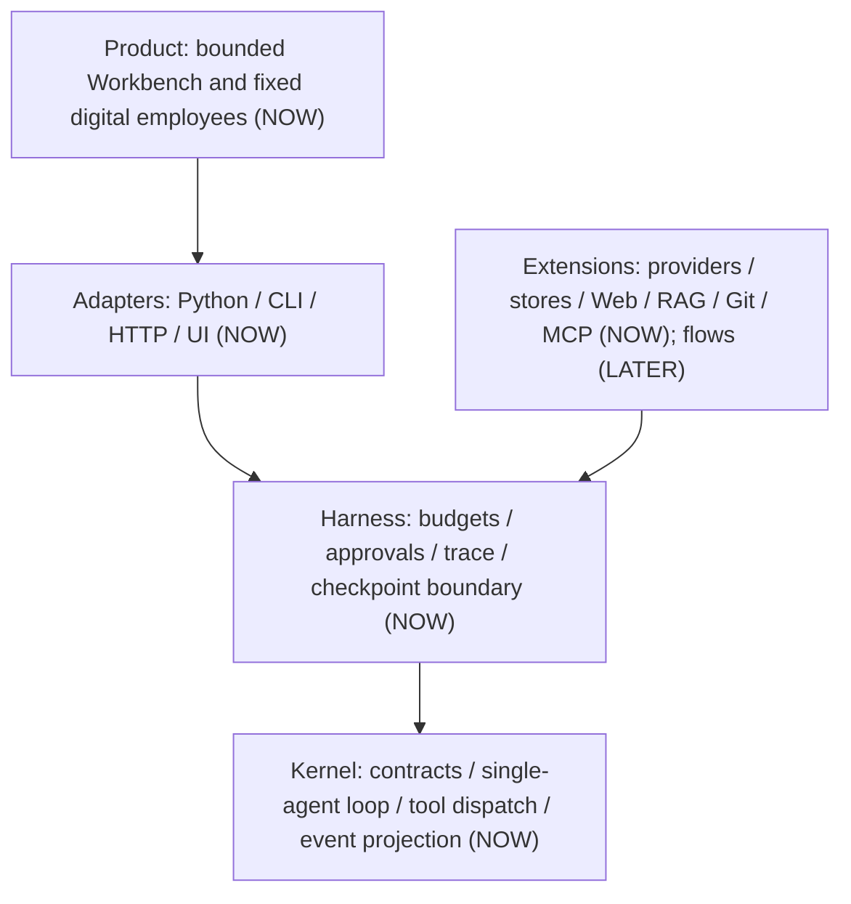

# Sasori foundation: decision, architecture, research, and gates

Status: **accepted foundation for an experimental vertical slice**
Date: 2026-08-07
Decision owner: repository maintainer
Current implementation state: the repository foundation, single Loop/Harness, G1 trust semantics, stdlib OpenAI/Anthropic adapters with optional upstream SSE aggregation, Python/CLI/HTTP entry points, local multi-application HTTP/SSE, domestic-source Docker delivery, trusted local plugins, three first-party application compositions, curated catalog metadata, and a bundled Workbench exist. Real-provider smoke, public token streaming, multi-agent orchestration, untrusted-plugin isolation, and a central marketplace remain incomplete; planned behavior is not described as shipped behavior.

## 1. Decision

### Recommendation

Sasori is a conditional **GO** as a four-to-eight-week validation of one proposition:

> Python teams can add a small, inspectable agent runtime to an existing service and diagnose or recover failed tool runs materially faster than with a direct model SDK or a larger framework.

It is **not yet a GO** for a general-purpose framework, plugin marketplace, or WorkBuddy-scale product. Reliability is necessary but not enough to make developers migrate. Before expanding, Sasori must show switching value in real applications.

### Initial user

The initial user is a Python backend developer who already has a FastAPI, Django, worker, or automation service and needs a tool-using agent without adopting a graph DSL or a full platform.

### Evidence gate for continuing as a framework

Within the validation period:

1. Interview 15 developers who already operate an agent or tool-calling loop.
2. Migrate two existing applications, not demos.
3. Let five non-team developers complete the quickstart without author assistance in 30 minutes.
4. Demonstrate at least a 50% reduction in median fault-localization time on the same injected failures versus a direct SDK and one mature framework.
5. Obtain one unprompted request for a second Sasori integration.

If these fail, retain the useful Loop/Harness as a testing and trace library rather than inflating it into a platform.

## 2. Brand without copyright debt

The useful Sasori character ideas are precision control, modular mechanisms, many configurations, decisive execution, and durable art. They become product principles:

- **Control lines are visible:** every model and tool transition is inspectable.
- **Mechanisms detach:** providers, storage, servers, skills, and UI are optional.
- **One puppet, one controller:** all adapters use the same runtime path.
- **Durability is earned:** a run is complete only after its stable result is committed.
- **Spectacle serves control:** later visual design may be expressive, but never hides state or evidence.

The project must not use official Naruto artwork, character silhouettes, costumes, dialogue, logos, or imply endorsement. Public technical APIs use ordinary industry terms, not anime lore. A trademark/name review is required before a major public launch. As of 2026-08-07, the PyPI JSON endpoint for `sasori` returned 404; the npm name was already occupied, so future frontend packages need a scope such as `@sasori-ai/*`.

## 3. Architecture

### 3.1 Kernel (`NOW`)

The initial distribution is `sasori`. The kernel has no required third-party runtime dependency and contains only:

- immutable message, model-reply, tool-call, tool, and public-event contracts;
- one async single-agent loop;
- serial tool dispatch;
- maximum-step and per-call timeout budgets;
- explicit event projection;
- a Harness used by applications and deterministic tests.

The kernel must not import provider SDKs, web servers, third-party database clients or ORMs, telemetry exporters, vector databases, UI packages, or orchestration frameworks. The current durable store uses only the standard-library `sqlite3` module.

### 3.2 Harness (`NOW`)

The Harness owns policy around the loop, not a second loop. It composes:

- model and tool registry;
- step/time budgets;
- event sink;
- approval policy;
- SQLite checkpoint store;
- append-only trace and recovery policy.

Python, CLI, HTTP, and UI adapters must call this Harness. Product code gets no private execution path.

### 3.3 Optional adapter and extension boundaries (`NOW/LATER`)

These are boundaries, not directories to scaffold before use:

| Capability | Intended package | Earliest gate |
|---|---|---|
| OpenAI-compatible provider | `sasori.OpenAIResponsesModel` backed by `sasori.provider_openai`; split only after an external package consumer exists | deterministic JSON/SSE conformance implemented; live smoke open |
| Anthropic provider | `sasori.AnthropicMessagesModel` backed by `sasori.provider_anthropic`; split only after an external package consumer exists | deterministic JSON/SSE conformance implemented; live smoke open |
| SQLite checkpoint/trace | currently `sasori.sqlite_store`; split only after an external package consumer exists | recovery state machine accepted |
| CLI | `sasori` entry point | implemented on the shared Harness path |
| HTTP/SSE | `sasori-server` entry point | implemented on the shared Harness path |
| MCP adapter | current frozen host adapter; split only after an external package consumer exists | bounded stdio boundary accepted |
| Graph/flow/multi-agent | extensions | three single-agent applications validated |
| Workbench | bundled static `sasori_web` resources; split only if independent deployment is needed | bounded product implemented after three applications |
| Marketplace | metadata service, not binary host | market gate in section 8 |

### 3.4 Public events are a projection

Internal mutable state, persisted checkpoints, UI streams, and telemetry are not the same record. Sasori exposes a small versioned event projection that adapters may persist or stream. Internal changes do not automatically become public ABI changes.

Initial semantic event families:

- `run.started`, `run.completed`, `run.failed`, `run.cancelled`;
- `model.started`, `model.completed`, `model.failed`;
- `tool.requested`, `tool.started`, `tool.completed`, `tool.failed`;
- `approval.requested`, `approval.resolved`, `recovery.resolved`.

Checkpoint generations are durable internal state, not yet a public event family. A future `checkpoint.committed` projection needs an adapter consumer and a compatibility decision; the runtime does not emit a self-referential checkpoint event merely to expose its internal write frequency.

Golden tests compare type, version, run/step identity, tool identity, call identity, and normalized data. They do not require identical timestamps or provider prose.

### 3.5 Execution invariants

1. A final answer is accepted only when the model returns no tool call.
2. An incomplete/truncated tool call never executes.
3. Tool arguments are checked against the Python callable signature before execution.
4. A tool exception becomes an explicit tool-error result that the model can observe; it is never reported as success.
5. `CancelledError` propagates after a cancellation event; it is never converted into an ordinary tool error.
6. Serial tool execution is the initial semantic. Parallel execution waits for explicit effect/idempotency metadata.
7. Model and tool timeouts are visible failures. A timed-out synchronous function running in a worker thread may continue; documentation and tests must not claim otherwise.
8. Recovery is at step boundaries. Sasori does not claim arbitrary-point replay or exactly-once side effects.
9. Before a side-effecting tool can be resumed automatically, it supplies a stable idempotency key and recovery policy. Otherwise recovery stops for human resolution.
10. Provider-specific capability remains behind an explicit escape hatch; the common contract must not pretend all providers are identical.

### 3.6 Durable state machine and commit points

`Harness.run()` and `Harness.resume()` enter the same `_drive()` loop. There is no replay loop and no event-sourcing executor. Each durable transition uses `BEGIN IMMEDIATE`, updates the run revision with compare-and-swap, appends a full recoverable checkpoint and semantic events in the same transaction, commits, and only then calls the observational event sink.

| Durable status / call state | Meaning | Allowed next action |
|---|---|---|
| `ready_model` | History is committed; no accepted reply is pending | Call the model. A crash may cause another model attempt and cost, but no tool is dispatched from an uncommitted reply. |
| `processing_reply` + call `requested` | The accepted model reply, immutable call fingerprint, effect metadata, and stable key are committed | Validate, request approval when needed, or commit dispatch intent. |
| `awaiting_approval` | `approval.requested` and its exact fingerprint are committed | Resolve once to approve or deny. Repeating the same decision is idempotent; a conflicting decision fails. |
| `awaiting_resume` | An approval or manual effect decision is durable, but the Loop has not continued | Project `paused / resume_required`. Only an explicit resume request re-enters `_drive()`. |
| call `dispatching` | Dispatch intent was committed before entering the handler | Read-only work may retry. Idempotent work may retry only with the same framework-injected key. Ordinary side effects become `effect_unknown`. |
| call `result` | Tool output or explicit tool error and the updated history are committed together | Never invoke that tool call again; continue to the next call or model step. |
| `effect_unknown` | A non-idempotent effect may or may not have happened | Stop. A human must use the same fingerprint plus an audit reason to record a result, record failure, or explicitly accept retry risk. |
| `pending_final` | The accepted final assistant message is committed but the terminal transition is not | Commit the final message, terminal status, and `run.completed`; do not call the model again. |
| `completed` | Final status and message are durable | Return the stored result without model or tool work. |
| `cancelled` | Cancellation is a durable terminal fact | Propagate cancellation and refuse resume. An unknown effect may still be reconciled for audit, but the cancelled run cannot become completed. |
| `failed` | A terminal runtime/model failure was committed | Refuse normal continuation. |

The tool call fingerprint binds `run_id`, accepted model step, call ordinal, tool name, and canonical JSON arguments. Provider call IDs remain evidence fields and are unique only within a run; they are not effect idempotency keys. For an idempotent tool, Sasori reserves the keyword-only handler argument `idempotency_key`, refuses a model-supplied value, persists the computed key before dispatch, and injects exactly that key on every recovery attempt.

File-backed stores are deliberately single-owner in G1. A cross-platform non-blocking OS file lock is held for the store lifetime, SQLite requests exclusive locking, and revision CAS rejects stale run drivers. There is no heartbeat, multi-worker executor, distributed transaction, or external exactly-once guarantee. Local and container probes prove a second owner process fails startup; network filesystems remain out of scope. SQLite cannot atomically commit an HTTP request, file write, email, payment, or service restart with its local transaction.

### 3.7 Provider continuation decision

`ModelReply` and assistant `Message` carry an optional opaque `provider_state` string. A provider adapter stores a versioned JSON envelope containing the exact vendor response items needed for the next tool-result turn; the Harness copies it without parsing, and SQLite persists it with the checkpoint. This is required for OpenAI reasoning items and Anthropic thinking/tool-use blocks to survive process restart without lossy reconstruction. Provider state is private continuation data: it is excluded from public events and ordinary UI projections, and a provider mismatch during an unresolved tool turn is a protocol error rather than an implicit cross-provider conversion.

## 4. First-party application slices

The first slice remains the deterministic Incident application, which is small enough to audit and rich enough to exercise the Loop:

1. The deterministic model requests the read-only `inspect_incident` tool.
2. It proposes `record_action`, a real append-to-audit-log side effect.
3. The Harness records the request; the durable approval gate allows or denies the exact immutable call.
4. The approved tool fsyncs one JSONL action under the configured data path.
5. The model produces a final action record, and restart recovery returns the same durable result without repeating the effect.

Research adds allowlisted web evidence plus approved SQLite/FTS5 indexing and citation-preserving retrieval. Developer adds bounded workspace inspection/atomic writes, state-bound local Git, and optional frozen MCP stdio tools. Both use application policy prompts outside persisted/public messages and the caller-supplied `SQLiteStore`; neither adds another Loop.

The current code contains the Loop/G1 slice plus Python, CLI, HTTP/SSE, Workbench, and container consumers. The server freezes an `app_id → Harness` mapping; every Harness shares one store and mutation gate, while each run stores its immutable application binding. It proves the public contracts, event order, tool validation/error path, cancellation propagation, timeout, maximum-step behavior, approval binding, effect-aware recovery, append-only trace, SQLite reopen/resume, application-safe restart, and durable cursor reconnect. Each trust rule enters through the same Harness and a runnable regression test, not a parallel implementation. See [ADR-0006](ADR-0006-MULTI-APP-RUN-BINDING.md).

### Slice acceptance

- happy path yields the expected semantic event order and final message;
- unknown, truncated, malformed, and exception-raising tools do not execute silently;
- a timeout is distinguishable from a tool exception;
- cancellation reaches the caller and emits `run.cancelled`;
- the same Harness works with a deterministic fake and a later real provider adapter;
- packaging has zero required third-party runtime dependencies;
- the complete kernel is readable in one review session.

## 5. Competitive source study

All links are pinned snapshots inspected on 2026-08-07. Upstream `main` can move after this document. Pi was deeply inspected at commit `58fc0431...`; a final `git ls-remote` observed its `main` at `a261366bde90c24826eb77bfc600f1bb62ad36e2`, with the inspected `pi-agent-core` package still at `0.84.0`.

| Project | Snapshot / license | Learn | Do not copy |
|---|---|---|---|
| [pi](https://github.com/earendil-works/pi/tree/a261366bde90c24826eb77bfc600f1bb62ad36e2) | `a261366b`, MIT | provider boundary, one readable Loop, stable tool-result ordering, reject truncated calls, steering/follow-up separation, pinned supply chain, strong event tests | unfinished second durable Harness, giant product extension API, default full-trust plugins, all provider SDKs in one install |
| [Pydantic AI](https://github.com/pydantic/pydantic-ai/tree/916fc83e8929470679db5ac1b3065bda5d5f4253) | `916fc83e`, MIT | typed messages/events, `TestModel`/`FunctionModel`, provider extras, test override and real-request guard | graph/durable capability complexity in the first linear loop |
| [LangGraph](https://github.com/langchain-ai/langgraph/tree/658541c4960f329864a2523fc7d52427e8190bed) | `658541c4`, MIT | checkpoints, interrupt/resume, state transitions, store conformance | Pregel/channel/graph compiler in the core |
| [OpenAI Agents Python](https://github.com/openai/openai-agents-python/tree/f3b6c617853880b6dbad16b58ff9d071d5756afb) | `f3b6c617`, MIT | small public Runner/Hooks surface, lifecycle separation, focused trace envelopes | OpenAI response items leaking into a generic contract; one ever-growing Runner |
| [smolagents](https://github.com/huggingface/smolagents/tree/e3a5b8994b301983b91c0325546e9dc82eab8cf0) | `e3a5b899`, Apache-2.0 | readable generator loop and explicit steps; CodeAgent as an optional product | sync-only core, UI/image dependencies in the base package, print replay called recovery |
| [Agno](https://github.com/agno-agi/agno/tree/e7f08bfb5bb4e63799de554b6bee7464e10a3653) | `e7f08bfb`, Apache-2.0 | comprehensive run events, confirmations, continue/fork, DB acceptance | God Agent, loop logic inside model classes, duplicated sync/async paths, one-package platform |
| [CrewAI](https://github.com/crewAIInc/crewAI/tree/18c52c4e1db20fecc1db1a8da53485d3d49314c6) | `18c52c4e`, MIT | approachable role/task UX and high-level Crew/Flow extension ideas | 31-dependency core product, dual loops, RAG/auth/A2A/product mixing |

### Product, UI, and ecosystem references

| Project | License boundary | Decision |
|---|---|---|
| [OpenHands Agent Canvas](https://github.com/OpenHands/OpenHands/tree/4d3d9d197c0721c7f7d3b26029a4e5d09703890c) and [Software Agent SDK](https://github.com/OpenHands/software-agent-sdk/tree/1fccbc71ba93206d5aad5d3b558fba36665cf566) | MIT | learn UI/Agent Server separation, mock/live E2E, artifact timeline; do not adopt its coding-specific product as core |
| [assistant-ui](https://github.com/assistant-ui/assistant-ui/tree/6d155db501ed2f5a90beafff2aef47c512772f72) | MIT, core still 0.x | preferred future chat shell candidate behind a Sasori adapter and pinned version |
| [CopilotKit](https://github.com/CopilotKit/CopilotKit/tree/291cd32832aa1c56cfff4f6606f71b81b3bbe628) | MIT | use only if shared state/generative UI/HITL is proven necessary |
| [AG-UI](https://github.com/ag-ui-protocol/ag-ui/tree/0d2de4fc84c05f44d5da51d80f5c4e9d6a817f19) | MIT, protocol packages 0.0.x | optional wire adapter; it cannot define internal Sasori events |
| [Lobe UI](https://github.com/lobehub/lobe-ui/tree/0c7121acceb2309ac6533a640a1fb2651bab748a) | MIT | independently assess individual visual components |
| [LobeHub](https://github.com/lobehub/lobehub/tree/8de42d5c37af6ceaa93f0933a5da6af5ff0c1014) | Community License | research only; do not use as an open product base |
| [Dify](https://github.com/langgenius/dify/tree/90d6046345a4d53ca3e1dcd9a419cca49a537858) | modified Apache terms | research manifest/lifecycle ideas in separately Apache-2.0 plugin repos; do not fork the product |
| [WorkBuddy Bench](https://github.com/Tencent/workbuddy-bench/tree/b516950be5b56eb3be406c2f76ee1c5111dcb57f) | custom terms, including regional exclusion | do not copy code or test data; use only independently derived task dimensions |

### Reuse rule

Ideas and invariants may be independently implemented. Copying or line-by-line translating a substantial MIT/Apache implementation requires its notice and provenance in `THIRD_PARTY_NOTICES.md`. Product Community Licenses and modified licenses require a separate legal decision; do not assume a `package.json` license field overrides the repository license.

## 6. Testing is the product gate

### Test layers

| Layer | Required evidence |
|---|---|
| Core unit/contract | every loop branch; event schema; signature validation; truncated call; max steps; error; timeout; cancellation |
| Deterministic Harness | scripted model and tool outcomes; semantic golden trace; no network |
| Provider conformance (`PARTIAL`) | deterministic JSON/SSE success/tool continuation, malformed/interrupted output, 429, timeout, duplicate call and cancellation pass; live credentials remain open |
| Crash/recovery (`NOW`) | crash before/after model response, before tool dispatch, after side effect, before/after result commit; no silent duplicate side effect |
| Adapter black box (`NOW`) | Python/CLI/HTTP consume the same runtime/projection; real endpoint result, not just process/container health |
| UI browser acceptance (`PARTIAL`) | real-browser delayed status/cold-event/SSE/create/approval isolation passes; full create/approve/explicit-resume/final/history/restart, mobile navigation, keyboard, reduced motion, visible permissions and console evidence remain required |
| Container product gate (`NOW`) | no-cache mainland-source candidate-image build; split approval/resume; exact events/SSE/final/effect; restart persistence; exclusive owner; secret audit |
| Packaging/supply chain | wheel contents/size, zero core deps, hashes/lock, application and image SBOMs, trusted provenance |

### Honest determinism

- A fake model can yield an identical semantic trace.
- A recorded trace can render the same public state projection across versions with migrations.
- A real provider is not expected to reproduce identical prose or tool choices from a seed.
- A replay of events is not a re-execution of side effects.
- Recovery success means the declared state-machine invariant holds, not that the world rolled back.

### Initial release thresholds

- Supported Python: 3.11-3.13.
- Core required runtime dependencies: 0.
- Core wheel target: under 250 KiB until measurements justify changing it.
- No unhandled branch in the Loop; coverage percentage is secondary to explicit failure cases.
- At least two materially different providers pass the same conformance suite before claiming provider neutrality.
- Windows and Linux core tests cannot require Bash, WSL, administrator symlink rights, Docker, or network.

## 7. Roadmap and hard gates

### Days 0-14: foundation and kernel spike

Deliver:

- this decision and research baseline;
- minimal contracts, Loop, Harness, deterministic fake tests;
- incident-triage simulation;
- measurement script for wheel, imports, event trace, and first-run DX;
- interview script and competitor fault-injection benchmark design.

Gate G0:

- foundation reviewed against implementation;
- all core checks pass on Windows;
- no provider/UI/third-party database dependency enters core;
- the slice demonstrates errors, timeout, cancellation, and truncated-call refusal.

### Days 15-35: trust semantics

Deliver:

- approval request/resolution;
- explicit tool effect and idempotency metadata;
- append-only trace;
- SQLite step-boundary checkpoint/resume;
- crash-point test matrix.

Gate G1:

- state machine and commit points documented;
- injected crashes never become false success;
- duplicate side effects are prevented by idempotency or stop for manual resolution;
- old public traces remain readable.

Current G1 evidence includes unit, contract, timeout, cancellation, approval, persistence, recovery, append-only, schema-version, single-writer, and process-crash checks. The suite binds non-read-only calls to `tool_revision`, migrates schema v1 → v2 → v3, persists immutable application bindings, fails closed for legacy unbound runs in multi-app mode, backfills observer gaps from a durable event cursor, isolates observer cancellation after commit, and records a late idempotent effect honestly. Fault injection covers every in-process commit boundary. Separate child processes terminate with `os._exit()` after dispatch intent, after a completed external effect but before result commit, and after final commit; reopening the database never silently replays the ordinary side effect and returns the already committed final answer without another model call. Power-loss, disk corruption, network-filesystem, and multi-worker claims remain out of scope.

### Days 36-55: providers and adapters

Deliver:

- OpenAI-compatible and Anthropic adapters as optional installs;
- shared provider conformance suite;
- CLI and minimal HTTP/SSE adapters using the same Harness;
- domestic-source Docker build for the server.

Gate G2:

- two real-provider smoke tests plus deterministic fixtures;
- 429, timeout, interrupted stream, malformed tool arguments, and cancellation cases pass;
- CLI and HTTP projections are semantically equivalent;
- Docker build and real endpoint pass through mainland sources.

Current G2 evidence on 2026-08-08: deterministic OpenAI Responses and Anthropic Messages JSON/SSE wire tests cover full two-turn tool continuation, strict local schema validation, authoritative terminal aggregation, malformed/incomplete/refused/interrupted results, SSE framing/order, 429/retry-after, redirect rejection, total transport deadline, cancellation, duplicate IDs, oversized bodies, and secret-free exception chains. Upstream deltas never enter the public projection or durable provider state. CLI and HTTP use one public projection; HTTP/SSE approval/resume and cursor reconnect pass. A local manual, no-cache Compose acceptance built from `d384ab2` through the digest-pinned DaoCloud base and Tsinghua index (`sasori:local` image ID `sha256:196a3db71942fc0c20118e2029c81882ae678963ceaefccd9ce8e271a05b8fc3`) stopped at `resume_required` with 11 events and zero actions, then completed exactly 16 events and one exact approved action only after explicit resume. Its SSE reconnect returned sequences 11-16; restart preserved the projection/event/SSE hashes, final, cursor, and effect count; the external action log remained `0 → 1 → 1`; and a second database owner was rejected with `ConcurrentRunError` without disclosing the token. The current CI definition repeats that split-phase deterministic Incident workflow and uploads only audited JSON evidence after cleanup; a hosted run URL bound to the exact revision is required before claiming public CI evidence. This is not live-provider, image-SBOM, signing, trusted-provenance, or public-deployment evidence. G2 remains **open** because neither provider key/model is configured for the two required live smokes.

### Days 56-75: switching-value validation

Deliver:

- two real application migrations;
- blind fault-localization comparison against a direct SDK and one mature framework;
- quickstart study with five external developers;
- public compatibility policy for the still-0.x event API.

Gate G3:

- the evidence gate in section 1 passes;
- no feature is added only to make the demo look broad;
- the kernel still has one Loop and one Harness.

### Days 76-90: alpha decision

If G3 passes, publish an alpha, three first-party extensions, package signing/provenance, and a curated plugin index specification. Do not freeze a broad plugin ABI or start a marketplace yet. If G3 fails, pivot to the testing/trace Harness.

## 8. Extensions, permissions, and marketplace

### Trusted local extensions

When needed, use Python's standard `importlib.metadata.entry_points()` for discovery. An installed entry point runs with the Python process's full privileges. Documentation must label it trusted code; a manifest cannot sandbox it.

### Untrusted marketplace extensions

Untrusted code must not load in the main process. The minimum isolation is a separately supervised subprocess; filesystem/network/process/secret risks may require a container. Capability declarations are both pre-install disclosure and runtime policy, not decorative metadata.

Required future manifest fields include publisher, source, license, package/version/hash, core compatibility range, entry point, requested filesystem/network/process/secret capabilities, lock/provenance, signature, deprecation status, and security contact.

### Marketplace gate

Do not build a central marketplace until all are true:

1. At least 10 useful external plugins exist, at least five live outside the main repository, and at least two have non-core authors.
2. Installation, upgrade, rollback, uninstall, deprecation, removal, emergency disable, and disclosure procedures are tested.
3. Permission diffs are shown before upgrade.
4. Malicious-plugin tests cover credential theft, path traversal, dependency confusion, event spoofing, unbounded subprocesses, and upgrade takeover.
5. A maintainer owns security review and incident response.

Before that, use PyPI naming conventions and a curated metadata index. Follow PyPI Trusted Publishing/provenance ideas and the MCP Registry principle of storing metadata and package references rather than hosting every binary.

## 9. Product and UI

### Start condition

The start condition has been met: Incident, Research, and Developer consume the
same public event projection, and Python/CLI/HTTP semantics agree. The bundled
product imports static contracts only; it does not import private Python runtime
objects or add an execution path.

### Current bounded workflow

The Workbench is a task-control surface, not another chat skin. It currently:

1. Captures a task and chooses one fixed, server-enabled application/worker.
2. Shows durable run history, final output, and the live/cold/reconnected event timeline.
3. Preview tool arguments and side effects.
4. Pause for approval or denial.
5. Resolve an unknown effect and resume from an explicit declared boundary.
6. Shows actual skills, tools, effects/revisions, application availability,
   and honest trusted-process permission disclosure.

Desktop information architecture: worker/history navigation on the left, task
conversation and composer in the center, and timeline/approval/evidence/
capability views on the right. Narrow screens switch these three surfaces with
a bottom navigation bar without hiding pending approvals.

Structured plans, downloadable artifact provenance, run cancellation, dynamic
skill selection, background queues, multi-agent collaboration, sandboxed plugin
execution, and marketplace installation are not current Workbench capabilities.
Research citations and Developer file/Git results remain ordinary untrusted
tool/final text until a separate artifact contract is justified.

### Preliminary visual language

- background `#0B0D10`, raised surface `#14181D`, paper `#F2EEE6`;
- lacquer accent `#B52A32`, brass accent `#C69A52`, status colors chosen to pass WCAG contrast independently of red/green;
- typography prioritizes readable system sans and a restrained display face only for brand headings;
- motion explains state transitions, lasts roughly 120-240 ms, uses transform/opacity, and respects `prefers-reduced-motion`;
- modular seams, fine control lines, and precision joints are acceptable motifs;
- anime portraits, parchment cosplay, constant particles, ornamental kanji, unreadable glow, and motion that masks latency are prohibited.

The current UI is dependency-free static HTML/CSS/JavaScript served from an
exact asset allowlist. Authenticated SSE uses `fetch()` plus `ReadableStream`;
live, cold, and reconnect events enter one pure, Node-tested reducer scoped by
`run_id`. The reducer advances only a contiguous durable cursor, distinguishes
an identical duplicate from a conflict, validates SSE metadata and event
version, and pairs with a selection epoch so a late older response cannot take
over the current view. A dependency-free headless-browser fixture now executes
the production HTML/assets and deterministically releases late status, cold
history, SSE, create, and approval responses after a newer view is selected;
the wider product/browser matrix remains partial. See
[ADR-0008](ADR-0008-WORKBENCH-EVENT-REDUCER.md).
This smaller native implementation met the current product contract, so
`assistant-ui`, CopilotKit, AG-UI, and Lobe UI were not added. Re-evaluate one
pinned dependency only when a measured missing capability exceeds the cost of
the current code; multiple state frameworks do not enter together.

## 10. Model collaboration contract

Model names describe a role and cost/quality class; they do not replace acceptance criteria.

| Role | Assigned resource | Input | Output | May write |
|---|---|---|---|---|
| planning/challenge | Claude Opus | brief, source evidence, constraints, open decisions | ADR/plan/risk proposal | planning artifacts only when authorized |
| implementation/integration | Codex GPT-5.6 Sol, high/ultra for hard core changes | accepted contract, exact file scope, runnable acceptance | minimal diff plus checks | assigned worktree |
| black-box verifier | Codex GPT-5.6 Luna | clean checkout, user task, commands, success contract | independent report and reproduction | no production files |
| frontend implementation | Kimi K3 | frozen event/API fixtures, design tokens, browser acceptance | UI diff, screenshots, browser evidence | frontend worktree only |
| final integrator | primary task owner | all diffs and reports | accepted/rejected merge decision | integration worktree |

OpenAI's current model guide describes Sol as the flagship tier and Luna as an efficient high-volume tier; this supports Sol for difficult implementation and Luna for repeated black-box cases, but project benchmarks may revise the assignment. Use [GPT-5.6 model guidance](https://developers.openai.com/api/docs/guides/model-guidance?model=gpt-5.6) and do not globally default to maximum reasoning without measured benefit.

Every handoff includes objective, allowed paths/actions, frozen contracts, relevant sources, acceptance commands, expected artifacts, and stopping conditions. Parallel writers use separate worktrees. Planner output cannot silently change contracts; implementers cannot silently change acceptance; verifiers do not fix the code they judge.

Current machine status on 2026-08-07:

- Claude Code `2.1.141` successfully produced a planning review with `opus`; its impossible byte-level/cross-provider replay claims were rejected by the challenge pass.
- Codex CLI `0.116.0` is available.
- Kimi CLI `0.31.1` is installed; the managed OAuth provider currently reports four models and `kimi-code/k3` as the default alias. Frontend work may use that configured K3 path, but still requires frozen API fixtures and browser acceptance.

## 11. Docker and deployment contract

The current HTTP/Docker package follows this contract:

- the default base image comes through a mainland registry, for example `docker.m.daocloud.io/library/python:3.12-slim`;
- Debian sources switch to Aliyun or another explicitly tested mainland mirror before package installation;
- `UV_DEFAULT_INDEX` or `PIP_INDEX_URL` defaults to Tsinghua's PyPI mirror and remains configurable;
- dependency versions/hashes remain locked; mirror use never disables lock verification;
- Compose exposes a project-local configurable port and does not stop unrelated services;
- native-Linux file secrets remain host-private and use an explicit numeric supplemental group so the non-root container can read the bind mount without making it world-readable;
- acceptance calls a real agent endpoint and validates the final persisted/visible result, not just image build or container health.

Current deployment modes are the embedded Python library, CLI, and the local
HTTP/SSE container with the bundled Workbench. Optional workers/queues,
Kubernetes charts, and cloud templates are not created before a concrete
single-node limit is measured and their operational contract is testable.

## 12. Stop conditions

Pause expansion and review the strategy if any occurs:

- no external adopter by week eight;
- the measured debugging/recovery advantage is under 2x on the chosen failures;
- the vertical slice needs more than two slice-specific core abstractions;
- a second Loop or product-only execution path appears;
- provider/UI/database code becomes a required core dependency;
- recovery tests produce a false success or silent duplicate side effect;
- public contracts break more than once before the first three applications are migrated;
- a central marketplace or new product surface bypasses its evidence gate;
- a more mature permissively licensed project proves the same wedge, making Sasori a thin rebrand.

## 13. Brainstorm status

**Foundation implemented; gated expansion in progress.**

The target user, technical mechanism, risks, alternatives, and first validation slice are coherent. G1 is closed; G2 has deterministic provider-adapter wire fixtures and local container evidence but still needs live provider smoke. Plugin/product work must keep the single Loop and cannot erase that open gate.
